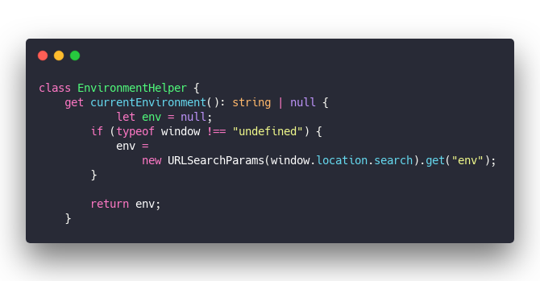
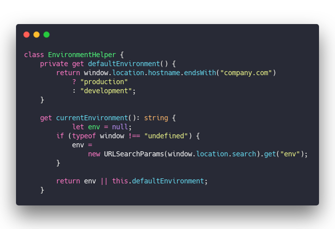
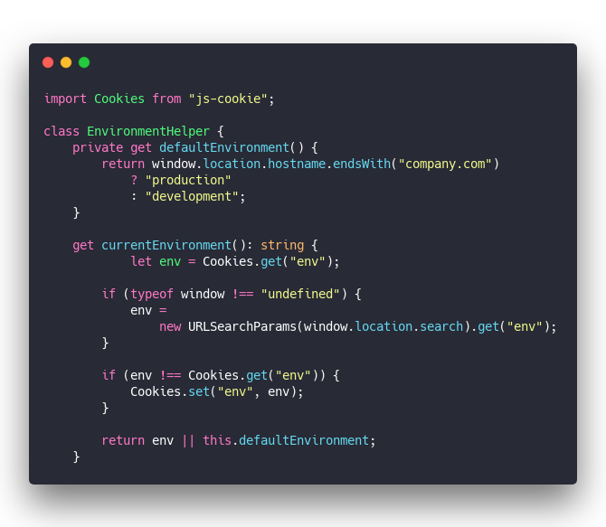
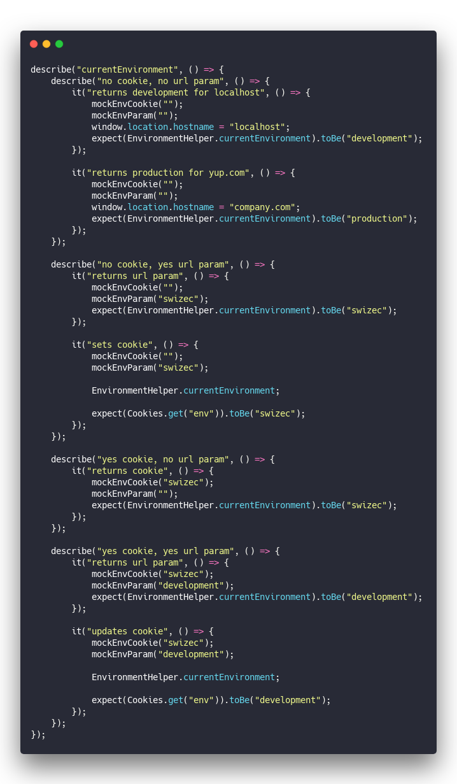
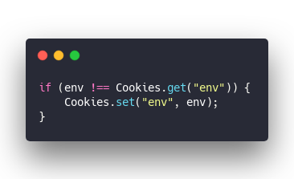
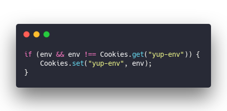

> &quot;Hey Bob, we need a function that returns the current environment name so QA can test our apps&quot;
>
>

Okay that&#x27;s easy enough.

You&#x27;re building a utility method for every project. Something that checks an `env=` param and lets you run web apps against production, QA, and local environments.

&amp;t=seti&amp;l=typescript&amp;ds=true&amp;wc=true&amp;wa=true&amp;pv=48px&amp;ph=32px&amp;ln=false&amp;code=class%20EnvironmentHelper%20%7B%0A%20%20%20%20get%20currentEnvironment()%3A%20string%20%7C%20null%20%7B%0A%20%20%20%20%20%20%20%20%09let%20env%20%3D%20null%3B%0A%20%20%20%20%20%20%20%20if%20(typeof%20window%20!%3D%3D%20%22undefined%22)%20%7B%0A%20%20%20%20%20%20%20%20%20%20%20%20env%20%3D%0A%20%20%20%20%20%20%20%20%20%20%20%20%20%20%20%20new%20URLSearchParams(window.location.search).get(%22env%22)%3B%0A%20%20%20%20%20%20%20%20%7D%0A%0A%20%20%20%20%20%20%20%20return%20env%3B%0A%20%20%20%20%7D)

`URLSearchParams` parses the `window.location.search` string into a Map and you `.get()` the `env` param. If the param isn&#x27;t there, the value is `null`.

Your spidey senses were tingling so you made sure `window` is defined. Lets you run this code in server-side rendering.

Job well done 👌

> &quot;Hey Bob, would be cool if we didn&#x27;t need to add ?env=development on localhost and ?env=production on production&quot;

Damn, that _would_ be cool.

You add some defaults.

&amp;t=seti&amp;l=typescript&amp;ds=true&amp;wc=true&amp;wa=true&amp;pv=48px&amp;ph=32px&amp;ln=false&amp;code=class%20EnvironmentHelper%20%7B%0A%20%20%20%20private%20get%20defaultEnvironment()%20%7B%0A%20%20%20%20%20%20%20%20return%20window.location.hostname.endsWith(%22company.com%22)%0A%20%20%20%20%20%20%20%20%20%20%20%20%3F%20%22production%22%0A%20%20%20%20%20%20%20%20%20%20%20%20%3A%20%22development%22%3B%0A%20%20%20%20%7D%0A%20%20%20%20%0A%20%20%20%20get%20currentEnvironment()%3A%20string%20%7B%0A%20%20%20%20%20%20%20%20%09let%20env%20%3D%20null%3B%0A%20%20%20%20%20%20%20%20if%20(typeof%20window%20!%3D%3D%20%22undefined%22)%20%7B%0A%20%20%20%20%20%20%20%20%20%20%20%20env%20%3D%0A%20%20%20%20%20%20%20%20%20%20%20%20%20%20%20%20new%20URLSearchParams(window.location.search).get(%22env%22)%3B%0A%20%20%20%20%20%20%20%20%7D%0A%0A%20%20%20%20%20%20%20%20return%20env%20%7C%7C%20this.defaultEnvironment%3B%0A%20%20%20%20%7D)

That wasn&#x27;t so hard. If there&#x27;s no param, pick a default value based on the current domain. `"production"` in production and `"development"` everywhere else.

Going to break in QA environments and that&#x27;s okay. The QA team knows to add `?env=qa` when testing.

> &quot;Hey Bob, you know what would be really cool? If we remembered the environment even if someone drops the param by accident&quot;

That&#x27;s a _great_ idea!

You [npm install js-cookie](https://www.npmjs.com/package/js-cookie) and get to work.

&amp;t=seti&amp;l=typescript&amp;ds=true&amp;wc=true&amp;wa=true&amp;pv=48px&amp;ph=32px&amp;ln=false&amp;code=import%20Cookies%20from%20%22js-cookie%22%3B%0A%0Aclass%20EnvironmentHelper%20%7B%0A%20%20%20%20private%20get%20defaultEnvironment()%20%7B%0A%20%20%20%20%20%20%20%20return%20window.location.hostname.endsWith(%22company.com%22)%0A%20%20%20%20%20%20%20%20%20%20%20%20%3F%20%22production%22%0A%20%20%20%20%20%20%20%20%20%20%20%20%3A%20%22development%22%3B%0A%20%20%20%20%7D%0A%20%20%20%20%0A%20%20%20%20get%20currentEnvironment()%3A%20string%20%7B%0A%20%20%20%20%20%20%20%20%09let%20env%20%3D%20Cookies.get(%22env%22)%3B%0A%20%20%20%20%20%20%20%20%09%0A%20%20%20%20%20%20%20%20if%20(typeof%20window%20!%3D%3D%20%22undefined%22)%20%7B%0A%20%20%20%20%20%20%20%20%20%20%20%20env%20%3D%0A%20%20%20%20%20%20%20%20%20%20%20%20%20%20%20%20new%20URLSearchParams(window.location.search).get(%22env%22)%3B%0A%20%20%20%20%20%20%20%20%7D%0A%20%20%20%20%20%20%20%20%0A%20%20%20%20%20%20%20%20if%20(env%20!%3D%3D%20Cookies.get(%22env%22))%20%7B%0A%20%20%20%20%20%20%20%20%20%20%20%20Cookies.set(%22env%22%2C%20env)%3B%0A%20%20%20%20%20%20%20%20%7D%0A%0A%20%20%20%20%20%20%20%20return%20env%20%7C%7C%20this.defaultEnvironment%3B%0A%20%20%20%20%7D)

You read the `env` cookie, check the URL param, and update the cookie when those don&#x27;t match. Return the environment or default based on domain.

Job well done!

Function&#x27;s getting a little complicated, but eh it&#x27;s still simple enough right? Easy to reason about.

Deploy 🚀

## Hidden complexity in simple code

You get bug reports. Something&#x27;s fishy.

Works okay on localhost, seems fine enough in production, but QA environments are acting weird. On every 2nd page load, they start hitting production servers.

This function ain&#x27;t so simple after all. What did you miss?

You have 3 pieces of state. Each can be set or not set. How many states is that?

Bet you it&#x27;s more than you think 😛

Lemme show you a trick from college

You write a binary truth table. Each column is a variable, `0` means empty, `1` means set.

2^3 gives you 8 different states to look at.

Your function has just 4 conditionals, hmm 🤔

We can discard some because of precedence rules. `?env=` param always wins, so you can drop all but one row where it&#x27;s set.

Same is true for cookie. It always wins over the domain.

We&#x27;re down to 4 states and 4 conditionals. Should be fine now, right?

> Beware of bugs in the above code; I have only proved it correct, not tried it. ~ Donald Knuth

### Test the code!

What the heck&#x27;s still missing? Let&#x27;s add some tests. More tests than you think.

&amp;t=seti&amp;l=typescript&amp;ds=true&amp;wc=true&amp;wa=true&amp;pv=48px&amp;ph=32px&amp;ln=false&amp;code=describe(%22currentEnvironment%22%2C%20()%20%3D%3E%20%7B%0A%20%20%20%20describe(%22no%20cookie%2C%20no%20url%20param%22%2C%20()%20%3D%3E%20%7B%0A%20%20%20%20%20%20%20%20it(%22returns%20development%20for%20localhost%22%2C%20()%20%3D%3E%20%7B%0A%20%20%20%20%20%20%20%20%20%20%20%20mockEnvCookie(%22%22)%3B%0A%20%20%20%20%20%20%20%20%20%20%20%20mockEnvParam(%22%22)%3B%0A%20%20%20%20%20%20%20%20%20%20%20%20window.location.hostname%20%3D%20%22localhost%22%3B%0A%20%20%20%20%20%20%20%20%20%20%20%20expect(EnvironmentHelper.currentEnvironment).toBe(%22development%22)%3B%0A%20%20%20%20%20%20%20%20%7D)%3B%0A%0A%20%20%20%20%20%20%20%20it(%22returns%20production%20for%20yup.com%22%2C%20()%20%3D%3E%20%7B%0A%20%20%20%20%20%20%20%20%20%20%20%20mockEnvCookie(%22%22)%3B%0A%20%20%20%20%20%20%20%20%20%20%20%20mockEnvParam(%22%22)%3B%0A%20%20%20%20%20%20%20%20%20%20%20%20window.location.hostname%20%3D%20%22company.com%22%3B%0A%20%20%20%20%20%20%20%20%20%20%20%20expect(EnvironmentHelper.currentEnvironment).toBe(%22production%22)%3B%0A%20%20%20%20%20%20%20%20%7D)%3B%0A%20%20%20%20%7D)%3B%0A%0A%20%20%20%20describe(%22no%20cookie%2C%20yes%20url%20param%22%2C%20()%20%3D%3E%20%7B%0A%20%20%20%20%20%20%20%20it(%22returns%20url%20param%22%2C%20()%20%3D%3E%20%7B%0A%20%20%20%20%20%20%20%20%20%20%20%20mockEnvCookie(%22%22)%3B%0A%20%20%20%20%20%20%20%20%20%20%20%20mockEnvParam(%22swizec%22)%3B%0A%20%20%20%20%20%20%20%20%20%20%20%20expect(EnvironmentHelper.currentEnvironment).toBe(%22swizec%22)%3B%0A%20%20%20%20%20%20%20%20%7D)%3B%0A%0A%20%20%20%20%20%20%20%20it(%22sets%20cookie%22%2C%20()%20%3D%3E%20%7B%0A%20%20%20%20%20%20%20%20%20%20%20%20mockEnvCookie(%22%22)%3B%0A%20%20%20%20%20%20%20%20%20%20%20%20mockEnvParam(%22swizec%22)%3B%0A%0A%20%20%20%20%20%20%20%20%20%20%20%20EnvironmentHelper.currentEnvironment%3B%0A%0A%20%20%20%20%20%20%20%20%20%20%20%20expect(Cookies.get(%22env%22)).toBe(%22swizec%22)%3B%0A%20%20%20%20%20%20%20%20%7D)%3B%0A%20%20%20%20%7D)%3B%0A%0A%20%20%20%20describe(%22yes%20cookie%2C%20no%20url%20param%22%2C%20()%20%3D%3E%20%7B%0A%20%20%20%20%20%20%20%20it(%22returns%20cookie%22%2C%20()%20%3D%3E%20%7B%0A%20%20%20%20%20%20%20%20%20%20%20%20mockEnvCookie(%22swizec%22)%3B%0A%20%20%20%20%20%20%20%20%20%20%20%20mockEnvParam(%22%22)%3B%0A%20%20%20%20%20%20%20%20%20%20%20%20expect(EnvironmentHelper.currentEnvironment).toBe(%22swizec%22)%3B%0A%20%20%20%20%20%20%20%20%7D)%3B%0A%20%20%20%20%7D)%3B%0A%0A%20%20%20%20describe(%22yes%20cookie%2C%20yes%20url%20param%22%2C%20()%20%3D%3E%20%7B%0A%20%20%20%20%20%20%20%20it(%22returns%20url%20param%22%2C%20()%20%3D%3E%20%7B%0A%20%20%20%20%20%20%20%20%20%20%20%20mockEnvCookie(%22swizec%22)%3B%0A%20%20%20%20%20%20%20%20%20%20%20%20mockEnvParam(%22development%22)%3B%0A%20%20%20%20%20%20%20%20%20%20%20%20expect(EnvironmentHelper.currentEnvironment).toBe(%22development%22)%3B%0A%20%20%20%20%20%20%20%20%7D)%3B%0A%0A%20%20%20%20%20%20%20%20it(%22updates%20cookie%22%2C%20()%20%3D%3E%20%7B%0A%20%20%20%20%20%20%20%20%20%20%20%20mockEnvCookie(%22swizec%22)%3B%0A%20%20%20%20%20%20%20%20%20%20%20%20mockEnvParam(%22development%22)%3B%0A%0A%20%20%20%20%20%20%20%20%20%20%20%20EnvironmentHelper.currentEnvironment%3B%0A%0A%20%20%20%20%20%20%20%20%20%20%20%20expect(Cookies.get(%22env%22)).toBe(%22development%22)%3B%0A%20%20%20%20%20%20%20%20%7D)%3B%0A%20%20%20%20%7D)%3B%0A%7D)%3B)

Yep, 7 tests for just 4 states. And I think that&#x27;s still missing some helpful tests.

So, what was the bug?

## 🤦‍♀️

Bug&#x27;s right here:

&amp;t=seti&amp;l=typescript&amp;ds=true&amp;wc=true&amp;wa=true&amp;pv=48px&amp;ph=32px&amp;ln=false&amp;code=if%20(env%20!%3D%3D%20Cookies.get(%22env%22))%20%7B%0A%20%20%20%20Cookies.set(%22env%22%2C%20env)%3B%0A%7D)

That means we overwrite the cookie with an empty value when there&#x27;s no URL param. Should look like this:

&amp;t=seti&amp;l=typescript&amp;ds=true&amp;wc=true&amp;wa=true&amp;pv=48px&amp;ph=32px&amp;ln=false&amp;code=if%20(env%20%26%26%20env%20!%3D%3D%20Cookies.get(%22yup-env%22))%20%7B%0A%20%20%20%20Cookies.set(%22yup-env%22%2C%20env)%3B%0A%7D)

That simple function took 2 days off my life. All because I was too damn proud to write tests the first time.

Happy coding ❤️

Cheers,  
~Swizec

PS: this situation adapted for brevity, IRL there were some other functions involved further obscuring the complexity