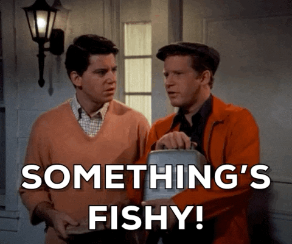
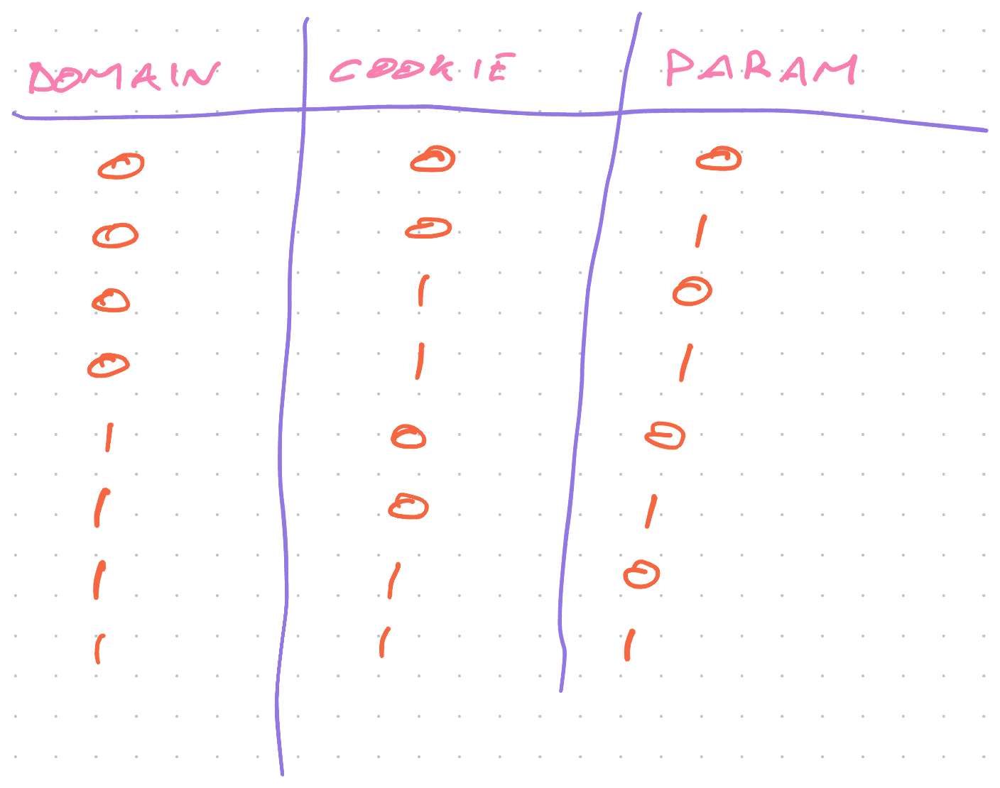
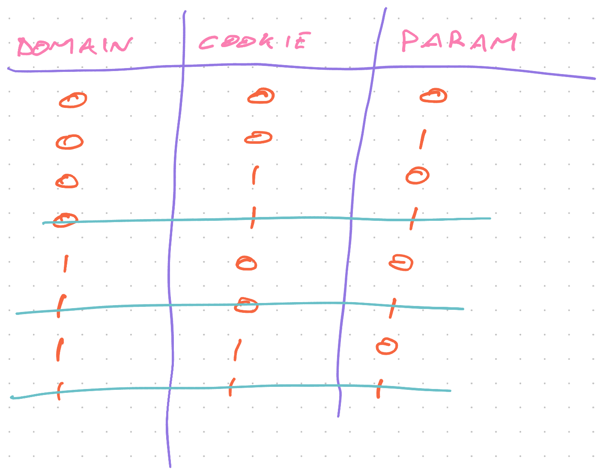
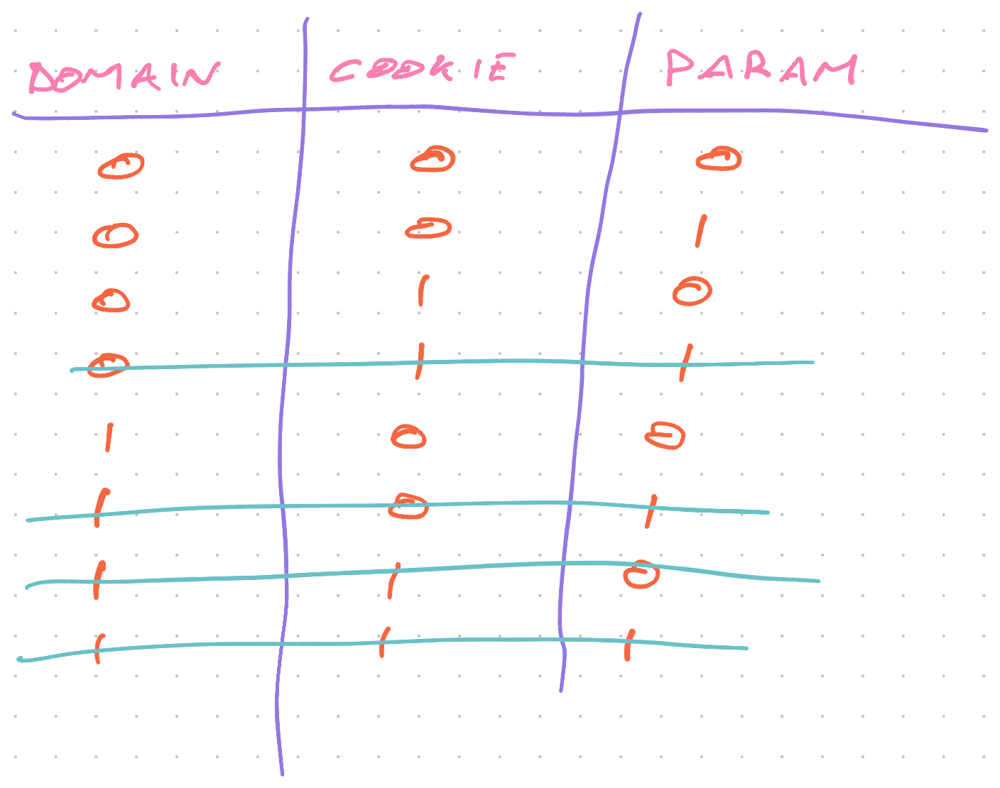

> "Hey Bob, we need a function that returns the current environment name so QA can test our apps"

Okay that's easy enough.

You're building a utility method for every project. Something that checks an `env=` param and lets you run web apps against production, QA, and local environments.

```javascript
class EnvironmentHelper {
    get currentEnvironment(): string | null {
        	let env = null;
        if (typeof window !== "undefined") {
            env =
                new URLSearchParams(window.location.search).get("env");
        }

        return env;
    }
```

`URLSearchParams` parses the `window.location.search` string into a Map and you `.get()` the `env` param. If the param isn't there, the value is `null`.

Your spidey senses were tingling so you made sure `window` is defined. Lets you run this code in server-side rendering.

Job well done 👌

> "Hey Bob, would be cool if we didn't need to add ?env=development on localhost and ?env=production on production"

Damn, that _would_ be cool.

You add some defaults.

```javascript
class EnvironmentHelper {
    private get defaultEnvironment() {
        return window.location.hostname.endsWith("company.com")
            ? "production"
            : "development";
    }

    get currentEnvironment(): string {
        	let env = null;
        if (typeof window !== "undefined") {
            env =
                new URLSearchParams(window.location.search).get("env");
        }

        return env || this.defaultEnvironment;
    }
```

That wasn't so hard. If there's no param, pick a default value based on the current domain. `"production"` in production and `"development"` everywhere else.

Going to break in QA environments and that's okay. The QA team knows to add `?env=qa` when testing.

> "Hey Bob, you know what would be really cool? If we remembered the environment even if someone drops the param by accident"


That's a _great_ idea!

You [npm install js-cookie](https://www.npmjs.com/package/js-cookie) and get to work.

```javascript
import Cookies from "js-cookie";

class EnvironmentHelper {
    private get defaultEnvironment() {
        return window.location.hostname.endsWith("company.com")
            ? "production"
            : "development";
    }

    get currentEnvironment(): string {
        	let env = Cookies.get("env");

        if (typeof window !== "undefined") {
            env =
                new URLSearchParams(window.location.search).get("env");
        }

        if (env !== Cookies.get("env")) {
            Cookies.set("env", env);
        }

        return env || this.defaultEnvironment;
    }
```

You read the `env` cookie, check the URL param, and update the cookie when those don't match. Return the environment or default based on domain.

Job well done!

Function's getting a little complicated, but eh it's still simple enough right? Easy to reason about.

Deploy 🚀

## Hidden complexity in simple code

You get bug reports. Something's fishy.

Works okay on localhost, seems fine enough in production, but QA environments are acting weird. On every 2nd page load, they start hitting production servers.



This function ain't so simple after all. What did you miss?

You have 3 pieces of state. Each can be set or not set. How many states is that?

Bet you it's more than you think 😛

Lemme show you a trick from college



You write a binary truth table. Each column is a variable, `0` means empty, `1` means set.

2^3 gives you 8 different states to look at.

Your function has just 4 conditionals, hmm 🤔

We can discard some because of precedence rules. `?env=` param always wins, so you can drop all but one row where it's set.



Same is true for cookie. It always wins over the domain.



We're down to 4 states and 4 conditionals. Should be fine now, right?

> Beware of bugs in the above code; I have only proved it correct, not tried it. ~ Donald Knuth

### Test the code!

What the heck's still missing? Let's add some tests. More tests than you think.

```javascript
describe("currentEnvironment", () => {
  describe("no cookie, no url param", () => {
    it("returns development for localhost", () => {
      mockEnvCookie("")
      mockEnvParam("")
      window.location.hostname = "localhost"
      expect(EnvironmentHelper.currentEnvironment).toBe("development")
    })

    it("returns production for yup.com", () => {
      mockEnvCookie("")
      mockEnvParam("")
      window.location.hostname = "company.com"
      expect(EnvironmentHelper.currentEnvironment).toBe("production")
    })
  })

  describe("no cookie, yes url param", () => {
    it("returns url param", () => {
      mockEnvCookie("")
      mockEnvParam("swizec")
      expect(EnvironmentHelper.currentEnvironment).toBe("swizec")
    })

    it("sets cookie", () => {
      mockEnvCookie("")
      mockEnvParam("swizec")

      EnvironmentHelper.currentEnvironment

      expect(Cookies.get("env")).toBe("swizec")
    })
  })

  describe("yes cookie, no url param", () => {
    it("returns cookie", () => {
      mockEnvCookie("swizec")
      mockEnvParam("")
      expect(EnvironmentHelper.currentEnvironment).toBe("swizec")
    })
  })

  describe("yes cookie, yes url param", () => {
    it("returns url param", () => {
      mockEnvCookie("swizec")
      mockEnvParam("development")
      expect(EnvironmentHelper.currentEnvironment).toBe("development")
    })

    it("updates cookie", () => {
      mockEnvCookie("swizec")
      mockEnvParam("development")

      EnvironmentHelper.currentEnvironment

      expect(Cookies.get("env")).toBe("development")
    })
  })
})
```

Yep, 7 tests for just 4 states. And I think that's still missing some helpful tests.

So, what was the bug?

## 🤦‍♀️

Bug's right here:

```javascript
if (env !== Cookies.get("env")) {
  Cookies.set("env", env)
}
```

That means we overwrite the cookie with an empty value when there's no URL param. Should look like this:

```javascript
if (env && env !== Cookies.get("yup-env")) {
  Cookies.set("yup-env", env)
}
```

That simple function took 2 days off my life. All because I was too damn proud to write tests the first time.

Happy coding ❤️

Cheers,<br/>
~Swizec

PS: this situation adapted for brevity, IRL there were some other functions involved further obscuring the complexity
