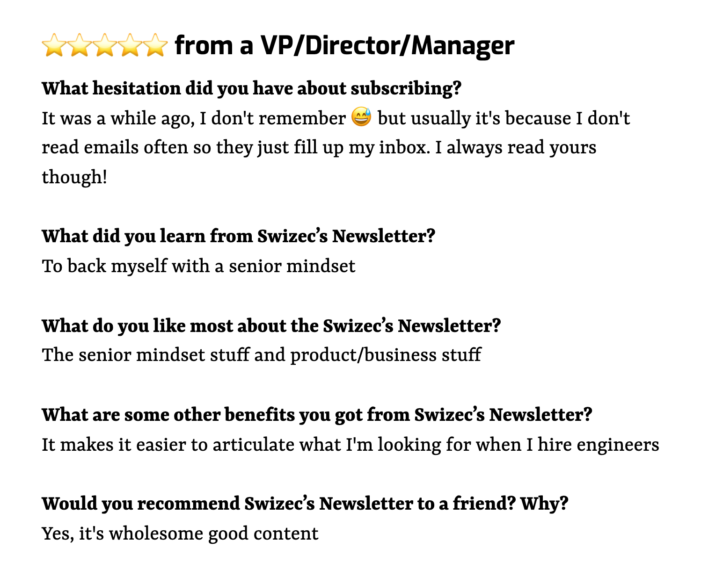

Every year I ask readers if they're enjoying this newsletter. Then fail to use those responses 😅

This year I said heck it and built a [/testimonials](https://swizec.com/testimonials) page that shows everyone's feedback raw from Typeform. Here's how.

https://www.youtube.com/watch?v=SWqy6swdVTw

## The perfect feedback form

The best feedback comes from deep in your gut. It's something you feel to be true, but can't quite put into words.

To get great testimonials, you have to ask a specific series of questions.

1.  What was your hesitation in joining?
2.  What did you learn?
3.  What do you like most?
4.  What else do you like?
5.  Would you recommend to a friend? Why?

Straight from [Sean D'Souza's Brain Audit](https://brainaudit.com/)

[](https://brainaudit.com/)

Add a few connecting words and you get beauties like this:

> I’ve got 25 years of web dev experienced but I learned to feel more confident in my decisions and I love the no BS straight shooting opinionism. The newsletter usually bings a big smile to my face and I’d recommend it to everyone. It's a wealth of experience and knowledge being shared very openly and honestly, even the bad stuff.

And this:

> I was worried the advice would be too generic or too tech specific. But I learned what value engineers add to an org and **how to build a career as opposed to climbing the ladder**. My favorite were **the long term perspectives** which do not focus only on one aspect of career like salary and roles. The Senior Mindset series in particular helps with gaining context around the industry. Going to use this to **get promoted** and be more comfortable about **the value I add and asking for a raise**.


For a newsletter I like to add demographics info. Helps to know if your writing lands with VPs in BigTech or individual contributors in tiny startups.

Just don't be like me and mess up the URL that adds everyone's email to the feedback. Can't followup to add faces and names to the good ones. Everything's anonymous 💩

## A custom gatsby-typeform-source plugin

The goal is to write a [Gatsby page query](https://www.gatsbyjs.com/docs/how-to/querying-data/page-query/) and bake Typeform data into your site at deploy time. [Gatsby v4 offers more rendering options](https://www.gatsbyjs.com/docs/conceptual/rendering-options/) similar to NextJS, but my data changes once a year. Static is best.

Even re-fetching on every deploy is too much let's be honest.

When we're done, a query like this fetches every response to a pre-configured form.

```graphql
query {
  allTypeformResponse {
    nodes {
      answers {
        field {
          title
        }
        type
        number
        text
        choice {
          label
        }
      }
    }
  }
}
```

You can see [the full code change, here](https://github.com/Swizec/swizec.com/pull/76). And [a followup fix for rendering](https://github.com/Swizec/swizec.com/commit/5d99e04bdfc6f05dbe482ab5c11cce3474d434d4) when I learned of a surprise in Typeform's API. More on that below.

### Init with a starter

Quickest way to start a custom plugin is in your `/plugins` directory. With a starter.

    gatsby new plugins/gatsby-typeform-source https://github.com/gatsbyjs/gatsby-starter-plugin

This creates a basic file structure with `gatsby-node.js`, `gatsby-ssr.js`, a `gatsby-browser.js`, and a `package.json` file. The typical files you'll need to hook into Gatsby's machinery.

We'll do our work in `gatsby-node.js` because we're creating new data nodes for the ... content mesh? ... whatever they're calling it these days. 🤷‍♀️

### Fetch Typeform fields and responses

You'll need to `yarn add @typeform/api-client`, [the official Typeform SDK](https://github.com/Typeform/js-api-client). It's a good SDK, I like it. Easy to use :)

The JSON for Typeform responses looks like this:

```json
{
  total_items: 156,
  page_count: 1,
  items: [
    {
      landing_id: 'idxliv8btjvwel0l6uj0qidxliv50j4q',
      token: '...',
      response_id: '...',
      landed_at: '2022-01-22T02:45:14Z',
      submitted_at: '2022-01-22T02:51:55Z',
      metadata: { ... },
      hidden: { email: '' },
      calculated: { score: 0 },
      answers: [
        {
          field: {
            id: 'Sk4MM6YV3fyz',
            ref: '0bbede4f-b734-4fde-8c52-58aa6b23175a',
            type: 'opinion_scale'
          },
          type: 'number',
          number: 5
        },
        {
          field: {
            id: 'kTdlVboYMQVH',
            ref: '8fbe75b0-2caa-4523-a89b-566d4948d920',
            type: 'long_text'
          },
          type: 'text',
          text: "It was a while ago, I don't remember 😅 but usually it's because I don't read emails often so they
just fill up my inbox. I always read yours though!"
        },
        ...
      ]
    },
```

That means we'll need to fetch the form to get information about what questions were answered.

Like this:

```javascript
// fetches responses for a specific typeform
function fetchResponses(token, formId) {
  const typeformAPI = createClient({
    token,
  })

  return Promise.all([
    typeformAPI.forms.get({ uid: formId }),
    typeformAPI.responses.list({
      uid: formId,
      pageSize: 1000,
    }),
  ])
}
```

`token` is your personal API token from Typeform settings. `formId` is the ID of the form you want.

We create a new client then get the form and the list of responses. For simplicity we set `pageSize: 1000` so we don't have to deal with pagination. 1000 is max though.

`Promise.all` makes both requests in parallel. For a small performance boost.

### Tie the data together

We'll need to bake the form questions into every response. That makes them easier to use via GraphQL – you can query the question as part of an answer. No custom code required.

That happens in Gatsby's `sourceNodes` function:

```javascript
// plugins/gatsby-typeform-source/gatsby-node.js

exports.sourceNodes = async (
  { actions, createContentDigest, createNodeId },
  pluginOptions
) => {
  // fetch data
  const [{ fields }, { items }] = await fetchResponses(
    pluginOptions.token,
    pluginOptions.formId
  )

  // create map of form fields
  const fieldMap = new Map(fields.map((field) => [field.id, field]))

  // tie answers to fields and cleanup
  for (const response of items) {
    const data = {
      answers: response.answers.map((answer) => ({
        ...answer,
        field: fieldMap.get(answer.field.id),
      })),
      metadata: response.metadata,
      submitted_at: response.submitted_at,
      landed_at: response.landed_at
    }
```

We use `pluginOptions` to let the site configure the Typeform API token and `formId`.

The `fieldMap` maps every `field.id` to its value. A `Map()` can take an array of `[key, value]` pairs to create itself. Handy :)

Then we iterate over all the responses to create a data object that:

- has all the answers
- ties each answer with its question
- contains metadata
- timestamps
- throws away response properties that didn't look useful

We'll feed that into Gatsby's `createNode` to make data nodes.

### Create nodes for Gatsby's machinery

Before you can create Gatsby data nodes, you need to define a new type. That way GraphQL understands the structure of your data and makes it easy to query.

We do that with [`createSchemaCustomization`](https://www.gatsbyjs.com/docs/reference/config-files/gatsby-node/#createSchemaCustomization)

```javascript
// plugins/gatsby-typeform-source/gatsby-node.js

exports.createSchemaCustomization = ({ actions }) => {
  const { createTypes } = actions

  createTypes(`
        type TypeformResponse implements Node {
            id: ID!
            answers: [TypeformAnswer]
            metadata: TypeformMetadata
            submitted_at: String!
            landed_at: String!
            variables: String
        }

        type TypeformMetadata {
            user_agent: String
            platform: String
            referer: String
            network_id: String
            browser: String
        }

        type TypeformField {
            id: ID
            title: String
            type: String
        }

        type TypeformAnswer {
            field: TypeformField
            type: String
            text: String
            choice: TypeformChoice
            number: Int
        }

        type TypeformChoice {
            id: ID,
            label: String
        }
    `)
}
```

It's a description of the shape of our data. We created a bunch of custom types and tied them together.

To use them, we add a call to [`createNode`](https://www.gatsbyjs.com/docs/reference/config-files/actions/#createNode) after every `const data = { ... }`.

```javascript
// plugins/gatsby-typeform-source/gatsby-node.js

const { createNode } = actions

createNode({
  id: createNodeId(`typeformResponse-${response.response_id}`),
  parent: null,
  children: [],
  ...data,
  internal: {
    type: "TypeformResponse",
    contentDigest: createContentDigest(data),
  },
})
```

This tells Gatsby to add a new node to the content mesh or whatever, creates an `id`, and a `contentDigest` so Gatsby can handle caching and optimize performance. I think it can skip page generation, if data stayed the same.

## Using the custom Typeform source plugin

With that custom plugin, we can add Typeform responses to any page or component in Gatsby.

### Configure the plugin

First you enable the plugin in `gatsby-config.js`:

```javascript
// gatsby-config.js

  plugins: [
    {
      resolve: "gatsby-typeform-source",
      options: {
        // configured in .env and your hosting provider
        token: process.env.TYPEFORM_TOKEN,
        // hardcoded globally because I'm lazy
        formId: "jLgVKKLf",
      },
    },
```

Would be nice if the `formId` was a query param, but I needed this to build the [/testimonials](https://swizec.com/testimonials) page. Not solve every problem ever ✌️

An important engineering skill.

https://twitter.com/pkuhar/status/1485732890100973571

### Run the query

You can fetch Typeform data anywhere inside Gatsby. Mine is set up to create pages based on MDX.

```mdx
// src/pages/testimonials.mdx

---

title: "Newsletter testimonials"
description: "What readers think of Swizec's newsletter"

---

import { graphql } from "gatsby"
import { TypeformResponse } from "../components/TypeformResponse.js"

export const pageQuery = graphql`
  query {
    allTypeformResponse {
      nodes {
        answers {
          field {
            title
          }
          type
          number
          text
          choice {
            label
          }
        }
      }
    }
  }
`

About once a year I send a feedback poll to newsletter subscribers. Here are all their responses from 2021. You can judge for yourself 😊

<>
  {props.data.allTypeformResponse.nodes.map(({ answers }) => (
    <TypeformResponse answers={answers} />
  ))}
</>
```

Set a title and description, import a React component and Gatsby's graphql hook. Export a page query, add intro text, and iterate through the data to render responses.

### Render the data

The tricky surprise was that Typeform's API _skips questions that weren't answered_. Saying `answers[3]` can return answers to different questions for different people 🙃

A smol helper function solves that problem:

```javascript
function getAnswer(question, answers) {
  return answers.find((answer) => answer.field.title === question)
}
```

It finds the correct answer based on the question text.

The rest is about slapping together HTML components to show a testimonial. You can [see the implementation on GitHub](https://github.com/Swizec/swizec.com/blob/master/src/components/TypeformResponse.js).

I think it came out great!

[](https://swizec.com/testimonials/)

Think I should opensource the `gatsby-typeform-source` plugin? Hit reply

Cheers,<br/>
~Swizec
