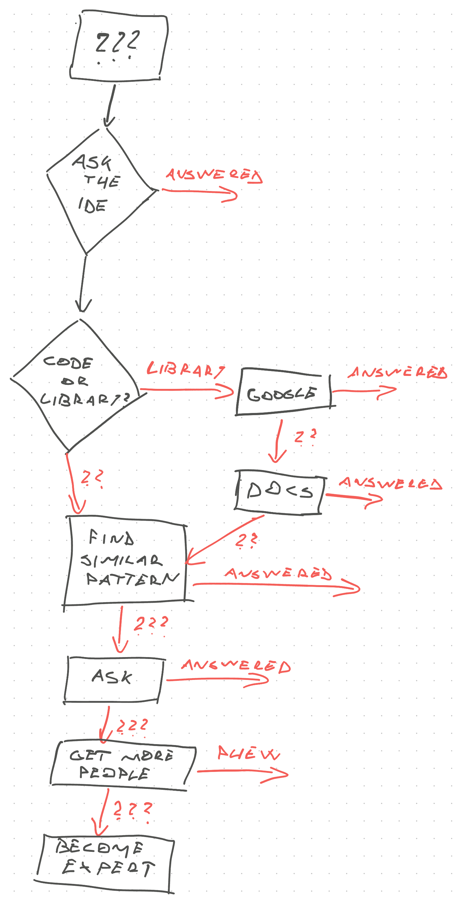

import { ContentUpgrades } from "@swizec/gatsby-theme-course-platform"

Friend, what makes a senior engineer stand out in an interview?

No it's not the amount of side projects or their leetcoding speed. It's not even past experience – every senior has past experience.

It's knowing how and when to ask for help.

https://twitter.com/Swizec/status/1431044504186880007

You don't need to have _the_ approach, but you should have _an_ approach. As a senior you'd expect to be pretty used to asking for help by now.

Here's the approach I use.

## 1. Ask the IDE

Asking your IDE is a great first step. When you're not sure what function to call, what's available, or which arguments to use in a function – ask the IDE!

Autocomplete can tell you what's in scope and which properties or methods exist on an object. Jump to definition should tell you what arguments exist for a function.

Typed languages like TypeScript help make your IDE more powerful. Machine readable comments like [JSDoc](https://jsdoc.app) get you halfway there in dynamic languages.

You may not realize you're asking for help but it's nice when you don't have to fit the whole project in your brain. Let computers do what computers are good at ✌️

## 2. Code or library question?

The IDE couldn't help and now you're faced with a branching decision: Is this a codebase question or a library question?

### Library questions

You can answer library questions by googling. Other people have run into this issue before. If Google can't find the answer, documentation can help.

I like to Google first because you get someone's blog post, GitHub issue, or StackOverflow question with your exact situation. When that's not available, it often finds the documentation page you need.

Trawling 100 pages of docs to find the 2 sentences that answer your question ... 🤢

<ContentUpgrades.SeniorMindset />

## 3. Code archaeology

When the issue is specific to your codebase or Google can't find anything relevant, you're shit out of luck.

_Nobody_ outside your organisation could have run into this issue. It's specific to you, your team, and your company. 💩

Fear not! You can ask your former self!

Dig through the codebase, look for patterns similar to what you're doing, and copy that shit. The bigger the codebase, the more likely you'll find an answer.

The code archaeology approach is easiest when you're adding a new feature that's similar to an old feature. You can trace the whole codepath from UI to database and add your code next to all the existing code.

You can [clean up the duplication later](https://swizec.com/blog/reader-question:-when-do-you-fix-tech-debt/). Or find that the features look similar by accident and this isn't duplication at all.

But that's a problem for another day. Piggybacking off existing patterns is the solution for today.

## 4. Ask

All right, getting help from the universe has failed, time to ask the team.

Here's what you do:

    @team or @specific-person-who-prob-knows can you help with X? I've tried A, B, and C. That didn't work because of Y and Z. Here's relevant information ...

If you know the specific person (like from a git blame) who might help, tag them. If you know the team responsible for this area, tag them.

**Always ask in a public channel**. That way others can learn from your question or jump in to help.

Assume people can't read your mind. Summarize the problem, attach relevant screenshots for context. People are really good at grokking context from pictures. Attaching error messages helps too.

### When to ask

Ask earlier than you think. While you have a few avenues left to explore.

Don't expect others to drop everything and jump to help you. Respect their focus :)

As you find more information, add it. If you find the answer, share it.

## 5. Ask more people

You'll find that some questions stump others trying to help. Escalate! Get more people involved.

_"Who else do you think might know?"_ is a fantastic question in these situations. Go poke the person they suggest. Then the next person, then the next.

Navigate through the org until you find someone who knows the answer. You'll do this exploration for questions like _"why did we do it this way, is there a reason?"_ more than for strictly technical questions.

## 5. Become the expert

When nobody knows, it's time to become the expert.

https://twitter.com/Swizec/status/1255557735971618816

Good luck!

Cheers, 
~Swizec
