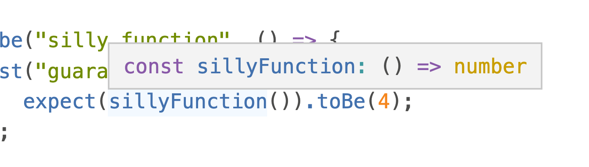
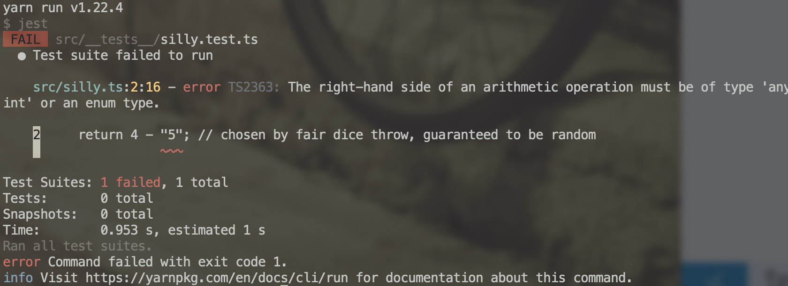
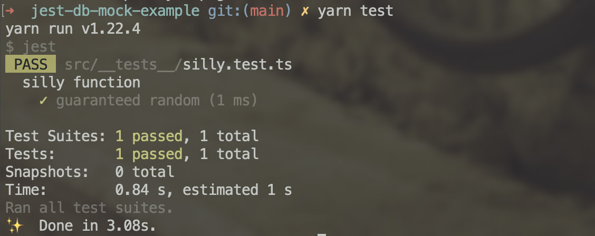

this is something I do just rarely enough that it's a pain in the butt. Next time Google is going to find this article and we'll know what to do 🤞

[Jest](https://jestjs.io/) is a testing framework from Facebook. Fast becoming an industry standard thanks to a good balance between flexibility and batteries included. No need to cobble together a bunch libraries into a bespoke framework nobody outside your team understands.

_cough sinon, mocha, chai, karma cough_

Using plain Jest on a TypeScript codebase has rough edges. Your code compiles before testing, which means you:

1.  Can't use types in your tests
2.  Don't get type errors in your tests
3.  Get error messages about compiled instead of source code
4.  Have to debug compiled JavaScript and manually relate back to TypeScript source code

**The goal:** full TypeScript support in your tests, type checking when running tests, meaningful error messages. 😍





We'll get there with [ts-jest](https://kulshekhar.github.io/ts-jest/), a Jest transformer that enables Jest to understand TypeScript.

You can see the [full repository for this code on GitHub](https://github.com/Swizec/jest-db-mock-example).

## Initial setup

We start with an empty-ish repository after running `git init` and `yarn init`. Or an existing codebase. Either works :)

For the initial setup we can use [ts-jest's install documentation](https://kulshekhar.github.io/ts-jest/docs/getting-started/installation)

    yarn add -D jest typescript ts-jest @types/jest ts-node
    yarn ts-jest config:init

This installs jest and ts-jest, TypeScript (if you don't have it yet), and type definitions for jest so TypeScript knows what's available. You'll need [ts-node](https://github.com/TypeStrong/ts-node) to support TypeScript-based configuration later.

`config:init` gives you a default config file like this:

```javascript
// jest.config.js
/** @type {import('ts-jest/dist/types').InitialOptionsTsJest} */
module.exports = {
  preset: "ts-jest",
  testEnvironment: "node",
}
```

## Make tests runnable

If you don't have it yet, add this section to your `package.json`:

```json
{
  "scripts": {
    "test": "jest"
  }
}
```

You can now run `yarn test` to fire up Jest and run all your tests. Jest doesn't require any configuration to find your tests. Goes through the whole project and looks for files that look like they're tests.

This will bite us later, but it's lovely.

## Configure TypeScript

If you haven't yet, you'll need to configure TypeScript. I like to use this file as a sane default, it's traveled with me through many projects:

```json
// tsconfig.json
{
  "compilerOptions": {
    "target": "es2017",
    "types": ["node", "jest"],
    "allowJs": true,
    "skipLibCheck": true,
    "esModuleInterop": true,
    "allowSyntheticDefaultImports": true,
    "strict": true,
    "forceConsistentCasingInFileNames": true,
    "module": "commonjs",
    "moduleResolution": "node",
    "resolveJsonModule": true,
    "isolatedModules": true,
    "baseUrl": ".",
    "noFallthroughCasesInSwitch": true,
    "outDir": "./dist"
  },
  "compileOnSave": true,
  "include": ["."]
}
```

The key parts are:

- `"types": ["node", "jest"]`, tells TypeScript to assume node and jest types are globally available. Make sure you include `jest`.
- `"outDir": "./dist"` I like to put compiled files in `/dist`. Best add dist this to `.gitignore` so you don't add compiled files to git
- `"forceConsistentCasingInFileNames": true` if you work on a Mac and deploy to anything but a Mac, this is going to save you lots of frustration. Ask me how I know 😖

### Tell TypeScript to ignore Jest files

Jest encourages you to put test files next to the code you're testing. Makes tests easier to find and cleans up imports.

What's better?

this:

```typescript
// tests/api/v2/importantBlob/functions.test.ts
import functionBeingTested from "../../../src/api/v2/importantBlob/functions"
```

or this:

```typescript
// src/api/v2/importantBlob/__tests__/functions.test.ts
import functionBeingTested from "../functions"
```

🤔

Let's agree colocating tests and code is better.

But now you have a problem – when TypeScript builds your code, all those test files end up in `dist/`. Bloats your builds and in some cases confuses Jest about which files to run and breaks testing.

**Solution:** a special config for builds:

```json
// tsconfig.build.json
{
  "extends": "./tsconfig",
  "exclude": ["**/*.test.*", "**/__mocks__/*", "**/__tests__/*"]
}
```

This configuration tells TypeScript to exclude files that look like tests. It has to be separate otherwise `ts-jest` won't see your test files 🙃

To use `tsconfig.build.json`, add this to your `package.json` file or build process:

```json
{
  "scripts": {
    "test": "jest",
    "build": "tsc -p tsconfig.build.json"
  }
}
```

Now when you run `yarn build`, typescript uses the special `tsconfig.build.json` configuration.

## Improved Jest config

I didn't like having a JavaScript file floating around my pure and clean wonderful codebase just to configure Jest. Kill the default and make it TypeScript 💪

```typescript
// jest.config.ts
import type { Config } from "@jest/types"

const config: Config.InitialOptions = {
  preset: "ts-jest",
  testEnvironment: "node",
  verbose: true,
  automock: true,
}
export default config
```

Much better.

Same `ts-jest` preset and `node` test environment as before, added `verbose` and `automock`. [Automock](https://jestjs.io/docs/configuration#automock-boolean) is nice because it tells Jest to automatically create a mocked version of any imported code.

Great for ensuring a clean environment for every test. And you can define specific behavior when you need it. We'll talk about that another time.

## Write a test

To ensure everything's working, we write a quick test.

Put a silly function in `src/silly.ts`:

```typescript
export function sillyFunction() {
  return 4 // chosen by fair dice throw, guaranteed to be random
}
```

And a test for this function in `src/__tests__/silly.test.ts`:

```typescript
// requireActual ensures you get the real file
// instead of an automock
// we use import type and <typeof ...> to still get types
import type * as Silly from "../silly"
const { sillyFunction } = jest.requireActual<typeof Silly>("../silly")

describe("silly function", () => {
  test("guaranteed random", () => {
    expect(sillyFunction()).toBe(4)
  })
})

// required with this small example
// to make the isolatedModules config happy
export {}
```

We have to use `jest.requireActual` because of the earlier `automock: true` configuration. This loses type information for the code we're testing, so we help TypeScript by doing `import type` and passing that type to `jest.requireActual` with `<>`.

You keep full type hints in your test code:


Run `yarn test` and you get a successful test run:



Happy testing ❤️

Cheers,<br/>
~Swizec

PS: this is the setup for an article coming next week, here's a sneak peek:

https://twitter.com/Swizec/status/1449170568578621443

think I have a solution but needed to write this part first 🤞
