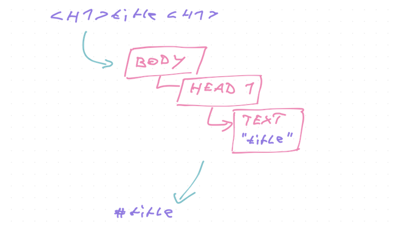

Ever had to debug a compiler my friend? It's hard.

Typical engineering wisdom goes that if you blame the compiler, you're wrong. You messed up and can't figure it out and it is _not the compiler's fault_.

But sometimes it is.

I'm working on a script to [convert Wordpress exports to Markdown](https://github.com/Swizec/wordpress-to-markdown) and after months of tinkering, noticed a terrible bug. JSX code samples don't work.

You take this bit of Wordpress source code:

&t=seti&l=html&ds=true&wc=true&wa=true&pv=48px&ph=32px&ln=false&code=%3Cpre%20lang%3D%22javascript%22%3E%0Aclass%20ReportSize%20extends%20React.Component%20%7B%0A%20%20refCallback%20%3D%20element%20%3D%3E%20%7B%0A%20%20%20%20if%20(element)%20%7B%0A%20%20%20%20%20%20this.props.getSize(element.getBoundingClientRect())%3B%0A%20%20%20%20%7D%0A%20%20%7D%3B%0A%0A%20%20render()%20%7B%0A%20%20%20%20return%20(%0A%20%20%20%20%20%20%3Cdiv%20ref%3D%7Bthis.refCallback%7D%20style%3D%7B%7B%20border%3A%20%221px%20solid%20red%22%20%7D%7D%3E%0A%20%20%20%20%20%20%20%20%7Bfaker.lorem.paragraphs(Math.random()%20*%2010)%7D%0A%20%20%20%20%20%20%3C%2Fdiv%3E%0A%20%20%20%20)%3B%0A%20%20%7D%0A%7D%0A%3C%2Fpre%3E>)

And you get this output:

&t=seti&l=null&ds=true&wc=true&wa=true&pv=48px&ph=32px&ln=false&code=%60%60javascript%0Aclass%20ReportSize%20extends%20React.Component%20%7B%0A%20%20refCallback%20%3D%20element%20%3D%3E%20%7B%0A%20%20%20%20if%20(element)%20%7B%0A%20%20%20%20%20%20this.props.getSize(element.getBoundingClientRect())%3B%0A%20%20%20%20%7D%0A%20%20%7D%3B%0A%0A%20%20render()%20%7B%0A%20%20%20%20return%20(%0A%20%20%20%20%0A%20%20%20%20%20%20%20%20%7Bfaker.lorem.paragraphs(Math.random()%20*%2010)%7D%0A%0A%20%20%20%20)%3B%0A%20%20%7D%0A%7D%0A%60%60>)

But you're supposed to get this:

&t=seti&l=null&ds=true&wc=true&wa=true&pv=48px&ph=32px&ln=false&code=%60%60javascript%0Aclass%20ReportSize%20extends%20React.Component%20%7B%0A%20%20refCallback%20%3D%20element%20%3D%3E%20%7B%0A%20%20%20%20if%20(element)%20%7B%0A%20%20%20%20%20%20this.props.getSize(element.getBoundingClientRect())%3B%0A%20%20%20%20%7D%0A%20%20%7D%3B%0A%0A%20%20render()%20%7B%0A%20%20%20%20return%20(%0A%20%20%20%20%20%20%3Cdiv%20ref%3D%7Bthis.refCallback%7D%20style%3D%7B%7B%20border%3A%20%221px%20solid%20%20red%22%20%7D%7D%3E%0A%20%20%20%20%20%20%20%20%7Bfaker.lorem.paragraphs(Math.random()%20*%2010)%7D%0A%20%20%20%20%20%20%3C%2Fdiv%3E%0A%20%20%20%20)%3B%0A%20%20%7D%0A%7D%0A%60%60>)

The compiler that translates plain Wordpress HTML to Markdown makes a mistake. Sees HTML inside a code sample, parses it as HTML, then silently drops it.

🙃

How would you fix this?

I verified the input is all correct until it goes into the html-to-markdown compiler. That's always a good first step. [Garbage in, garbage out](https://en.wikipedia.org/wiki/Garbage_in,_garbage_out)

## How compilers work

Compilers work in 3 stages.

1.  The front-end parses text inputs into an Abstract Syntax Tree – AST
2.  The middle-end manipulates the AST to add optimizations and other changes
3.  The back-end turns your AST back to text

That's the general idea. You can read about compilers in more detail in my [LOLCODE-to-JavaScript compiler](https://swizec.com/blog/lolcodetojavascript-compiler-babel-macro/) article.

### Modern tools for Markdown processing

Your best bet to play with markdown right now is the [Unified](https://unifiedjs.com/) ecosystem. It's what Gatsby, Next, Prettier, and many others use.

Unified is a system of plugins with plugins that let you parse, process, and output ASTs. Easy to get started and confusing to dig deep. Hard to find the code that _does_ anything.

Every plugin calls another plugin. 😅

General lay of the land is that:

- [unified](https://github.com/unifiedjs/unified) is the protocol that holds it all together
- [rehype](https://github.com/rehypejs/rehype) is the plugin ecosystem for HTML parsing/rendering
- [remark](https://github.com/remarkjs/remark) is the plugin ecosystem for Markdown parsing/rendering

A basic example that parses HTML and spits out Markdown goes like this:

&t=seti&l=javascript&ds=true&wc=true&wa=true&pv=48px&ph=32px&ln=false&code=import%20parse%20from%20'rehype-parse'%0Aimport%20rehype2remark%20from%20'rehype-remark'%0Aimport%20stringify%20from%20'remark-stringify'%0A%0Aunified()%20%2F%2F%20initiate%20the%20pipeline%0A%09.use(parse)%20%2F%2F%20parse%20HTML%20to%20AST%0A%09.use(rehype2remark)%20%2F%2F%20translate%20Rehype%20AST%20to%20Remark%20AST%0A%09.use(stringify)%20%2F%2F%20stringify%20AST%20to%20markdown%0A%09.process(inputHTML%2C%20(err%2C%20markdown)%20%3D%3E%20%7B%0A%09%09console.log(markdown)%0A%09%7D)>)

## How you debug a compiler

Debugging a compiler is where life gets tricky. A whole processing pipeline, oof.

You're trying to find out which step of the processing pipeline makes a mistake. And whether it's a mistake at all. You _could_ still be the one holding it wrong.

Works for everyone else. Chances are you're holding it wrong. But how do you figure out _how_ you're holding it wrong?

You can watch me work through the issue here:

I go through the process methodically injecting console.logs into the pipeline to see how nodes change shape. Trying to figure out where it goes wrong.

In the end I decided it wasn't a bug. Or if it was, it's too deep for me to fix.

### A debugging kludge

First you create a small example. As small as possible.

Then you build a debugging kludge – a tiny plugin that helps you hook into the compilation process.

It's a kludge because it's temporary, dirty, and for your eyes only. Like slapping a `console.log` into your code to see what's going on.

Your pipeline has two sides, if you're translating HTML to Markdown:

1.  The Rehype side
2.  The Remark side

These require different kludges because the AST structure is different. Tag naming is different, properties are different, etc. Both are tree structures.

#### Debug a Rehype AST

To see how Rehype sees your code blocks, you use a kludge like this:

&t=seti&l=javascript&ds=true&wc=true&wa=true&pv=48px&ph=32px&ln=false&code=function%20debugCodeBlocks()%20%7B%0A%20%20%20%20function%20findCodeBlocks(node)%20%7B%0A%20%20%20%20%20%20%20%20let%20nodes%20%3D%20%5B%5D%3B%0A%0A%20%20%20%20%20%20%20%20if%20(node.tagName%20%3D%3D%3D%20%22pre%22)%20%7B%0A%20%20%20%20%20%20%20%20%20%20%20%20nodes.push(node)%3B%20%2F%2F%20%3Cpre%3E%20nodes%20are%20code%20blocks%0A%20%20%20%20%20%20%20%20%7D%20else%20if%20(node.children)%20%7B%0A%09%09%20%20%20%20%20%20%20%20%2F%2F%20recursively%20walk%20through%20child%20nodes%0A%20%20%20%20%20%20%20%20%20%20%20%20for%20(let%20child%20of%20node.children)%20%7B%0A%20%20%20%20%20%20%20%20%20%20%20%20%20%20%20%20nodes.push(...findCodeBlocks(child))%3B%0A%20%20%20%20%20%20%20%20%20%20%20%20%7D%0A%20%20%20%20%20%20%20%20%7D%0A%0A%20%20%20%20%20%20%20%20return%20nodes%3B%0A%20%20%20%20%7D%0A%20%20%20%20%0A%20%20%20%20return%20tree%20%3D%3E%20%7B%0A%09%20%20%20%20const%20codeBlocks%20%3D%20findCodeBlocks(tree)%0A%09%20%20%20%20%0A%09%20%20%20%20%2F%2F%20deep%20print%20the%20codeBlocks%20array%0A%09%20%20%20%20console.log(require(%22util%22).inspect(tree%2C%20false%2C%20null%2C%20true))%3B%0A%09%20%20%20%20%0A%09%20%20%20%20return%20tree%3B%0A%20%20%20%20%7D%0A%7D>)

Look at the output and you see what Rehype sees. Every property, node structure, and value.

Change the `if` to observe different nodes. I don't recommend printing the whole AST. Too much.

#### Debug a Remark AST

On the other side of the `rehype2remark` divide, you have a Markdown AST. Same basic structure, different naming conventions.

Remark is easier to debug because it's well-supported by the [unist](https://github.com/syntax-tree/unist) ecosystem of helper plugins. 🎉

To print code blocks on the Remark side:

&t=seti&l=javascript&ds=true&wc=true&wa=true&pv=48px&ph=32px&ln=false&code=import%20visit%20from%20%22unist-util-visit%22%3B%0A%0Afunction%20codeBlockDebugger()%20%7B%0A%20%20%20%20return%20(markdownAST)%20%3D%3E%20%7B%0A%20%20%20%20%20%20%20%20visit(markdownAST%2C%20%22code%22%2C%20(node)%20%3D%3E%20%7B%0A%20%20%20%20%20%20%20%20%20%20%20%20console.log(require(%22util%22).inspect(node%2C%20false%2C%20null%2C%20true))%3B%0A%20%20%20%20%20%20%20%20%7D)%3B%0A%20%20%20%20%7D%3B%0A%7D>)

The `visit` helper handles recursion for you.

## How to fix a compiler pipeline issue

There's 3 ways to fix a compiler pipeline issue:

1.  On the parsing side
2.  In the middle
3.  On the stringify side

Fixing parsers by hand is hard. Writing, too. Most parsers are auto-generated from [grammar definition files](https://en.wikipedia.org/wiki/GNU_Bison).

Rehype parses my JSX-containing code blocks as if they were HTML. I thought they should be strings.

After digging, I discovered that Rehype uses [Parse5](https://github.com/inikulin/parse5) – an HTML5 compliant parser used in the entire Node ecosystem. With 75,000,000 downloads per month ... yeah I'm the one who's wrong.

Fixing stringification is boring. You'll dig and dig and do nothing fun for days. Shit's boring, we did it for my compilers class in college.

Plus you've got a battle-tested stringifier right there. You need to give it the right input tree 😉

## MacGyver a fix in the middle

Compiler middleware is the best place to add your fix.

Take the AST, change it so stringification does what you want. Magic.

Here's what I did for my example of JSX-containing code blocks:

&t=seti&l=javascript&ds=true&wc=true&wa=true&pv=48px&ph=32px&ln=false&code=function%20fixCodeBlocks()%20%7B%0A%20%20%20%20const%20settings%20%3D%20%7B%0A%20%20%20%20%20%20%20%20quoteSmart%3A%20false%2C%0A%20%20%20%20%20%20%20%20closeSelfClosing%3A%20false%2C%0A%20%20%20%20%20%20%20%20omitOptionalTags%3A%20false%2C%0A%20%20%20%20%20%20%20%20entities%3A%20%7B%20useShortestReferences%3A%20true%20%7D%2C%0A%20%20%20%20%7D%3B%0A%0A%20%20%20%20return%20(tree)%20%3D%3E%20%7B%0A%20%20%20%20%20%20%20%20%2F%2F%20same%20recursion%20findCodeBlocks%20as%20above%0A%20%20%20%20%20%20%20%20const%20codeBlocks%20%3D%20findCodeBlocks(tree)%3B%0A%0A%20%20%20%20%20%20%20%20for%20(let%20block%20of%20codeBlocks)%20%7B%0A%20%20%20%20%20%20%20%20%20%20%20%20%2F%2F%20copy%20position%20info%20for%20the%20whole%20%3Cpre%3E%20so%20we%20can%20fake%20it%20later%0A%20%20%20%20%20%20%20%20%20%20%20%20const%20position%20%3D%20%7B%0A%20%20%20%20%20%20%20%20%20%20%20%20%20%20%20%20start%3A%20block.children%5B0%5D.position.start%2C%0A%20%20%20%20%20%20%20%20%20%20%20%20%20%20%20%20end%3A%20block.children%5Bblock.children.length%20-%201%5D.position.end%2C%0A%20%20%20%20%20%20%20%20%20%20%20%20%7D%3B%0A%0A%20%20%20%20%20%20%20%20%20%20%20%20%2F%2F%20replace%20children%20with%20my%20fakes%0A%20%20%20%20%20%20%20%20%20%20%20%20block.children%20%3D%20%5B%0A%20%20%20%20%20%20%20%20%20%20%20%20%20%20%20%20%0A%20%20%20%20%20%20%20%20%20%20%20%20%5D%3B%0A%20%20%20%20%20%20%20%20%7D%0A%0A%20%20%20%20%20%20%20%20return%20tree%3B%0A%20%20%20%20%7D%3B%0A%7D>)

Find all the code blocks, replace their children with a fake new child.

&t=seti&l=javascript&ds=true&wc=true&wa=true&pv=48px&ph=32px&ln=false&code=%2F%2F%20add%20a%20fake%20%3Ccode%3E%20block%0A%2F%2F%20helps%20preserve%20language%20property%0A%7B%0A%20%20%20%20type%3A%20%22element%22%2C%0A%20%20%20%20tagName%3A%20%22code%22%2C%0A%20%20%20%20properties%3A%20%7B%0A%20%20%20%20%20%20%20%20className%3A%20%5B%0A%20%20%20%20%20%20%20%20%20%20%20%20%60language-%24%7B%0A%20%20%20%20%20%20%20%20%20%20%20%20%20%20%20%20block.properties%20%26%26%20block.properties.lang%0A%20%20%20%20%20%20%20%20%20%20%20%20%7D%60%2C%0A%20%20%20%20%20%20%20%20%5D%2C%0A%20%20%20%20%7D%2C%0A%20%20%20%20children%3A%20%5B%0A%20%20%20%20%20%20%20%20%2F%2F%20stringify%20the%20full%20%3Cpre%3E%20block%0A%20%20%20%20%20%20%20%20%2F%2F%20as%20a%20text%20child%20of%20the%20new%20%3Ccode%3E%20block%20%20%20%20%20%20%20%20%20%20%20%20%20%20%20%20%20%20%20%20%0A%20%20%20%20%20%20%20%20%7B%0A%20%20%20%20%20%20%20%20%20%20%20%20type%3A%20%22text%22%2C%0A%20%20%20%20%20%20%20%20%20%20%20%20%2F%2F%20hast-util-to-html%2C%20Rehype's%20stringifier%0A%20%20%20%20%20%20%20%20%20%20%20%20value%3A%20toHTML(block%2C%20settings)%0A%20%20%20%20%20%20%20%20%20%20%20%20%20%20%20%20.replace(%22%3C%2Fpre%3E%22%2C%20%22%22)%0A%20%20%20%20%20%20%20%20%20%20%20%20%20%20%20%20.replace(%2F%5C%3Cpre.*%3E%2F%2C%20%22%22)%0A%20%20%20%20%20%20%20%20%20%20%20%20%20%20%20%20%2F%2F%20this%20fixes%20a%20bug%20caused%20by%20a%20dirty%20fix%20somewhere%20else%20%3AP%0A%20%20%20%20%20%20%20%20%20%20%20%20%20%20%20%20.replace(%2F%5C%3Cp%5C%3E%5C%3C%5C%2Fp%5C%3E%2Fg%2C%20%22%5Cn%5Cn%22)%2C%0A%20%20%20%20%20%20%20%20%20%20%20%20position%2C%0A%20%20%20%20%20%20%20%20%7D%2C%0A%20%20%20%20%5D%2C%0A%7D>)

Make the child a `<code>` block because Remark likes that better and stringify the whole `<pre>` tag into a single `text` node.

You get:

&t=seti&l=null&ds=true&wc=true&wa=true&pv=48px&ph=32px&ln=false&code=%60%60javascript%0Aclass%20ReportSize%20extends%20React.Component%20%7B%0A%20%20refCallback%20%3D%20element%20%3D%3E%20%7B%0A%20%20%20%20if%20(element)%20%7B%0A%20%20%20%20%20%20this.props.getSize(element.getBoundingClientRect())%3B%0A%20%20%20%20%7D%0A%20%20%7D%3B%0A%0A%20%20render()%20%7B%0A%20%20%20%20return%20(%0A%20%20%20%20%20%20%3Cdiv%20ref%3D%22%7Bthis.refCallback%7D%22%20style%3D%22%7B%7B%22%20border%3A%3D%22%22%20%26%2334%3B1px%3D%22%22%20solid%3D%22%22%20red%26%2334%3B%3D%22%22%20%7D%7D%3D%22%22%3E%0A%20%20%20%20%20%20%20%20%7Bfaker.lorem.paragraphs(Math.random()%20*%2010)%7D%0A%20%20%20%20%20%20%3C%2Fdiv%3E%0A%20%20%20%20)%3B%0A%20%20%7D%0A%7D%0A%60%60>)

Not perfect, but better. Need to fix the child html nodes or find a JSX stringifier 🤔

Cheers,  
~Swizec
