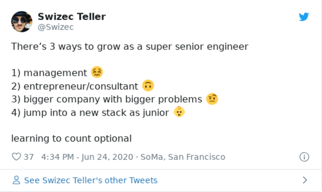

When you're starting out, growth is easy: Learn more about your tools, discover adjacent tools, get better at doing.

Then what?

You reach a point in your career when growth stalls.

Your problems stop changing, your code stays the same quality – good enough, ain't nobody got time for perfect – your stack is static and solves company needs. You're spinning wheels solving similar problem after similar problem.

Sometimes an exciting challenge crosses your desk.

5 minutes later you're yanked to a production issue. Or a mentoring question. Or a meeting with stakeholders. Or an urgent project that ain't got time for technology risk.

As _the_ experienced engineer on Product X, you're best suited for those.

Time to ask yourself

> Do you want 5 years of experience, or 1 year of experience 5 times?

If you ever worked at an agency, you'll know this deep in your gut. Every project is about the same as every other project. Details change, requirements evolve, the industry moves, but a website is just a website.

You might get faster, you might build tools, you may screen clients better ... but you're building the same thing day in and day out. 🥱

So how do you grow?

## Growing senior talent

Nurturing senior talent is a skill. An organizational skill. A skill many organizations lack.

Engineers come in at junior to mid levels. Stick around for a few years. Then leave.

And that's okay.

Not every organization _needs_ senior talent. You wouldn't pay someone an AI researcher salary ($500k+ in SFBA) to build a new landing page every 2 weeks.

So what do you do my friend? There's 3 ways to grow as a senior engineer:

1.  management
2.  entrepreneur
3.  bigger company with bigger problems
4.  become junior in new thing

Off-by-one errors notwithstanding, if you're happy with 1 year of experience 5 times. Go for it!

That's a very pleasant way to lead your life. Pays well, easy to do, leave work at work, spend time with the wife and kids and hobbies and whatnot.

You do you.

For me that feels like death.

I need a constant supply of new exciting challenges. Especially because coding is also my biggest hobby. You know, [Hackers](https://swizec.com/blog/hackers/) 😇

### 1) Management

As you become more experienced, start mentoring, and become a force multiplier for others, companies will push you into management.

This is natural.

You're already mentoring and helping out. You're already thinking about others' productivity. Why not manage them too?

From a company perspective this makes the most sense.

Senior talent understands the company, understands the process, and is bored with the problems. The company wants to try more things in parallel, not necessarily harder things.

So the company hires a horde of juniors and mids to do the grunt work that bores the seniors.

Who's gonna manage that horde?

😉

**But beware: this is a new career.**

### 2) Entrepreneur

You can always start a company. Consulting is a great option here.

Lots of new challenges, lots of new problems, lots of exciting new things to solve. You're gonna learn a lot.

But it won't be about technology or engineering.

Each new consulting client will teach you a little more about your craft. And a shitload more about consulting.

Each new product will make you a little faster at developing products. And a shitload better at product management, marketing, sales, copywriting ...

**Exciting, but a new career.**

You _might_ parlay this path into a principal engineer for hire. That can be fun.

Waltz into a company, analyze their problems, tell them what to do, champion some approaches, do some mentoring, then bounce. ✌️

### 3) bigger company with bigger problems

This path became clear one day in March while watching [Formula 1: Drive to Survive](https://en.wikipedia.org/wiki/Formula_1:_Drive_to_Survive) on Netflix.

> If they're good enough, they swim, they survive. And if they're not ... the pressure builds ... and builds ... and builds ~ Mercedes Team Boss

Mid-season drivers change teams. Negotiate new contracts. Make plans for next year. 2019 was special because almost every driver on the grid was up for re-neg. (documentary looks back 1 year)

And you know what most of them said? What was on their minds? Why they switched?

> I want to win. I know I got it in me. The fire is there. But this team can't get me there.

You enter F1 in a starter team. The back of the grid.

You're an F1 driver, the pinnacle of racing, and that makes you elite. But within F1, you're a chump. You have potential. You have _talent_.

But you need to [turn talent into mastery](https://swizec.com/blog/what-makes-you-a-true-master/).

Your car can't win. Your _team_ can't win. No matter how good _you_ are.

Prove yourself and you get to upgrade.

One day you reach Mercedes, Ferrari, or Red Bull. Then you're fighting for the championship.

The top 3 change every few years and it's never more than 3. If you're not driving for those, you ain't got a chance.

Something similar happens in technology companies. Startups in particular.

You can grow and grow and grow and then it just stops. You don't grow. You have nothing deeper to solve. No bigger problem. No bigger concern.

Maybe the startup isn't growing, maybe it grows by doing more not deeper, maybe it doesn't want to grow. Whatever it is, _you_ can't grow my friend.

Time to switch.

### 4) become junior in new thing

So you want 1 year of experience 5 _different_ times? 🤨

Great for diversifying your thinking. Learning Haskell had a huge impact on how I write JavaScript.

But should I jump into iOS? Nah, I'll never catch up.

You should expand, of course. Expand into adjacent fields. Fields where your expertise can help. Fields where you can augment your skills. Don't throw it all away and become junior.

Or do, I'm not your mum.

Cheers,  
~Swizec
