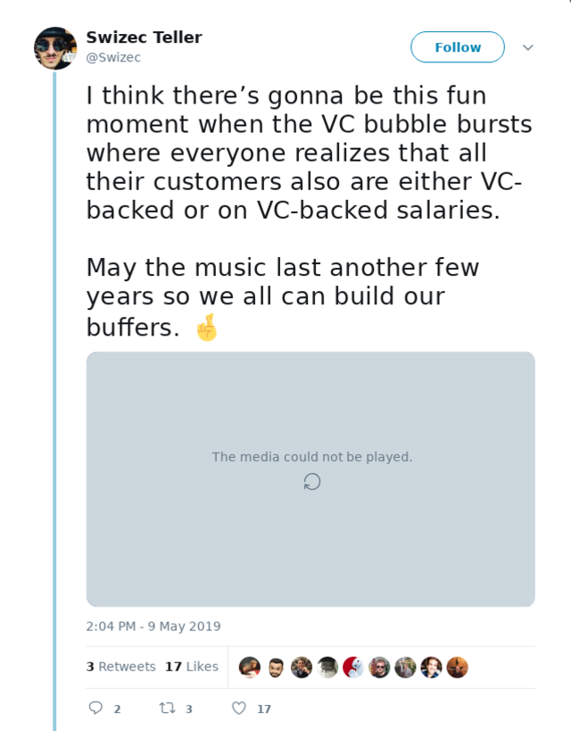
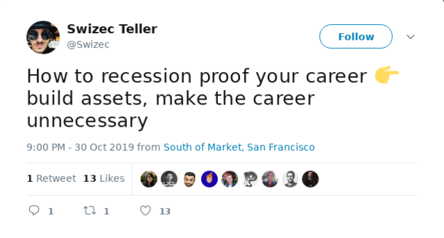
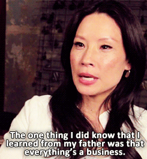
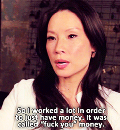
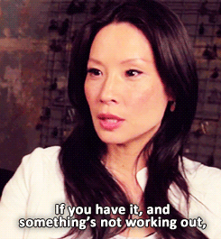

 Friend, the markets are going crazy, VCs are cashing out, and real estate is so low a schmuck like me can flirt with the idea of buying in San Francisco. 🤨

And I just got a notification from my bank that interest rates are down. Again.

_Something_ is going on. I&#x27;m not smart enough to know what, but it looks like people much smarter than me are battening down the hatches.

If you [search the internet](https://www.google.com/search?q=is+a+recession+comign&oq=is+a+recession+comign&aqs=chrome..69i57.2584j0j1&sourceid=chrome&ie=UTF-8) there&#x27;s widespread talk of a 2020 recession. Will it happen? Probably. Will it be bad? Who knows. What&#x27;s gonna trigger it? No idea.

The funny thing about recessions is that they always follow a period of unprecedented growth. We&#x27;ve had that for the last 10 years with a few corrections along the way.

The other funny thing about recessions is that they don&#x27;t happen unless everyone thinks they&#x27;re going to happen. Economy is doing smashingly well but folks are thinking maybe this is too much success and we should reconsider.

I&#x27;m too small of a fish to know what&#x27;s up. Here&#x27;s what I _do_ know:

1. We&#x27;ve had [_a lot_ of tech IPOs](https://www.cnbc.com/2019/10/10/a-wave-of-recent-ipos-will-soon-be-eligible-for-selling.html) this past year. That means investors (and employees with equity) want cash on hand.
2. The fed lowers interest rates to [stimulate economic growth](https://www.investopedia.com/articles/economics/08/interest-rate-affecting-consumers.asp), meaning there isn&#x27;t as much of it as they&#x27;d like.
3. Markets have been pretty darn volatile this year, although nowhere close to bitcoin 

Here&#x27;s a chart of the S&amp;P 500, the general indicator of how the US economy is doing. And since the US economy is everyone&#x27;s economy these days ...

Grey bars are recessions.

## _something_ is coming, so what?

An unfortunate consequence of recessions is that a few things can happen.

**You can have a complete market meltdown.** Similar to what happened with the dotcom bubble in the early 2000&#x27;s. As investment dried up companies realized they weren&#x27;t quite as profitable as they thought.

When companies started going out of business, other companies with good profits realized _&quot;Shit, the only reason our customers can afford us is because they&#x27;re burning investment cash ... and they don&#x27;t have it no more&quot;_

When that happens, **layoffs soon follow**. As companies fight to survive, the first thing they often do is lay off everyone who isn&#x27;t pulling their weight.

If you&#x27;ve got a cushy 6 figure software engineering job and you aren&#x27;t quite entirely certain how your work contributes to the bottom line ... I have bad news for you buddy. Sorry.

**You also get a [Cambrian explosion](https://en.wikipedia.org/wiki/Cambrian_explosion) of small business**

As talented highly skilled individuals like yourself find it hard to land the jobs they deserve (because no-one is hiring), they often turn to the only alternative: Business.

Why do you think most of the current tech giants are just about 10 years old? It&#x27;s because there was a recession 10 years ago and those founders couldn&#x27;t find jobs deserving of their talent. 😉

Why could they start those companies 10 years ago? Because people with cash on hand needed _somewhere_ to put it. Interest rates were low.

Who did we just say was cashing out and battening down the hatches for an upcoming recession? Oh yeah, everyone with a stake in those businesses.

## Build assets, not careers

A career is a job or a series of jobs throughout your life. You put in work and expertise and money comes out.

As you get better your salary grows. As you work on more expensive problems for bigger companies, your salary grows.

But your salary is always a thing that somebody else gives to you in return for your input. Not only are you not in control, you also stop getting paid, if you stop working.

An asset, however, **creates value when you aren&#x27;t looking**, is something you control, **and grows over time**.

Assets are more than just stocks and houses. Anything can be an asset, if you know how to use it.

This email list is an asset. There&#x27;s over 10,000 of you folks and some 25% open each email within a week. I can use that reach to sell products, build a brand, and even ask for jobs in a pinch. One of you is bound to know a guy who knows a dude who knows a gal who&#x27;s hiring.

Your brand is an asset. A list of good friends in the industry is an asset. Anything that helps you stand out from the crowd.

How hard do you think it would be for Dan Abramov to find a new job? Or for Swyx to reach high level folks at companies?

Just having that renown in the community is a _huge_ leg up. They&#x27;ve earned the right to a conversation with almost anyone. Huge.

That&#x27;s a brand.

**You can build a side business**. You know of a neat little problem, it&#x27;s not big enough for a unicorn, but it really stings the people who experience it.

Solve the problem! Build a solution, ask for $5 or $100 or howevermuch the solution is worth, and design a small marketing engine. Before you know it, there&#x27;s an extra \$1000 rolling into your coffers every month.

How much would an extra \$1000 per month help you out when your VC-backed employer goes poof? A little? A lot? Give you oodles of extra confidence? I thought so.

## Cash too is an asset

When everyone&#x27;s wealth goes down because of a recession, the person with the most wealth still has the most wealth.

Say you&#x27;ve got \$100,000 socked away in your savings. That&#x27;s a lot of money. Congratz 👏

If you put those dollars in index funds, they&#x27;ll grow at an average 6 to 7% per year. Perfect for your retirement.

But what if you need that money right now because you lost your job and need to weather through a recession?

Well my friend, you have access to $80,000 more than someone with $0 in their pre-recession savings. That&#x27;s a lot isn&#x27;t it?

Sure you&#x27;ll take a hosing if you take it out, but at least there&#x27;s something to take out. You can always save it back up later.

Even better is doing financial shenanigans. You can borrow against that $80k. Keep the $80k in your savings, borrow the \$30k you need to keep afloat while you look for a job, pay it off later.

That way you keep both the 7% \[average] growth _and_ have cash on hand. It&#x27;s how the rich people do it. **You never touch the actual money**

Where does the cash come from?

Yo, you&#x27;re a well paid software engineer. You&#x27;ve got the cash, you&#x27;re just spending it 😉

Think about your salary like an investor. If you get more cash, you&#x27;re going short on your company. If you get more equity, you&#x27;re going long.

Are you currently shorting your employer? If not, are you certain the long position is something your risk tolerance can take? Are you still shorting enough to cover basic needs _and build a fuck you fund_?

If not, please reconsider.

**Always build a fuck you fund.** A fuck you fund is the best asset you can have.

Happy Friday ❤️

Cheers,  
~Swizec
