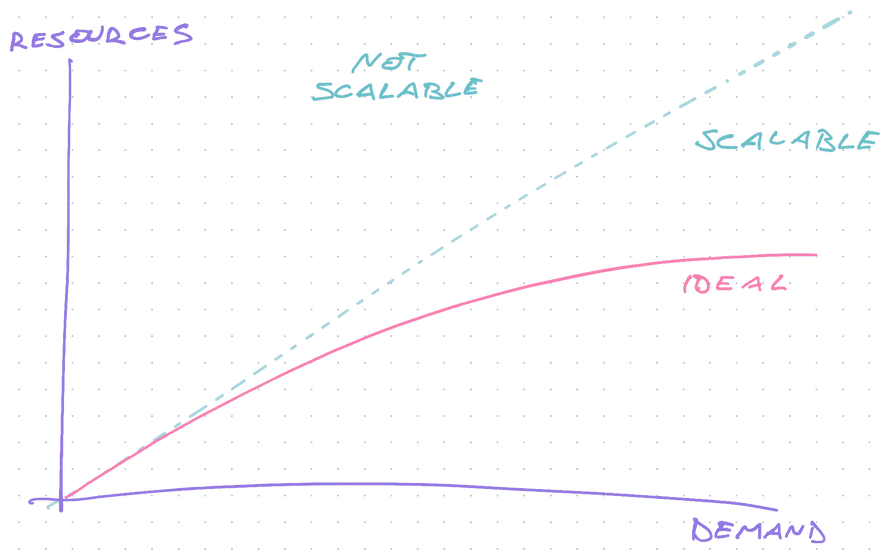

import { ContentUpgrades } from "@swizec/gatsby-theme-course-platform"

Friend, you can change tech later. Don't worry until you know it matters.

When you're in a company desperately trying to meet demand, _ship_. You'll have money, time, and professionals to fix code later. Even if you start with jQuery.

https://twitter.com/Swizec/status/1437833430381654016

This is the story of how I joined [Tia](https://asktia.com), a series A rocketship, to rewrite our web stack from jQuery to React while _increasing_ velocity, shipping new features, and growing to an [eye-watering $100,000,000 series B](https://www.forbes.com/sites/katiejennings/2021/09/14/this-startup-raised-100-million-to-bust-down-barriers-to-womens-health/). In a year.

We even got a shoutout from Nasdaq 🚀

## The backstory

Tia started as a chat app and search engine for women navigating the health system looking for answers to "weird" questions. Inspired by the founder's own story.

After 100,000 chats (talk about validation and market research, wow) the founders realized this won't do. To help women, you have to _help women_. You can't just send them into an unwelcoming health system.

They opened an in-person clinic in March 2019 and figured out a new type of health care. Whole woman whole health.

The clinic hit its monthly membership target in 6 minutes. 🚀

By May 2020 [Tia raised a $24,000,000 Series A](https://www.forbes.com/sites/berenicemagistretti/2020/05/28/fembeat-tia-raises-a-24-million-series-a-to-scale-its-online-and-offline-health-services-tailored-to-womens-needs/) to pour gas on their combined URL/IRL approach and build more clinics. Desperately trying to meet demand.

That's where I come in – June 2020. Looking for a rocketship to join, interesting challenges to solve, and to [grow as a senior engineer](https://swizec.com/blog/how-to-grow-as-a-senior-engineer-or-why-i-got-a-new-job/).

<ContentUpgrades.SeniorMindset />

## Why the rewrite

Tia always prioritized shipping over textbook perfection. Get your code to customers _now_, fix later if it works.

Our head of engineering wrote an entire health record system, from scratch, on a red-eye flight to New York to support the first clinic. It still works! Nobody wants to touch that code 😂

Before any engineers were hired, the early team picked jQuery and Pug running on Express to build the app. That's what they knew.

You can't wax poetic about technology when there's users banging down your door.

[Path dependence](https://swizec.com/blog/path-dependence-or-why-existing-code-always-looks-bad/) kicked in and by the time I joined, the code was a bowl of jQuery Pug spaghetti.

https://twitter.com/Swizec/status/1050860886754091008

Bugs were whack-a-mole, feature estimates were "1 forever", CSS scoping kicked your ass, a much needed UI re-design was like pulling teeth, and hiring new engineers was impossible. _"You want me to work on jQuery? In 2020? excuse me while I laugh you out of the room"_

The needs had changed. A lot.

As [Software Engineering at Google](https://swizec.com/blog/what-i-learned-from-software-engineering-at-google/) says, you can't scale 5x when every new engineer creates extra work for others. And when every spaghetti in your bowl of code pulls on another spaghett, guess what happens.

## How to rewrite safely

The decision was made to rewrite in React. But there were no React experts on the team. They hired me.

> Swizec, all new code is in React. No more jQuery. You get free reign to design our React ecosystem, figure out a migration path, and level up the team. No slowing down. Go.

Opportunity comes knocking dressed in overalls and looking like a shitload of work 💪

As Joel Spolsky said in a famous essay – [Rewrites are the dumbest thing you can do to a team](https://www.joelonsoftware.com/2000/04/06/things-you-should-never-do-part-i/). You will fail.

### 2 types of rewrites that never work

1.  Stop the world and rewrite. No new features, no business requests, no responding to market demands. We're rewriting.
2.  New team for new code. Core team keeps working, new team builds a replacement and when it's ready, you switch.

1 kills your business, 2 is _never_ going to catch up.

### The Ship of Theseus rewrite

> If you replace every piece of the boat with a new piece, is it the same boat? 🤔

You rewrite the app piece by piece with a focus on new features. Anything new happens in new tech. Anything old, if possible, gets updated when touched.

This is known as the strangler pattern.

You're chipping away at the old code until the tight embrace of new infrastructure strangles the old.

## How to rewrite fast

The strangler pattern for a webapp is best organized page by page. User clicks a link and gets the new app. New UI, better design, amazing performance, less jank. Wow 😍

Click another link and you're back to the old app. Meh.

This can be jarring _but it's okay_. As long as everything works and the new design has visual continuity with the old design. You don't think a BMW is no longer a BMW because they made it prettier.

_PS: the new BMW grilles are ridiculous, huge_

### The technical aspect

From a technical standpoint, the hard part was integrating a new React app with our existing ecosystem. I didn't want to blow up our devops.

We used these steps:

1.  A basic create-react-app setup in a subfolder
2.  Treat that folder as its own project, like a quasi monorepo
3.  Add a build command that compiles the app into static files
4.  Tell the Express server to route all `/prefix/*` requests to the compiled React app
5.  Use client routing with for `/prefix/*` URLs
6.  Build a proxy router in Express to pipe API requests from React to our existing microservices backend

From there, we could treat the new code as a typical React app with all the common tooling you're used to. Routing users between old and new code means sending them to the right URL ✌️

One day we'll go a step further and ensure those static assets work through a CDN instead of our Express server. It's fine.

The API proxy was needed for authentication and security. Express handles that just fine and it would be annoying to change.

### The new stack

The new stack focuses on fast iteration and ease of discoverability.

I wanted engineers to feel comfortable mucking about, find code quickly, and never have to keep huge context in their head. If you need to know about more than the file you're working on, something is wrong.

I wrote about those principles in [How we built a codebase engineers love](https://asktia.com/article/how-we-built-a-codebase-engineers-love) on the company blog.

To that end we used:

- [React Query](https://swizec.com/blog/how-react-query-gives-you-almost-everything-you-thought-you-needed-graphql-for/) for the data layer
- [Theme UI](https://swizec.com/blog/build-a-new-design-system-in-a-couple-afternoons/) as the basis for our UI library
- Storybook for isolated component development and light documentation
- React Router for routing
- TypeScript for consistency, autocomplete, and code discoverability

Notice there's no state library. You don't need that :)

React Query de-dupes your API requests and shares data between components fetching the same values. Even caches it to make your app feel snappy.

A perfect companion to my [Wormhole state management](https://swizec.com/blog/wormhole-state-management/) approach. Lots of custom hooks to encapsulate complexity and encourage reuse.

The in-house UI library means engineers can focus on features instead of fiddly design details.

We are now getting to a point where we'll need to start writing unit tests. TypeScript makes sure you aren't doing something dumb, but it can't test your logic. And the logic complexity is growing. 😅

### The team aspect

**All code is written with the best intentions and we wouldn't be here without it!**

https://twitter.com/Swizec/status/1438902518730289155

As the new hotshot on the team, you can never say that enough. The existing code is great! It works! It got the company to a huge Series A! You love it!

Without a bowl of spaghetti to fix, you wouldn't have a job. Without a validated business it wouldn't be worth fixing 😉

From there it's about education and making the new code accessible. Teach the team.

https://twitter.com/dargelies/status/1439009124214353928

_How_ to teach the team is an article for another day. We did a few internal workshops, lots of demos, a bunch of pair programming, shitloads of code review.

My favorite fix is to go gardening. _"Oh that's an interesting question, how can I fix the code so nobody asks that again?"_

And yes, we hired lots of new engineers with existing React skills. That helped. Now they're gardening too 👨‍🌾

## Did the rewrite work?

Tia was around 40 people and 6 or 7 engineers in 1 team when I joined. Now there's 190 people on slack and 16 engineers across 3 teams.

And we're a [$600mio company by valuation](https://www.forbes.com/sites/katiejennings/2021/09/14/this-startup-raised-100-million-to-bust-down-barriers-to-womens-health/) 🤯

https://twitter.com/Swizec/status/1439223577975214088

Evidently value was created. Would we have created more value without rewriting? I doubt it

Cheers, 
~Swizec

PS: When you're looking to join a rocketship, trajectory matters more than size. [Look for slope, not y-intercept](https://gist.github.com/gtallen1187/e83ed02eac6cc8d7e185).
