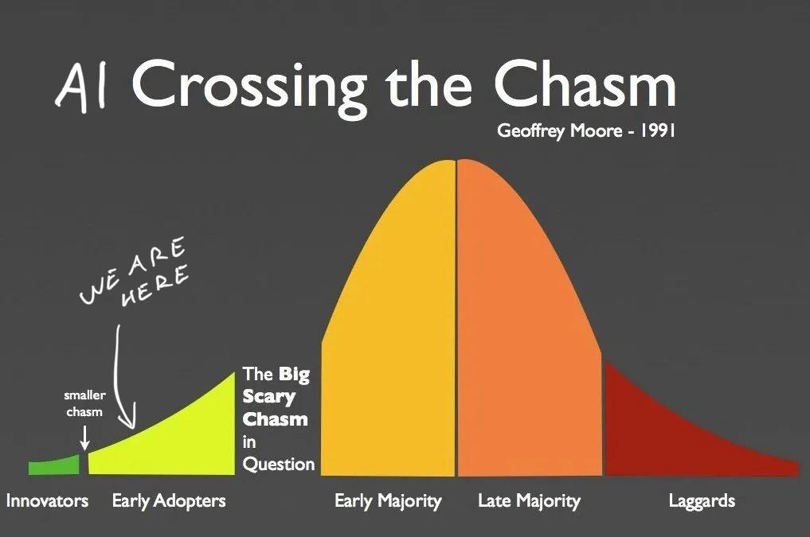

Generative AI is entering the next phase of Moore's [technology adoption cycle](https://en.wikipedia.org/wiki/Technology_adoption_life_cycle) – early adopters. Lots of people have been asking me for the quickest and cheapest way to get started. I'm writing this article so there's a link.

## Why start now

We are here:



Last year was the innovator gold rush. Before that was the pre-innovator research phase. We didn't really know what to do with large language models until someone figured out instruction tuning.

Now that you can say _"hey AI do this thing"_ it suddenly all feels useful and amazing. Although you should tamper your expectations \[name|], it's like talking to a wicked smart intern who makes lots of little mistakes.

But the output is useful. Mistakes and all. The field has come a long way since January 2023. Something about investors pouring [$50 billion into AI just last year](https://www.linkedin.com/pulse/rise-ai-funding-2023-venture-capital-phenomenon-david-borish-rok4c#:~:text=The%20year%202023%20marked%20a,in%20the%20years%20to%20come.).

## AI is useful, but far from perfect

At work I've used AI to summarize NPS surveys into high level summaries, write database migration scripts 🤫, and help with leet code puzzles that aren't worth my time. Like "write a script that iterates a directory".

For personal use I've:

- [built a Swiz chatbot](https://swizec.com/blog/how-i-turned-15-years-of-writing-into-a-chatbot/) that made me feel deeply understood but wasn't interesting to anyone else – that's the [Barnum effect](https://en.wikipedia.org/wiki/Barnum_effect)
- a [related articles feature for swizec.com](https://swizec.com/blog/how-i-added-a-related-articles-feature-on-swizec-com-using-gpt-4-embeddings/)
- made a tool that writes SEO descriptions for articles, tells me if an article makes sense, suggests improvements, and drafts a twitter thread
- built a script to analyze reader feedback

The copywriting is not good. Comes out squishy and boring to read. But it makes a great first draft. The summaries are fantastic when interpreted by a human who understands the material, and the code generation is pretty sweet after you fix a small bug or two.

## Easiest way to start

Here's the easiest way I've found to try if AI can do something. No license keys, no APIs, no signup. Everything runs locally on your machine.

1. You get [Ollama](https://ollama.com) for your machine. Supports Mac, Linux, and Windows
2. You grab [ollama-js](https://github.com/ollama/ollama-js) or [ollama-python](https://github.com/ollama/ollama-python) depending on preference
3. You [download a model](https://ollama.com/library). I suggest trying `ollama pull llama2` first
4. You fire up a script and run the model 👇

```javascript
import ollama from "ollama"

const response = await ollama.generate({
  model: "llama2",
  prompt: "<your prompt here>",
  systemPrompt: "You are <persona> helping <persona> with <task>",
  stream: true,
})

for await (const part of testimonial) {
  process.stdout.write(part.response)
}
```

This runs the `llama2` model on your machine, asks your question, and streams back the response word by word. If you're okay waiting in silence while the AI churns, you can set `stream: false` and console.log the response.

I like to run these with Bun. It's [the easiest way to run JavaScript CLI scripts](https://swizec.com/blog/bun-first-impressions/).

### Don't be afraid to experiment

You'll want to try a few different prompts. Word your question in different ways and see what works. Try different formatting too. The models seem to like markdown but sometimes simpler is better.

In AI papers they call this _"The prompt was discovered empirically"_. Everyone's just trying shit until it works 😉

### RAG is your friend

Retrieval Augmented Generation – RAG – is your friend. If you want to analyze documents, plop that bad boy right in your prompt and ask the model to analyze. `Here is a document about blah. What does it say about blah?\n\n<document body>` works wonders.

If you get nonsense responses, make sure your prompt includes the full body of your text. Not `[object Object]`. Happens to me every time. I like to print the full prompt before passing it into the model.

When you start having more content than fits the model's attention span this turns into a search problem. You'll have to get clever about how you choose relevant document fragments to include in the prompt.

### Try different models

Ollama is a large language model runner and model collection optimized for consumer hardware. The models that run on your machine aren't as good as the commercial stuff that requires huge GPUs to run.

But it's free and it's simple. That's why I like it for prototyping.

`llama2` is in my experience the best general language model that gets close in performance to ChatGPT. Great for summaries and okay at writing. Struggles with code.

Try other models. They have specialties! You'll have to change the `model: ` param in your generation call and you might have to change the prompt. Different models like to be spoken to differently.

### Caveats

Using Ollama is great for local experiments and making sure what you want is possible. Fast iteration cycles if you have a strong computer and no faffing around with cloud.

But it can be damn slow on an old computer.

https://twitter.com/Swizec/status/1764103976264650840

And it's very much _not_ production ready. You'll have to take your code and adapt to run in the cloud or call an API before you can ship to more than 1 user at a time.

### An example

If you'd like an example, here's a script I've been tinkering with to analyze newsletter and workshop feedback 👉 [analyze-feedback script](https://github.com/Swizec/analyze-feedback). Readme in progress :)

Cheers,<br />
\~Swizec
