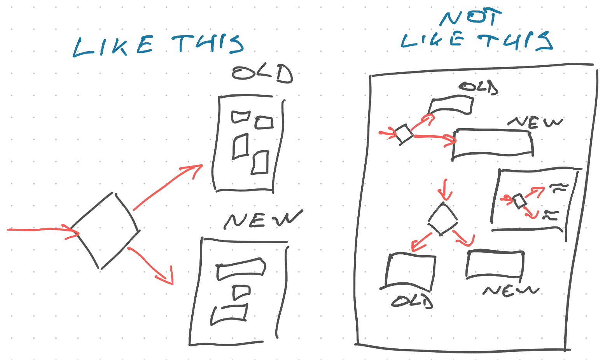

The first rule of feature flags is to use them as little as possible. If you can find any other way to work on your feature without exposing it all to users, do that.

https://x.com/Swizec/status/1798010890144628753

## Feature flags should be short-lived

Each flag _doubles_ the complexity of your code. The more flags you have, the exponentially worse it gets.

As you get used to this approach, you'll soon be working with code in your local environment that is set up for the latest and greatest, but vastly different from what your users can see. This is where weird bugs come from.

We had a fun incident once where we used a feature flag to build a quick seasonal feature nudging users to get their flu shot. Then a year passed and our PM said _"Hey did we ever turn that off? It was meant to be temporary"_.

Nope, feature was enabled and collecting useless data. You don't get a flu shot in June 😆

We turned off the feature and everything broke. The screen where we asked "Hey did you do the thing?" assumed the question was there and wouldn't let you proceed without answering. Turning off the question didn't turn off the form validation. Oops.

This is a classic feature flag leak. You build a new feature behind a flag, forget that it's flagged, then the rest of your code starts to assume the feature is always there.

I have not found a good way to combat this.

Best you can do is build a culture around scheduling regular time for code-deletion. Ruthlessly delete code when a flag has been enabled (or disabled) for a while and doesn't look it's going to change.

After a few months, it's unlikely the old version is coming back. Any "revert" will be a new feature in disguise. Safe to delete.

It's best if you can convince your product owner to schedule cleanup work on your regular roadmap because it makes _their_ life easier to keep track of fewer moving pieces.

## Use faux flags if you can

Faux feature flags let you avoid the cleanup problem all together. Instead of a feature flag, you can hide your work on a new page that users won't find.

Regardless of what your security experts say, users will not go around guessing URLs. And even if somebody stumbles on a new page that wasn't finished, is that a problem?

Users won't find your page, but you'll know where to go and will be able to test without fiddling with configurations. _And_ you can show what you're building to anyone by sharing a link.

A few major benefits of this approach are that:

- there's little to no overhead
- you can let anyone try the feature
- there's nothing to clean up later
- it forces you to cleanly separate versions

Once you're ready, you can add a user visible entry point to the new code. You could put _that_ behind a feature flag so you can carefully control who finds the new feature.

The URL-based implementation is web centric. For a native app you'll need a developer menu of some sort that lets you access hidden screens. For a server, you'd just make a new API.

## Use flags at the edges of your features

The best place to put a feature flag is _in front of your feature_. Even if that means duplicating your code.

You're planning to remove one of these branches soon. If the feature works, the old code will be deleted. If it doesn't, the new code will be deleted. You do not need to plan for the long-term maintenance of both branches.

Copy pasting your code is free. Detangling a rat's nest of components that try to fit multiple versions of a feature is ... not. I've seen people cry when trying to understand a function with 5 levels of nested feature flag conditionals all interacting with each other. It was me and it was a billing module which meant any mistake costs money.

When it comes to feature flags, forget Do Not Repeat Yourself and [focus on Separation of Concerns](https://swizec.com/blog/dry-vs-soc-a-difficult-choice/). You'll stop repeating yourself when you delete the code. It's fine.

One caveat if you're building enterprise software: It is common there to use long-lived feature flags that depend on your subscription level. The more you pay, the more power you get.

Even then I would recommend separating your branches as much as possible. Lean more towards separation of concerns than dry-ing up your code. You may have to fix things in multiple places, but your code will be easier to understand.

## Use flags to get early feedback

Beyond letting you build and integrate in peace with minimal unshipped work-in-progress, feature flags have another major benefit: Phased rollout.

A good feature flag implementation lets you control on/off states per user or cohort.

That means that while building, you can hand-select a few users to get an early preview of your new feature and tell you what they think. This could be a product manager, a trusted partner, or users who opt into beta.

You can get their feedback before the feature is even finished and let their usage shape your vision. This is a fantastic way to [kick the can](https://swizec.com/blog/writing-software-is-like-kicking-a-can/).

## Use flags to manage risk

When you're pretty sure the feature looks right, you can manage risk by slowly opening the spigot. We used this a lot when rewriting the signup flow – you don't want anything to go wrong there.

You know the code itself doesn't break your system because it's been running in production for weeks. And you know it works fine for a few hand-picked users.

Then you set the flag to 1% of all users and observe. Do your metrics tank? Does production data cause strange issues? Do you get a flood of bug reports? No, all good. Set it to 5%. Then 20%. Then ...

By the time every user gets the new feature, you know it works, you know people like it, you've polished the bugs, and optimized the behavior based on feedback. The last few cranks of your deploy ratio are a complete non-event.

## Give control to your product owner

And the best part: Your product owner can control the release. Let them work with other stakeholders to control the timing, align with any marketing, observe product metrics, and make sure the new feature is landing with users.

When they as the accountable person feel comfortable, they can ratchet up the release. Nobody likes accountability without control.

Throughout the release process, there's no engineering support required unless something breaks. You're free to focus on the next big thing 💪

Cheers,
\~Swizec
