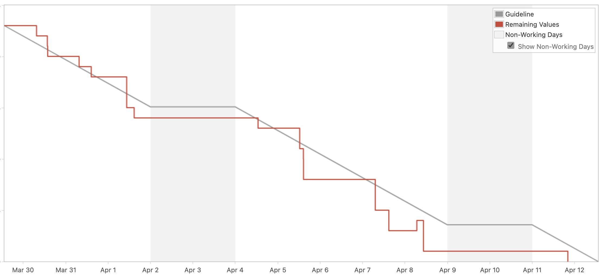

When my engineering manager joined the team I remember saying _"Don't worry about sprint estimates. In my entire career, I've never seen a sprint finished on time."_

He said: _"Oh I think we can fix that"_

18 months later, we made this beautiful [burndown chart](https://en.wikipedia.org/wiki/Burndown_chart) 😍

A burndown chart measures work remaining in a sprint. Grey line shows the theoretical ideal, red line shows reality. Each time you close a story, the line drops by its point estimate.

I've never seen a burndown chart more perfect than this. It ends with a day to spare, follows the grey line closely, _ahead_ of the grey line often!

Before you ask: No, this was not a small sprint. We had a full load with a quarter of the team out on vacation. At planning we even said we'll work a weekend if needed because of an important deadline.

## Why it went so well

We didn't want to work on the weekend so we had a perfect sprint instead 😛

The trick comes down to [WorkInProgress Kills Your Progress](https://swizec.com/blog/workinprogress-kills-your-progress/) and the [Theory of Constraints](https://swizec.com/blog/build-better-software-with-the-theory-of-constraints/). Here's what worked on a tactical level:

1.  **A real deadline** instead of a line in a spreadsheet. The whole company is going away for 3 days of culture stuff at a fancy resort. We didn't want to think about work during that time. Gotta finish before.
2.  **Small stories** – no even smaller than that. The sprint was full of small wrap-up tasks at the end of a long epic. Quick, easy to do, fast to review.
3.  **Work in sequence, not in parallel** enabled us to bang those small stories out. Pick one up, _finish_ it, move on to the next story. Burndown chart makes steady progress, creates momentum, keeps you going.
4.  **Bias to action** helps squeeze more juice out of a day. I don't know about you, but when I have 15min between meetings, they tend to wither away on Twitter and Imgur. This sprint I tried putting those chunks towards the invisible work. Quick question here, a helpful zoom session there, rapid code review, or smash the Merge button for someone with enough ✅ checkmarks. _"If you have time to lean, you have time to clean"_ style
5.  **Don't be a blocker** if you can spend an extra 5 minutes around the edges to unblock a story instead of letting it wait for tomorrow – do it. Boundaries are important, but an extra 5min of work can save 10 hours of waiting.
6.  [**Break the process**](https://swizec.com/blog/why-great-engineers-hack-the-process/) and merge your safe PR even if it has no reviews and nobody's available. Go on do it. Unblock yourself.

You can even validate a story instead of your product owner if she's busy and you've got her trust. Don't mess up 😛

Cheers, 
~Swizec

PS: I do _not_ recommend spending all your workdays in _"If you have time to lean, you have time to clean"_ mode. Save that energy for when it matters.

You can read a followup article here 👉 [Reader question: So about that perfect burndown chart ...](https://swizec.com/blog/reader-question-so-about-that-perfect-burndown-chart/)
