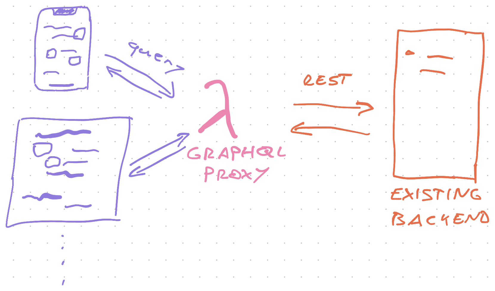
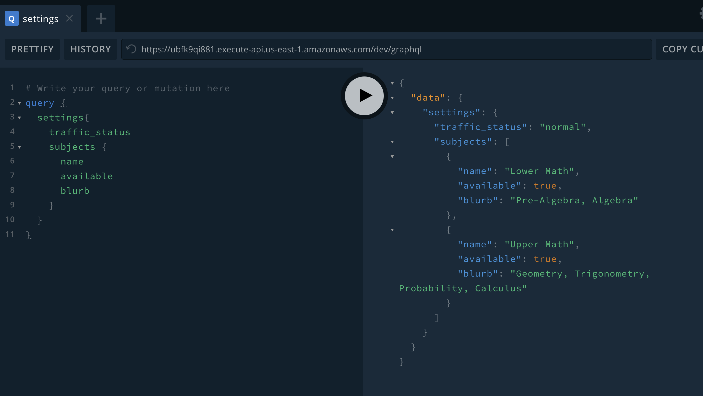

import { ContentUpgrades } from "@swizec/gatsby-theme-course-platform"

> GraphQL for new projects looks great ... buuuut how do you use it with that old backend cobbled together in Rails over the last bazillion years?

Can you write an async function that returns some data? Great! That's all GraphQL needs. 🤘

No seriously, it's _that_ simple.

You can connect GraphQL to your REST API instead of the database. Create a small proxy and start using GraphQL on the frontend today. No backend changes required.



We explored this idea on a stream 👇

https://www.youtube.com/watch?v=5d_CZHljxuw

Out came a proof of concept that took a 37KB payload from our production API at [Yup](https://yup.com) and turned it into this:



😍

## Why wrap a production API in GraphQL

37KB for _one request_ isn't even the biggest API payload we've got. It's just the most common 👉 _our entire settings object_.

Nobody even knows which of those fields are still in use. Can't remove any because you might break an old client.

So forever more every client gets every setting that any client in history ever needed.


With a GraphQL proxy, each client can take just what it needs.

It works like this:

1.  Client sends GraphQL query
2.  GraphQL proxy gets query and maps it to the `settings` resolver
3.  Resolver makes `fetch()` request to API
4.  API returns full settings object
5.  GraphQL machinery matches object to query
6.  Proxy returns only the requested data

Want to combine multiple API requests into one? Now you can! Just send 2 queries in 1 request.

Users get a faster app and lower bandwidth usage.

You get an easier coding experience on the client _and_ you empower frontend engineers to make better decisions.

Worried about the overhead of a GraphQL proxy?

Many requests can be cached and don't even have to hit your real backend.

<ContentUpgrades.ServerlessHandbook />

## How to wrap a REST API with GraphQL

1.  Create a GraphQL server
2.  Write query resolvers that poke your API
3.  Build GraphQL type definitions from your payloads

That last part is tedious, I'm sorry.

Wittern et al talk about [Generating GraphQL-Wrappers for REST APIs](https://arxiv.org/abs/1809.08319) in a 2018 paper, but I haven't found a good implementation in the wild yet. [Hasura](https://hasura.io/) looks like a great approach, but they convert your Postgres schema into a GraphQL API, not your client-facing API.

How related are your Postgres and your REST API really? I bet you build those payloads from SQL queries, environment variables, helper methods, and all sorts of stuff.

WalmartLabs created a [JSON-to-GraphQL](https://walmartlabs.github.io/json-to-simple-graphql-schema/) library that works well for a first pass. I used it on the stream.

You could create a crawler that goes through your API and builds GraphQL type definitions. 🤔

## Build a proof-of-concept to impress your boss.

After harping on and on that we need GraphQL and it will solve many of our problems, my team started getting tired of my shit. We can't do it, it's too hard, we don't want to change the backend, we ... screw you I'm building it.

here's what I found

[full code on Github](https://github.com/Swizec/graphql-rest-proxy)

### serverless.yml

Host on AWS Lambda so you don't have to deal with servers. Focus on the code.

```yaml
service: yup-graphql-proxy

provider:
    name: aws
    runtime: nodejs12.x
    stage: dev

functions:
    graphql:
        handler: dist/graphql.handler
        events:
            - http:
                  path: graphql
                  method: GET
                  cors: true
            - http:
                  path: graphql
                  method: POST
                  cors: true
```

Run `sls deploy` and you get a server that runs your `graphql.handler` method on every GET and POST request.

### graphql.ts – Apollo AWS Lambda server

Apollo is great for building GraphQL servers. Good community support, integrates well with Lambda, great developer experience. 👌

```typescript
// src/graphql.ts
import { ApolloServer, gql } from "apollo-server-lambda";
import { APIwrapper } from "./APIwrapper";
import { settingsSchema } from "./schema/Settings";

// this is where we define the shape of our API
const rootSchema = gql`
    type Query {
        // queries – GET api
    }
    
    type Mutation {
        // mutations – POST api
    }
`;

const typeDefs = [rootSchema, settingsSchema];

// a convenience wrapper for your API
const API = new APIwrapper();

// this is where the shape maps to functions
const resolvers = {
    Query: {
        // query resolvers go here
    }
    Mutation: {
        // mutation resolvers go here
    }
};

const server = new ApolloServer({ typeDefs, resolvers });

export const handler = server.createHandler({
    cors: {
        origin: "*", // for security in production, lock this to your real endpoints
        credentials: true
    }
});
```

This creates a GraphQL server. Send a POST request and it maps queries to resolvers. Send a GET request and you see an Apollo playground so you can try your queries.


### schemas

Schemas represent the shape of your API.

This will take some manual work. I recommend a Query for every GET endpoint in your API and a Mutation for every POST/PUT/DELETE etc.

Then use something like the [walmartlabs schema generator](https://walmartlabs.github.io/json-to-simple-graphql-schema/) to build type definitions for each endpoint. Some might overlap and that's okay.

To keep code organized I recommend 1 schema file per endpoint – `src/schema/Thing.ts`. Like this

```typescript
src/schema/Settings.ts

import { gql } from "apollo-server";

// schema generated with: https://walmartlabs.github.io/json-to-simple-graphql-schema/
export const settingsSchema = gql`
    type Reactions {
        name: String
        emoji: String
        label: String
    }

    type Subtopics {
        id: Int
        name: String
        label: String
    }

    type Subjects {
        id: Int
        name: String
        blurb: String
        available: Boolean
        
// ...
    }
`;
```

There's 300 lines of this crap. You don't wanna write it by hand from scratch 😅

A crawler could be a good idea. Something you point at all the different endpoints and it collects those schema definitions.

You'll have to consolidate and clean up by hand.

### combining all those schemas

Get all your schemas imported and into an array, pass them into ApolloServer as type definitions.

```typescript
// src/graphql.ts

import { userSchema } from "./schema/User";
import { settingsSchema } from "./schema/Settings";

const rootSchema = gql`
    type Query {
        user: User
        settings: Settings
    }
`;

const typeDefs = [rootSchema, userSchema, settingsSchema];

const server = new ApolloServer({ typeDefs, resolvers });
```

Query `user` returns the `User` model, `settings` for `Settings` etc. Build a mapping that makes sense for your API.

Remember that you can `extend type` in any schema to extend existing types. Great for adding queries and mutations.

### map queries to REST requests with resolvers

Resolvers are where you map queries to data. Any data from anywhere. 🤘

For my settings proof-of-concept, it looks like this:

```typescript
// src/graphql.ts

const API = new APIwrapper();

// this is where the shape maps to functions
const resolvers = {
    Query: {
        settings: async () => {
            await API.login();
            return API.settings();
        }
    }
    // Mutation: {}
};
```

An API wrapper helps with authentication, staying logged in as a user, and sending the right headers with each request.

The `API.settings()` method sends a fetch request to `/api/settings` and returns the payload.

```typescript
// src/APIwrapper.ts

import fetch from "isomorphic-fetch";

export class APIwrapper {
    headers: JSONBlob = {
        "Content-Type": "application/json",
        Authorization: `Token token=<auth_token>`,
        Accept: "application/json.v2"
    };

    async settings() {
        await this.login();

        const settings = await fetch("https://swizec.ngrok.io/api/settings", {
            headers: this.headers
        }).then(res => res.json());

        return settings;
    }
}
```

Hardcoded to my dev machine because this is just a prototype. You'd want that to be a setting or environment variable of some sort.

The headers also are hardcoded and I stripped the token before sharing.

My login method also is quite ratchet. It uses a demo user's email/pass combination to fake logging into the server. 🤣

```typescript
async login() {
    if (this.headers["X-Has-User-Account"]) {
        // already logged in, keep going
        return;
    }

    const response: LoginResponse = await fetch(
        "https://swizec.ngrok.io/api/login",
        {
            method: "POST",
            headers: this.headers,
            body: JSON.stringify({
                user: {
                    email: "admin@localhost.com",
                    password: "Password1!"
                }
            })
        }
    ).then(res => res.json());

    // add login stuff to headers for other methods
    this.headers = {
        ...this.headers,
        "X-Has-User-Account": "true",
        "X-User-Known-Key": response.identifier,
        "X-User-Authentication-Token": response.access_token
    };
}
```

You'll need to figure this part out for yourself. Authentication depends on your backend implementation. You might not even need it for some requests.

## And that's how you wrap your REST API in a GraphQL

1.  GraphQL server
2.  Turn payloads into schema
3.  Map queries to endpoints

Where it gets tricky is preserving end-user authentication. You'd need to get cookie/token information from the client or run the login process through your proxy.

Large POST requests could look weird too.

We have some endpoints that accept a JSON blob with tens of parameters. Several kilobytes of data. Stuffing all of that into mutation arguments feels funny.

Maybe you could have 1 parameter that accepts a JSON string 🤔

If you decide to go down this route, expect a schlep followed by _"Yay we have GraphQL now"_ from everyone else on your team. You'll be their hero.


I think it's worth it.

Cheers,  
~Swizec
