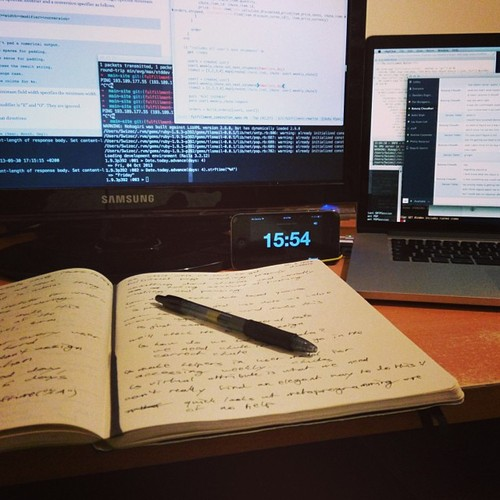
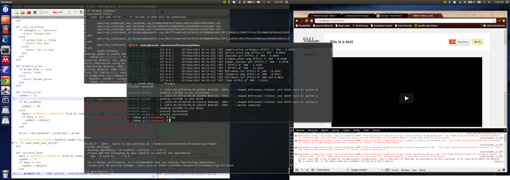
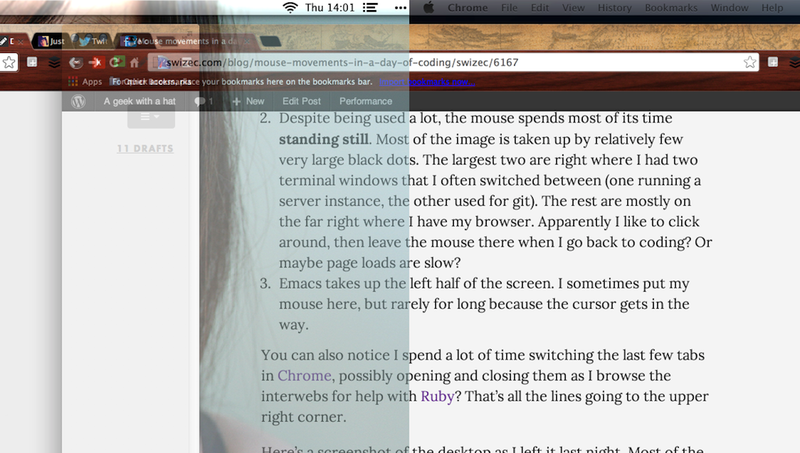

****\_\_

- launcher opens on screen you are currently working on
- the same top menu bar is repeated on both screens
- start menu, or dock, or whatever you call it, can be on both or just one screen depending on config
- you essentially have one big screen
- windows can be dragged seamlessly between screens
- windows can be placed across both screens
- desktop switching treats the whole workspace as a unit
- exposé feature shows windows on each screen
- dialogs open on active screen

\_\_

## Enter [Apple's](http://www.apple.com "Apple") [Dual Screen](http://en.wikipedia.org/wiki/Multi-monitor "Multi-monitor")

The first time I used dual screen on a Mac was a few years ago. I was shocked and horrified. The concept of having a main and a secondary screen was paramount to the experience. One monitor was The One You Are Using. It contained the top menu bar, the dock and whenever an app opened a new window or dialog, that's where it would appear. Even Quicksilver always opened there. A few months ago I tried again and Apple had greatly improved. Sure they still thought I had a main and secondary screen and would only launch new apps on Main, but at least apps opened new windows and dialogs on the active screen. This was the old way.

- menu bar is on main screen
- dock is on main
- a Space (desktop) spans both screens and acts as a single workspace
- new apps only open on main screen
- disconnecting a screen causes some weirdness
- active corners are for both screens as a whole
- windows can be dragged between screens flawlessly
- windows can span both screens
- screenshots create two images - one for each screen

The situation has improved since my first try, especially regarding app dialogs and new app windows appearing where I'm actually looking. This system worked very well. If only they fixed those issues with new apps, menu bar and the dock ...

## Enter OS X Mavericks

- both screens are main
- menu bar on both, dock on both
- launching apps works the way you expect
- dialogs and new windows open where you want
- two screens are no longer a cohesive unit
- windows can't span screens
- windows try too hard to show the transition between screens
- you have to switch each screen's desktop separately
- active corners on both screens
- exposé and such affect both screens at once
- disconnecting a screen doesn't cause weirdness

There is an option on [Mission Control](http://en.wikipedia.org/wiki/Mission_Control_%28OS_X%29 "Mission Control (OS X)") settings to turn off separate desktops for each screen, but that also turns off the new features I do like. Apple's new dual screen support is a mixed bag of good and bad. Ideally we could have features from both worlds, but maybe they intend to fix this soon? I sure hope so. I'm giving the new way a few more days and if I can't get used to it, I'm switching back to the hell of having a secondary and a main screen. But at least Mavericks fixed the bug that disconnected wi-fi every time my screen went to sleep.

