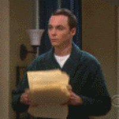

You know what's the best way to learn a new technology?

Build something.

You know the best way to stand out as a job applicant?

Build something.

Best way to make $1000/month on the side?

Build something.

So why aren't you building something my friend? Why isn't there a little passion project in your life that occupies your nights and weekends? Why aren't you jumping out of bed every morning to do a little hacking before dayjob.exe starts?

Let me guess: You don't have an idea?

Poppycock.

## "I don't have an idea" is the commonest excuse

You're not alone.

I remember talking to a friend a while ago. She was going through a life transition. Changing jobs, leaving the safety of a startup that jump-started her career, figuring out what to do next.

_"Well, what do you want?"_, I asked.

_"What I really want is to start a business"_

Okay then do it. You're well connected, just start.

_"Yeah but I don't have an idea"_

She got a job at an early-ish stage startup. Owns a product category. Kind of like a baby startup within a startup. It's pretty cool.

Hell, a few years ago I was grabbing coffee with a founder friend. Downtown San Francisco, beautiful day, okay coffee. Back then the city felt like an exciting wonderland full of opportunity. The future. Now it just feels like home.

_"Swiz, you're wasting time with this freelancing nonsense. You're a great guy, why don't you just start something real?"_

_"I don't have an idea."_

End of conversation.

## Why we say we don't have ideas

I think it's because we're afraid. It's easy to say you don't have an idea.

Nobody can fault you for not starting, if you don't have an idea. What're they gonna do? Force you? Point and laugh? Call you silly?

No of course not. _"I don't have an idea"_ ends the conversation.

You can't start without an idea.

But really, I think you _do_ have ideas my friend. I think you have plenty of ideas. You're just afraid.

Afraid they're not big enough. Afraid you'll fail. Afraid you can't do it. Afraid others will judge you. Afraid you'll waste your time.

Afraid.

It's easier never to start. Safe in your mind that little kernel of idea stays perfect. Unchanging.

Nobody will ever know but you. You always could've been great, you just didn't have an idea.

Struck a nerve? Hit reply

Cheers,  
~Swizec

PS: tomorrow we'll talk more about ideas and how they work
