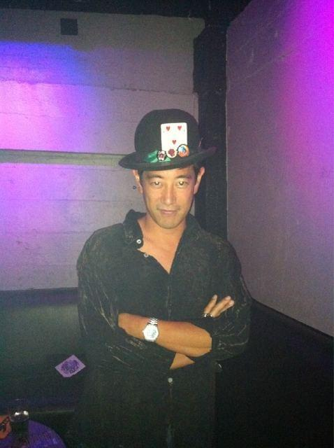

Today I learned that despite being an utter geek, I really like doing creative things outside. Was at Pier 2 in San Francisco this morning after a night of partying at DNA Lounge and it turns out turning on my iPad and mashing out the [750 words I write every morning](https://swizec.com/blog/750-words-a-day-keeps-the-insanity-away/ "750 words a day keeps the insanity away") on the portable keyboard is one of the most fun things I've ever done.

The view in sunny weather is really brilliant as well.

Another thing I learned is that Grant Imahara is a really cool guy. He was at the club and reacted really well to my going disturbing his date to ask for a photo of him with my hat. I shall attach photographic evidence of this fact ... as much as it's poor form to post party pictures of people on the internet, this just takes the cake. Definitely the highlight of my summer :)

Bonus thing I learned: with both curl and allow_url_fopen disabled my blog is brilliantly fast but half of it breaks. Not even [my awesome footer](https://swizec.com/blog/my-new-footer-gives-you-a-glimpse-into-my-life/ "My new footer gives you a glimpse into my life") works!
