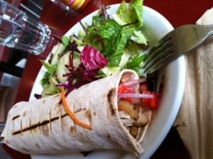

\[caption id=&quot;attachment_2269&quot; align=&quot;alignright&quot; width=&quot;300&quot; caption=&quot;Vegan food&quot;]\[/caption] Today I learned that despite being the biggest carnivore you are likely to meet I can actually enjoy a vegan lunch when it&#x27;s done right. Was on a shopping spree in San Francisco today because I need some clothes and they&#x27;re somewhat cheap this side of the pond. Part of the trip involved lunch and we went to an interesting place on Valencia called [Herbivore](http://www.herbivorerestaurant.com/). It&#x27;s a fully vegan restaurant that actually serves good food. The fake chicken I ate was so awesome I would never have guessed it wasn&#x27;t real chicken if I didn&#x27;t know in advance. Another thing I learned is that in the US it is in fact possible to get pulled over by a cop while riding a bicycle. Got confused at a very big crossroads and somehow ended up running a red light in a very very confused manner. Wanted to go left, but I couldn&#x27;t, then the lights started changing and everything went south quick. Whoo-whoop from a police bike and I was explaining myself to a cop. Got out scot free simply because I&#x27;m foreign and weird, but was told in a very sarcastic manner that here in the US you are supposed to stop when the light is red :D
