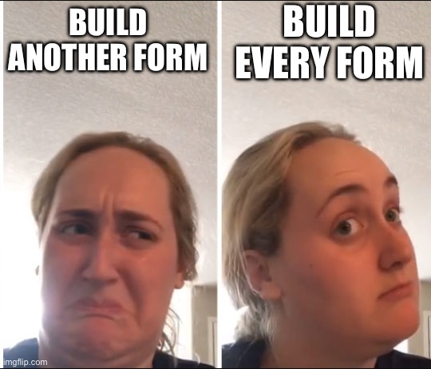
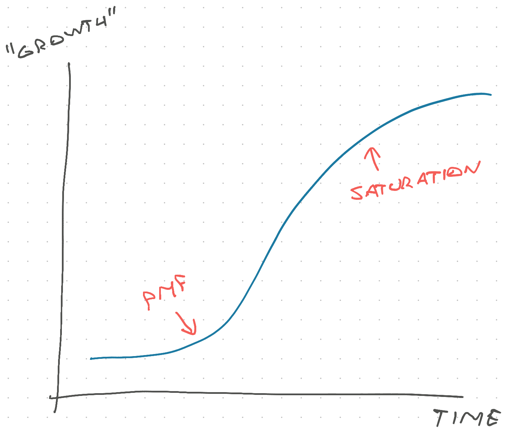
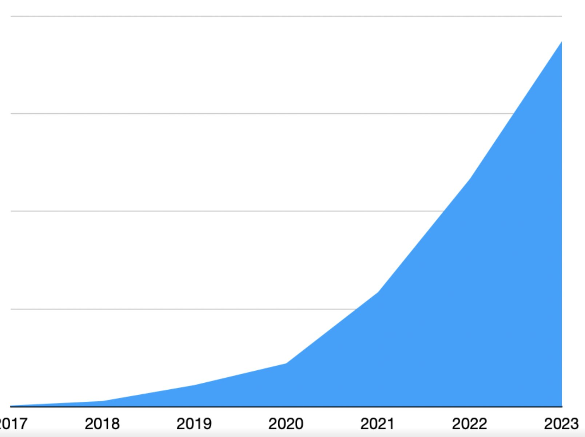

Do you ever look back on your life and think _"Wow, I barely know that person. So much has changed"_? And no I don't just mean the pandemic giving us all a reality check.

3 years ago I was a frustrated engineer at a zombie startup. The company was going nowhere and you could feel it. The challenges were insufficient and as much as management tried to conjure up problems big enough to keep us entertained, it doesn't work that way.

Then I changed jobs, went through a rapid hockeystick (20x growth in paying users), and lived to reflect on the experience. I feel like a different person. Maybe this reflection helps you in your career.

## Sign: Inventing problems

When you're bored, you can make an easy thing more hard by [solving a different more difficult problem](https://swizec.com/blog/solve-the-problem-not-a-different-more-difficult-problem/). That will keep you entertained for a while, but it's not the same as solving fundamentally difficult problems in a challenging environment. Your monkey brain will see through the ruse.

It was in that environment that I hallucinated myself into [why you should build a form generator](https://swizec.com/blog/why-you-should-build-a-form-generator/). Building a form is boring, but building a tool that can build _every_ form? Now we're talking!

That's what I mean by solving a different more difficult problem :)

If you ever find yourself having endless technical debates and making things more complicated than they need to be, run! Go somewhere that makes you deliver user value. Preferably something users pay for.

Friends don't let friends build [hammer factory factories](https://gwern.net/doc/cs/2005-09-30-smith-whyihateframeworks.html). Thanks to every reader 3 years ago who replied with _"Sorry Swiz but you're wrong"_.

## How engineers grow

I didn't realize it at the time, but that form builder was a sign it's time to move on. 2 months later I had a new job and wrote [How to grow as a senior engineer or why I got a new job](https://swizec.com/blog/how-to-grow-as-a-senior-engineer-or-why-i-got-a-new-job/).

My thesis was that senior engineers hit a growth wall:

> You reach a point in your career when growth stalls.

> Your problems stop changing, your code stays the same quality – good enough, ain't nobody got time for perfect – your stack is static and solves company needs. You're spinning wheels solving similar problem after similar problem.

> Sometimes \[rarely] an exciting challenge crosses your desk.

And then it's time to ask yourself: _"Do you want 5 years of experience, or 1 year of experience 5 times?"_

You can solve this in one of 3 ways

https://twitter.com/Swizec/status/1275829781259358213

Management is a different job. Entrepreneurship is a different skill-set. Re-junior-ing looks boring after a certain age. Bigger company with bigger problems!

## Join at the bottom of an S-curve

Business follows an S-curve. Starts off slow, grows super fast, then slows down again. Your timing matters.

The S-curve rules your career whether you like it or not.

That initial take-off is called Product Market Fit. It feels like you're being strapped to a rocket and getting pulled by the market. You're building as fast as you can and barely keeping up.

The slowdown comes from saturation. Your current approach reaches its limit and the rocket slows down. You have time to breathe, talk about technical debt, and over-complications start to creep back into your work.

You can start a new s-curve by launching more products or expanding into different markets. But that's for the business side to figure out.

You as an engineer just gotta make sure you're there at the bottom of an S-curve. Even joining a new team with a big mission within the same company can work.

## How the hockeystick made me grow

Here's what I mean when I say _"5 years of experience vs 1 year of experience 5 times"_.

3 years ago I was an engineer grinding pointless technical problems twiddling my thumbs while The Business figures out what we want. Then I joined an exciting opportunity that looked like a scary fuck-load of work.

Then this happened:

So much has happened that I didn't even write about it all. Deep skin-in-the-game experience that you'll only know if you ask.

### Experiences that could fill a small book each

We [re-built the core webapp from scratch](https://swizec.com/blog/how-to-rewrite-your-app-while-growing-to-a-dollar100000000-series-b/) and moved our software from serving 1 physical location to, I think, 10 across many markets. Lots of domain modeling challenges there.

We grew the engineering team from 7 peeps to an engineering org of 25 across 5-ish teams. I personally interviewed 200+ candidates. Our clinical providers grew from 20-ish to 400-ish. That was fun to code for.

Our engineering has matured! Plenty of insights from [Software Engineering at Google](https://swizec.com/blog/what-i-learned-from-software-engineering-at-google/) that I now have visceral experience applying. Like how to scale code review, build teams that don't block each other, and encourage coding standards without burning out.

We went from monthly-ish difficult to co-ordinate deploys to multiple deploys per day. Adopted feature flags across the org, taught product managers [how to treat us as equal partners, not code monkeys](https://swizec.com/blog/working-with-product/), got engineers to better understand stakeholders, adopted standard incident response tactics, instrumented everything to know what's going wrong, and lived through every lesson in The Unicorn Project.

## Engineering is so much more than code

It's one thing to know that engineering is more than programming. But it's quite another to _feel_ it. Viscerally.

Coding has become such an easy part of my job that I'm not even sure what to call myself anymore.

\~Swizec

PS: I refuse to admit 2020 was 4 years ago, much of that year doesn't even count as real time 😖 Plus the article sounds better as "3 years ago"
