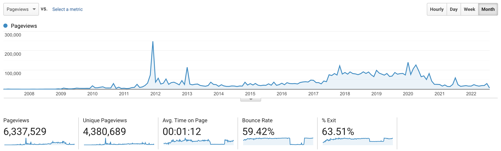
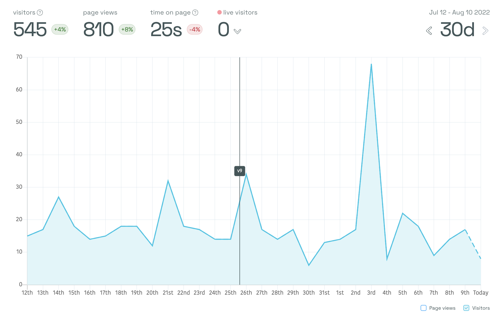
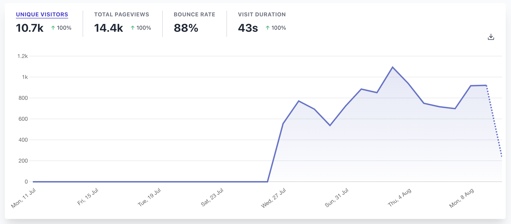

swizec.com has been around since 2005. For 15 of those years, it's been running Google Analytics to give me a sense of _"Is anyone out there?"_.

Publishing into the void is hard. Analytics tell you whether anyone's reading. Some months I cared more, others less.

You can tell by the traffic drop in the past 2 years that I haven't cared too much for a while. My email readers feel more important.

Hustling for traffic has lost its charm. Chasing keywords (technologies) that play with The Thing Of The Day got tiring. Not to mention I switched [from Wordpress to Gatsby](https://swizec.com/blog/how-to-export-a-large-wordpress-site-to-markdown/) and wow did I not realize how much free SEO you get with Wordpress 😅

We're fixing that. Slowly.

## Google Analytics does too much

Google Analytics started as a simple solution to a simple problem – you get pageview and visitor counts, Google gets data about the web. A fair trade.

Analytics back then were backend based. Servers counting requests with zero clue whether those requests are people, web crawlers, spam bots, or script kiddies looking for hacks.

Google solved that by moving analytics into JavaScript. _"If a user loads and runs your entire page, they must be human"_ the thinking went.

This is no longer true.

Google Analytics now loads 20kb of compressed JavaScript. Unpacks to 50kb 🤯 What's in there? Lots of privacy busting features I bet.

https://twitter.com/Swizec/status/1552693710541819905

These days Google Analytics do a lot. Tracking users in great detail as they navigate your site, before they reach your site, after they leave your site. Google knows all.

The goal conversion and sales tracking you can set up blows my mind. And I never once in my life figured out how to set it up right. Shit's too complicated.

I want to write good articles. I don't care to become an analytics expert.

## Moving to Google Analytics v4 is a shitshow

Lately Google Analytics has been pushing version 4. A newer better stronger faster ultra customizable alternative.

It started as a _"Hey you should try this"_.

I did. Couldn't get it record even a single pageview.

Last month it got pushy. _"You gotta try this, we turn off your current analytics in a year. There is no migration path."_

Wait what there's no migration path?

Okay fine. I spent a weekend adding GA4 to a test version of swizec.com. It recorded not a single pageview. Couldn't figure it out.

My friend who works in the SEO industry says GA4 is great for experts. He gets to set up all new dashboards from scratch for every client. Weeks of work. But you get to super fine-tune everything!!

Screw that.

## Better alternatives exist now

I've been using [Simple Analytics](https://www.simpleanalytics.com/) on a few websites for a while. It's one of the first privacy-focused analytics tools showing up to buck the Google Analytics trend.

It's okay. Does what I need. Never grew on me. Not sure why.

A couple weeks back I heard about [Plausible](https://plausible.io) on Twitter juuust as I was giving up on Google Analytics v4.

https://twitter.com/TkDodo/status/1550846975192465410

Simple, fast, privacy first, GDPR compliant, does what I need? Heck yeah sign me up!

Plausible loads a grand total of 1kb of JavaScript to do its thing. 20x less than Google 😍

And event tracking, like a reader subscribing to email, is a quick `window.plausible('Email Signup')` away. I have functioning conversion tracking for the first time in 17 years! Could never get it to work before and with Plausible it worked on my first try 💪

## GDPR and cookie banners

You need a cookie banner to use Google Analytics. It tracks users so hard the EU said _"Enough of this nonsense. At least annoy them into agreeing first!"_

I hate those banners and swizec.com was not GDPR compliant. Sorry.

Now it is. Without banners. Because there are no cookies and no user tracking. Thanks Plausible.

Cheers, 
~Swizec

PS: I care about your privacy so much that my site uses [privacy-first static tweet embeds](https://swizec.com/blog/build-privacy-focused-blazing-fast-tweet-embeds-codewithswiz-30/) and [lite-youtube embeds](https://swizec.com/blog/2-quick-tips-for-250percent-better-lighthouse-scores-codewithswiz-28/). GA was the last cookie this blog was setting.

PPS: I think the size of Google Analytics wouldn't bug me nearly so much if their devrels weren't constantly harping on performance and JavaScript size
