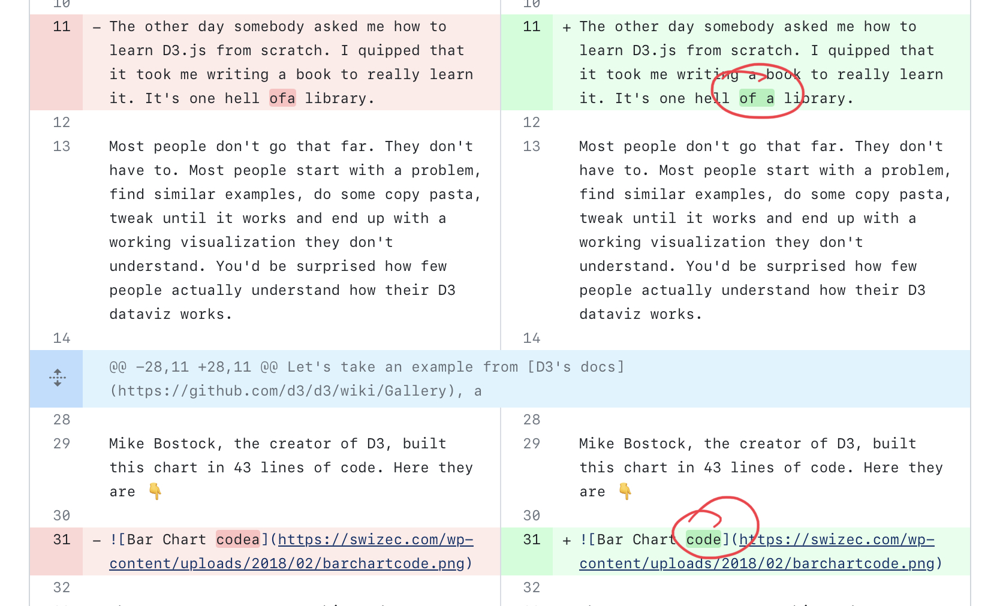
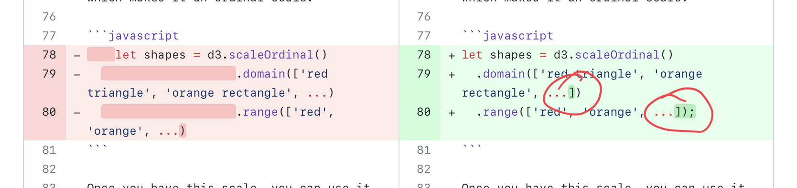
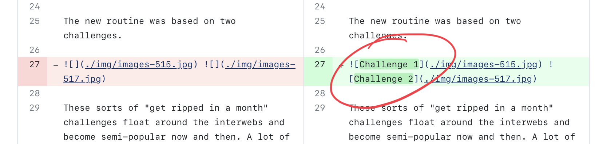
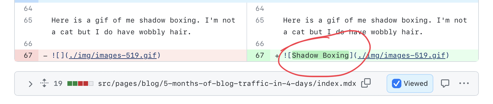
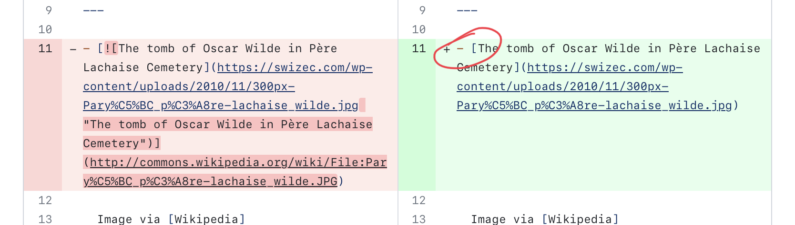
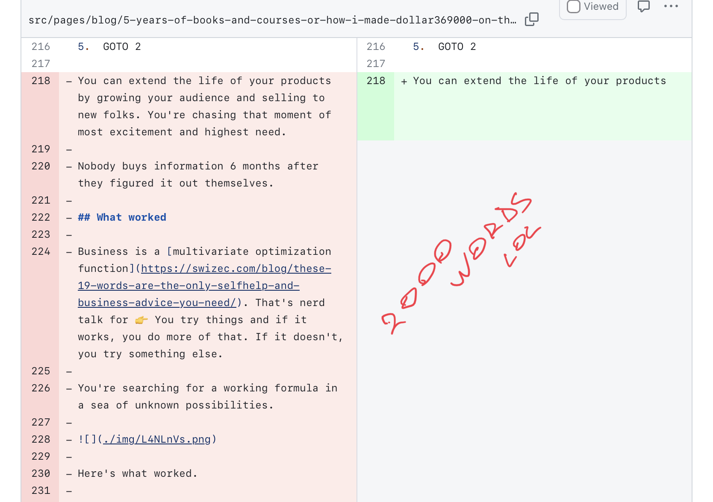
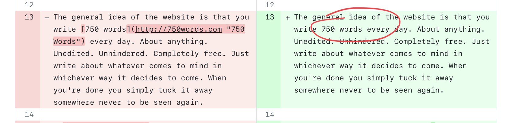
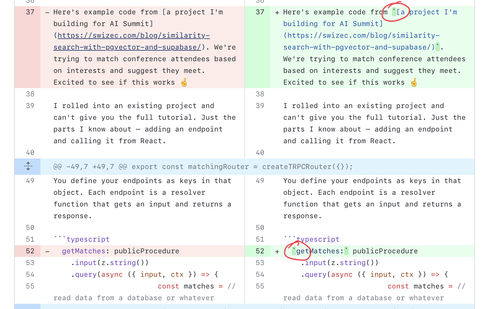
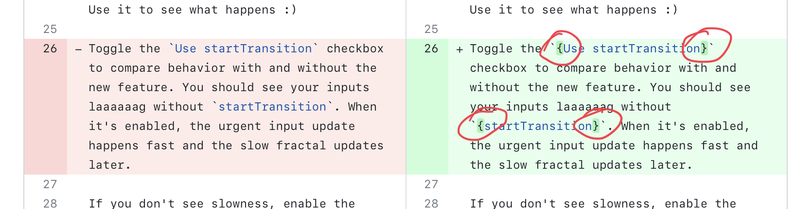
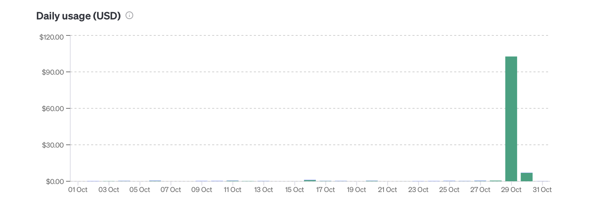

Generative AI makes super flashy demos. You try a thing and it just works! Fiddle with the prompt and it improves 🤩 Then you evaluate on lots of data and ... oh no.

That's what happened to me this weekend. I spent $110 and 26 hours running this thing on my blog.

https://twitter.com/Swizec/status/1718422614132306239

The results were ... not great. After editing 940 files, GPT-4 made mistakes on 25 of 35 files. I stopped counting after that.

No wonder [evals were the biggest topic of conversation at AI Eng Summit](https://swizec.com/blog/ai-engineer-summit-report/). Vibe checks don't scale.

## The experiment

**My task was simple:** There are 1774 posts on swizec.com stored as `.mdx` files. Some of these break MDXv2 and stop me from finishing the upgrade to Gatsby v5. Gatsby chokes on 1 file at a time and tells you little about what's wrong.

**Solution:** I've used ChatGPT in the past to fix or reformat naughty files. Always worked fine. Set it loose on my files and it's gonna fix the problem right?

_Narrator:_ Wrong. Swiz was lazy and should've taken the extra time to write a deterministic parser. This is not a problem for AI.

You can see the [whole script on GitHub](https://github.com/Swizec/swizec.com/blob/2c552abbb8672829ab1bbc1fc7bbbf5adf82f781/bin/markdown_cleanup.ts). It loops over files and calls the OpenAI API with a system prompt that passed the vibe check.

```typescript
// main loop
const mdxFiles = findMdxFiles("../src/pages/blog/") // You can replace './' with the desired directory

for (const file of mdxFiles) {
  const content = fs.readFileSync(file, "utf8")

  if (content.includes('")') || content.includes("{")) {
    console.log(file)

    const cleanedContent = await cleanupMarkdown(content)
    if (cleanedContent) {
      fs.writeFileSync(file, cleanedContent)
      console.log("done")
    } else {
      console.log("empty return")
    }
  }
}
```

To save costs I'm limiting the script to files with known potential problems. MDXv2 doesn't like free floating `{}` in text – evaluates them as a JavaScript expression – and I think it struggles with wonky markdown like ``.

The GPT-4 call looks like this:

```typescript
const cleanupMarkdown = async (content: string): Promise<string | null> => {
  try {
    const response = await openai.chat.completions.create({
      messages: [
        {
          role: "system",
          content: `You clean up MDX content so it conforms to standard syntax. The user sends you a file and you return the cleaned up file with no additional content. Do not change frontmatter.\n\nMake sure image captions only appear in the [] portion of an image tag, for example [hello](./img/hello.png "hello") -> [hello](./img/hello.png)\n\n${
            content.includes("{")
              ? "Wrap expressions like {abc} in backticks: `{abc}`"
              : ""
          }`,
        },
        {
          role: "user",
          content,
        },
      ],
      model: "gpt-4",
    })
    return response.choices[0].message.content
  } catch (error) {
    console.error("Error cleaning up markdown:", error)
    return content
  }
}
```

I developed this prompt over a few iterations using 2 test files. Kept tweaking until GPT-4 correctly fixed both files a few times.

This is the "vibe check" portion of evals.

Note the conditional in my prompt. This is a warning sign of things to come. I should've known 😅

You can [see the full diff on GitHub](https://github.com/Swizec/swizec.com/pull/125/files).

## Surprising successes

Lots of things worked great!

All files remained valid markdown. The expected transformations worked. GPT-4 didn't output any fluff before or after the expected content. I know that sounds basic, but when dealing with stochastic parrots predicting the next token, you can't assume.

Better yet, GPT-4 made proactive improvements!

It fixed typos.



It fixed bad syntax in code snippets.



It inferred image captions from context when needed. This was my favorite surprise.





When it worked, AI worked better than expected 💪

## Disappointing failures

Going through [the diff with all changes](https://github.com/Swizec/swizec.com/pull/125/files) I opted for a strict pass/fail evaluation.

The AI passed, if the resulting file is good to go.

The AI failed, if the file had any mistakes like unnecessary changes, deleted or reworded content, or the syntax was semantically wrong like an image turned link.

I stopped counting after 35 files because a **28.5% success rate** is no good. Likely improvable with a better prompt.

It loved to turn images into links.



It would remove content from long articles.



It would decide some links were unnecessary. Maybe my links are dumb but that's not for you to decide AI.



It would desperately try to follow instructions _even when they don't apply_. This was the biggest learning for me and something I've seen hints of in the past. GPT-4 is trained so hard to please that it will just make up a way to follow your instructions even if they don't apply.

> You asked for backticks around curly braces and I can't find no curly braces? Here's backticks and curly braces around some code-lookey stuff. I'm a good AI please tell me I'm a good AI.






It's like training my bird to run around a thing you point at (he loves this). If he can't understand what you're pointing at, he'll run around any random object in his sight then ask for a treat.

Or like that time he learned a clicker sound means treats and started clicking the clicker himself 😂

## The cost

Running this on 940 files cost about $110 and took 26 hours. We averaged around 35 requests per hour.



You don't realize how slow and expensive AI is to run until you try to batch some real work. Feels decently fast when you're just poking around.

## Lessons learned

Don't ask the AI for something that might not apply to your content. Test and evaluate on more inputs before going for the full run.

And make sure you parallelize the work.

Cheers,<br/>
~Swizec
