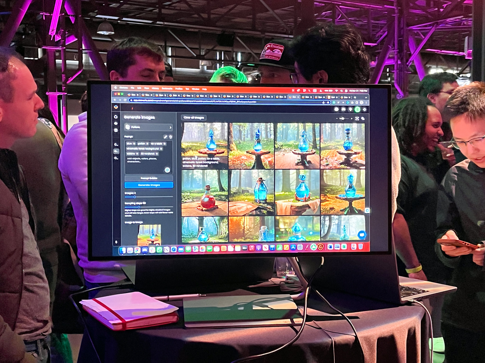

# I went to "AI Woodstock" and wow

Last week HuggingFace, a github for AI, organized a local meetup. _With 5000 people_. It was wonderful.

The "meetup" turned into a trade show. Exploratorium, a local science museum, had the two main halls filled with tiny little tables hosting random laptops and people showing off their stuff.

Everything from professional organizations and experienced sales people standing next to their banners, to a random dude with a laptop showing their GitHub Readme. It was awesome.

I've never been so pumped after an event. My body was buzzing all week. Makes me wanna drop everything and go fiddle with AI for 6 months 😇

Here are pictures I took and projects I saved.

## Phind

No picture. Too busy playing with the demo.

https://twitter.com/Swizec/status/1642332770520408064

[Phind.com](https://www.phind.com) is a ChatGPT optimized for programmers. Fine-tuned (stuffed with embeddings more likely) for questions about programming, it creates tutorials on-demand, cites its sources, and uses GPT-4 under the hood.

Everything I wished for in my [The programming tutorial SEO industry is dead](https://swizec.com/blog/the-programming-tutorial-seo-industry-is-dead/) article. Team at work finds it useful and agrees it's a lot like working with an extremely smart junior or intern who is fantastic at research but also on drugs.

And you can share search results. Chef's kiss 😘👌

## Cerebras

See that big hunk of silicone? It's _one_ chip optimized for AI computation. GPU, SSD, RAM, everything on a single wafer.

Guy said it was 8x faster than an A100 cluster. I don't know what that means but it sounds impressive. 👉 [Cerebras](https://www.cerebras.net)

## ImaginAiry

Like I said, some "exhibitors" were a dude with a laptop and a GitHub readme. [ImaginAiry](https://github.com/brycedrennan/imaginAIry) was one of those.

It's a CLI that runs stable diffusion (I think) on your laptop. They recommend using an M1, but you'd get decent results on an Intel Mac after 5 to 6 minutes of waiting.

Super easy to use: `imagine "a scenic landscape"` 😍

## Scenario

I didn't get to play with [Scenario](https://www.scenario.com) directly, but the demo looked wonderful. It's an AI studio optimized for creating game assets. Tooling looked nice.

## NapkinMatic

This one's tricky because I only took a huge video. Here's the interesting bit as a gif

[NapkinMatic](https://www.napkinmatic.com) takes your hand drawn sketch as a prompt and turns it into a proper drawing. Looks fantastic, makes me wanna download and experiment.

I _have_ been wanting to get back into drawing 🤔

## Arize

Forgot to take pictures, was enamored with trying to understand the demo.

[Arize](https://arize.com/) gives you AI observability at scale. For people deploying their AI models in production who need to know what's going on.

The example they used in demo was of an LLM model categorizing product reviews. The visualization showed a huge cluster of reviews that don't fit your LLM's fine-tuned embeddings and thus produce nonsense results.

It was neat to see a 3-D visualization of where embeddings fit in the latent space of an LLM's brain.

## Andrew Ng was there!

[Andrew Ng](https://en.wikipedia.org/wiki/Andrew_Ng) was there! I took his machine learning class back when MOOC courses first became a thing in 2011.

It was cool to see him in person. I didn't have the cojones to go say hi and share the fond memories I have of his class. To this day he's the only person who was able to explain neural networks in a way that made sense.

## There's more!

There was a company whose name I can't remember, pictures I didn't take because we were chatting, and whose sticker I lost ...

... they have a cloud database optimized for AI. You pump it full of pictures or text then you can write SQL queries on semantic attributes of your data. Stuff like `select count(*) from photos where scene="mountains"` 🤯

Plenty of other projects and companies. Some I probably didn't even find. There was a person with a laptop showing things off on a random cocktail table every few steps.

Amazing evening. Shit like that is why I pay rent in SF.

Cheers, 
~Swizec
