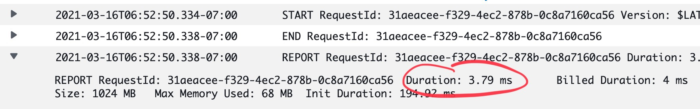

import { ContentUpgrades } from "@swizec/gatsby-theme-course-platform"

When you think of a backend or server developer, who comes to mind? 🤔


A wizard of arcane magics. The keeper of kingdoms. The holder of keys to Getting Data and Scaling Things and API Design and Modeling Domains.

They use weird technologies like Java and Go, wax poetic about Rust and never use it, cry and joke about kubernetes and docker. They write bash scripts that will make your eyes bleed.

> After weeks in the configuration dungeon, only then shall you be allowed to write application logic


<ContentUpgrades.ServerlessHandbook />

## The modern backend is a JavaScript function

Towers of configuration are nice in a masochistic sort of way. Hard work rewarded by a brittle pile of jenga that keels over when you sneeze.

Perfection.

If the configuration dungeon is not your jam, here's what you can do instead:

```typescript
export const handler = async () => {
  return {
    statusCode: 200,
    body: "Hello 👋",
  }
}
```

Yep, that's backend code. A JavaScript function that runs in the cloud.

Providers like Netlify and Vercel call it a "cloud function", AWS likes the term "Lambda".

**It is the whole backend**. No routing code, no boilerplate, no fuss.

## Runtime on demand

Deploy your function and you get [a live URL](https://z7pc0lqnw9.execute-api.us-east-1.amazonaws.com/dev/hello) like this `https://z7pc0lqnw9.execute-api.us-east-1.amazonaws.com/dev/hello`. Click that link and your platform handles the rest:

1.  API Gateway accepts the request
2.  Routes to the right server
3.  Server wakes up from the dead
4.  Runs your function
5.  API Gateway returns the response

Your server doesn't just wake up from the dead, _your server comes into being_ on demand. A whole new machine configured just for you and your request.

Fast.



That's the first request in days if not months. Fraction of a second.

The `Hello 👋` lambda lives to serve as an example in my new book. You can [try it and see that it's fast](https://z7pc0lqnw9.execute-api.us-east-1.amazonaws.com/dev/hello).

And yes, you _can_ make it even faster. But then it isn't as free when nobody's clicking.

## Infrastructure as code

The config for all this? 5 lines of code ✌️

_Code_ is the key word. Specifics in a future email, but the code part is important.

With infrastructure as code your environment definitions live alongside your application code. Part of the same review process, the same version control, the same skills.

Write instructions in a file, deploys follow them perfectly. Every time. Computers are great at that 😉

Better yet, you can make copies!

New engineer joins the team? `yarn deploy` and they get a full copy of your production environment to test with.

New pull request? `GitHub Action` and you get a full live copy of your environment for that piece of code. Test away.

Need to test 2 big features in parallel? Deploy twice from different branches. ✌️

It's dreamy.

## What this means for the future

The future belongs to full-stack frontend engineers.

Folks like you my friend who use their existing skills to own whole features, build big products, and go where their code makes the biggest difference.

If you can JavaScript, you can backend.

Cheers,<br/>
~Swizec
