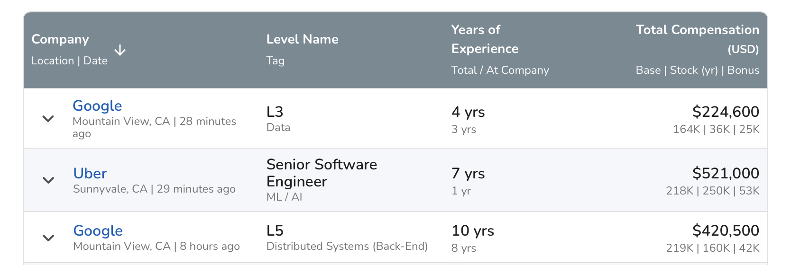

Your fellow reader Samuel asked a pointed question and I thought my answer could help you too.

Samuel asked how much I make and I answered – 213k + equity – then the bombshell:

> I must say that seeing your skills and your experience, I would have expected way more.
> Are the Netflix senior engineers who reached 600k$ TC last year really better than you are?

Better at solving Netflix-sized problems? Yes. They have hands-on practice and I have an abstract understanding of the problem space. [Experience wins](https://swizec.com/blog/skin-in-the-game/).

Better in some vague notion of engineering goodness? Eh probably not. On average we're all about average.

The more interesting question is a layer deeper: Why _aren't_ I working in BigTech? Why isn't everyone, if the money's so good and the coasting so sweet? [Rest and vest](https://www.insider.com/rest-and-vest-millionaire-engineers-who-barely-work-silicon-valley-2017-7) is a real thing that happens.

The short answer – I don't think I'd like it.

## BigTech is a J. O. B.

BigTech is the quintessential _job_ job. Every movie you've seen about the soul-crushing grind of corporate, that's BigTech. They like to pretend they're fun little startups, but they aren't.

Individual teams can be fun. Whole departments can be exciting rocketships. But the 50,000+ employee behemoth as a whole? Nah that's a corporate grind machine.

I have friends who work for and with these big companies. They always talk about the money, the awesome benefits, the wonderful perks, that cool coworker or two, ...

You know what none of them has ever said? _"I love my job"_.

When talk gets to the job itself, they either shut up or complain a lot. Everything takes forever, the projects are dumb, the pressure is arbitrary, the stress is unnecessary, the impact is smol, and the meetings oh god the meetings.

A designer friend of mine recently spent an hour in a high level leadership meeting with 10 VP level people ... arguing over the exact shade of blue to use for a cartoon character's shirt. 🙄

Not my cup of tea.

## The work style

As organizations grow, so does their overhead and bureaucracy. What works to coordinate 5 engineers in a room is different than what you need for 5,000 engineers across 3 continents.

I've heard from engineers at big companies that many of their deliverables are ... documents.

You have an idea and you write a proposal document. Then you have a few dozen meetings to collect feedback. Nobody reads or edits the document. Too busy. You re-explain everything you've written in this document to everyone.

You update the document with their feedback and your evolved understanding of the problem. After a few weeks you have an air-tight solution designed on paper.

Management takes a look and says _"That's nice, but not a priority. We'll think about it in Q3 2027"_. Polite office speak for never.

(╯°□°)╯︵ ┻━┻

I like to get shit done. [Understand problems by creating solutions](https://swizec.com/blog/coding-forces-you-to-understand-the-problem/). By the time I'm done, I want the problem solved, not described.

[Strategic Doing](https://strategicdoing.net/agile-leadership/) is a great book on this topic. _Do_ things, don't just talk about them.

## Look suspiciously at high comp numbers

Tech compensation is funny. Yes there's engineers at Netflix and friends making 600k in "total comp", but that doesn't mean 600k hits their bank account.

Here's a screenshot from [Levels.fyi for software engineers in San Francisco](https://www.levels.fyi/t/software-engineer/locations/san-francisco-bay-area)

Pretty representative based on what I've heard.

Look at the cash component – 164k, 218k, 219k. _That_'s the number hitting your bank account. For a software engineer this component tops out around 250k no matter how good you are.

Now look at the equity component – 36k, 250k, 160k. That's the funny money tech uses to attract talent _and tie your success to company success_. Incentives aligned 💪

## Tech pays funny money

I call equity "funny money" because its value changes. Many companies give you a grant based on current stock price. You have to wait N years (that's how they keep you around) before you can sell.

When you sell, you hope it's worth more than when you got it. But it could be worth less.

I have a friend who used to sell his falling stock every month to pay rent. It was worth less long-term than his cash salary.

If you got a 400k Netflix grant in January 2021, it is now worth 218k. Ouch. But if you got the same grant in January 2017 and haven't sold, it is now worth 900k. 🤔

That's the gamble.

At pre-IPO startups it gets even funnier. You get equity based on latest valuation and you can't sell. It's all fake paper money in a spreadsheet that you can't use. Many companies even block sales on secondary markets lest you get rich sooner than the investors do.

## Barbell investing

As Nassim Taleb says – the best strategy is to cap your downside and maximize your upside.

If you're gonna pay me enough cash, then I want the biggest possible lottery ticket of equity I can find. That's early-ish stage startups.

Plus the work is more fun.

But as my experienced manager likes to warn: There are more ways for your equity to be worth nothing, than for you to get rich. Make sure you love the job _now_.

Cheers, 
~Swizec
