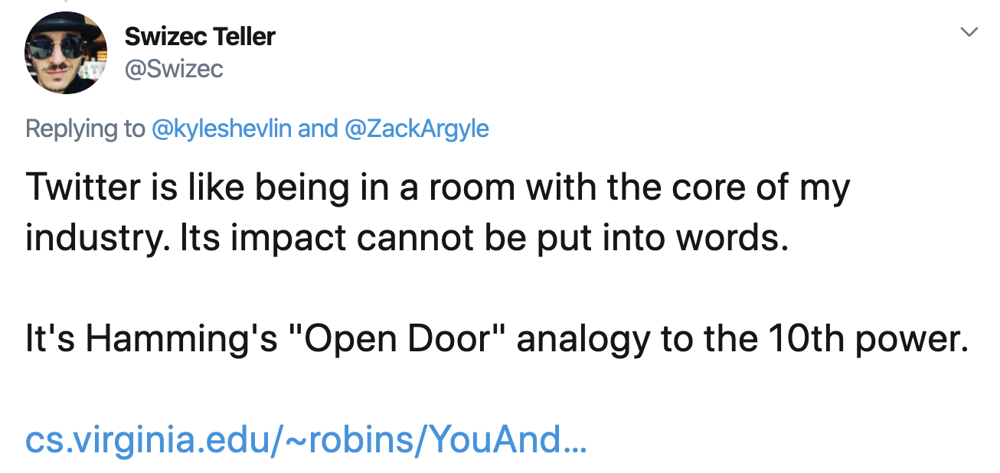
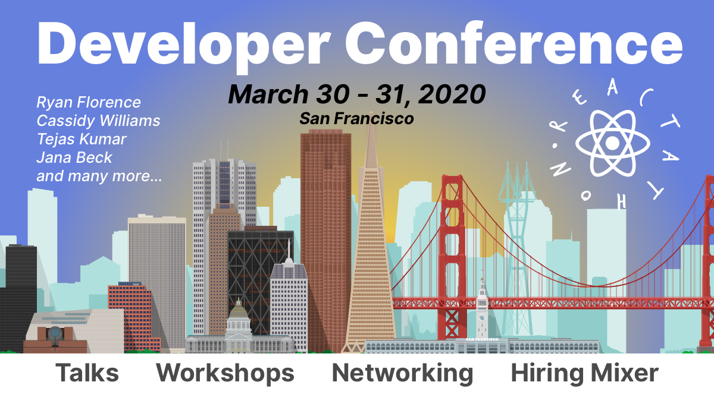

Conferences are a funny thing my friend. You mention them to one engineer and they go _"Bah humbug"_, talk to another and it's like _"OMG FREE WORK TRIP! 😱"_

And I think they're both right.

You see the thing about conferences is that most people don't know what they're for. They go for the wrong reasons and they're disappointed.

It's all about the hallway track. The people you meet.

As Hamming says in [You and Your Research](https://www.cs.virginia.edu/~robins/YouAndYourResearch.html).

> I noticed the following facts about people who work with the door open or the door closed. I notice that if you have the door to your office closed, you get more work done today and tomorrow, and you are more productive than most. But 10 years later somehow you don't know quite know what problems are worth working on; all the hard work you do is sort of tangential in importance. **He who works with the door open gets all kinds of interruptions, but he also occasionally gets clues as to what the world is and what might be important.** Now I cannot prove the cause and effect sequence because you might say, ``The closed door is symbolic of a closed mind.'' I don't know. But I can say **there is a pretty good correlation between those who work with the doors open and those who ultimately do important things**, although people who work with doors closed often work harder. Somehow they seem to work on slightly the wrong thing - not much, but enough that they miss fame.

## A conference is your open door

> clues as to what the world is and what might be important

_That_'s what conferences are for. Clues about the world.

You won't learn a new technology from a 20 minute talk. Not even a 45 minute talk. You won't come away with breakthrough new knowledge, or a whole new way of writing code.

But you might get some ideas. A bit of inspiration. See what others are doing. Notice problems others are solving. Sniff out the big challenges in your field. See where the industry is moving.

If Twitter is _like_ being in a room with the core of your industry, [Reactathon](https://www.reactathon.com/) **is** being in a room with the core of your industry.

## The hallway track is where it's at

The hallway track is where the good stuff happens my friend. Where you meet your peers, catch up with old friends, and fawn over industry greats as you tremblingly shake their hands.

No, just me?

Reactathon's hallway track is one of the best I've seen. They create this friendly atmosphere that lets you talk to anyone. Big enough there's lots of people, small enough we're all friends.

Just walk up and say hi

Just at Reactathon I've gotten to chat about Gatsby with Kyle Matthews, the growing importance of serverless with Swyx, Redux with Mark Erikson, chat Reason with Jared Forsyth, hang out with Wes Bos, get a fist bump from Ken Wheeler, talk GraphQL with Eve Porcello, and Hasura with Tanmai Gopal.

And a bunch of others. Too many to list.

This year I'm excited to chat with just about everyone who's coming ...

Guillermo Rauch is gonna be there, Kent C. Dodds, Ryan Florence, Cassidy Williams, DavidKPiano, and I'm sure almost everyone from previous years. It's a really great conference. Everyone comes back :P

Imagine what you could learn in a 5 minute chat with folks who spot trends and exciting technologies for a living! And all the folks who think about your problems every day and have years of experience under their belt 😍

I'm excited this is gonna be great.

Cheers, ~Swizec

PS: I'm giving [a lightning talk about useAuth](https://www.reactathon.com/speakers/profile#swizec-teller) that's gonna be fun, fire under butt to close those open pull requests 🙈

And I'm teaching a full day workshop on how to [Build and launch a modern webapp with React](https://ti.to/real-world-react/modern-app-with-react-workshop-2020). It's like the ServerlessReact.Dev course but in person, intense as heck, and heaps of fun.

If you wanna learn GraphQL, Serverless, some AWS, JAMStack, Gatsby, and how it all ties together in 7 solid hours of learning, then this workshop is for you. [check it out](https://ti.to/real-world-react/modern-app-with-react-workshop-2020)
