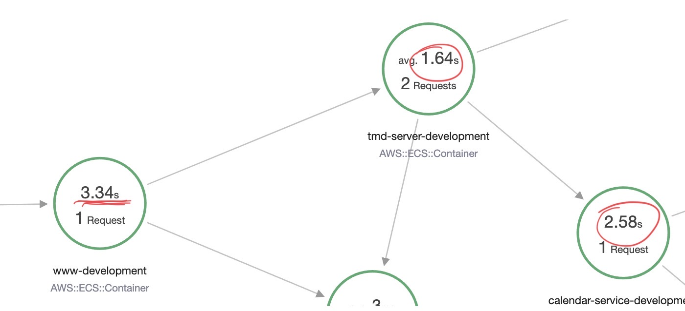

import { ContentUpgrades } from "@swizec/gatsby-theme-course-platform"

Or how we took an API endpoint from 16s to 3s.

This is one of those stories from practice – where theoretical beauty goes out the window and you care about low level JavaScript performance. An afternoon that makes you feel alive as a software engineer 😈

https://twitter.com/Swizec/status/1489051279007510534

## The background

After a quarter long project with far more details than fit in this article, we launched a major revamp of a user facing feature. Saves 40 hours of manual labor _per week_ for our ops team, enables users to book and manage their own weekly therapy appointments. Huzzah!

[](https://asktia.com)

Throughout development and even the pilot launch, this worked great.

Then we hit Go Time and this page took 16 seconds to load. When it didn't timeout. Going from 3 test providers to 80 real providers broke something. 🤨

## AWS X-Ray for the win

Luckily our amazing platform team had just enabled [AWS X-Ray](https://aws.amazon.com/xray/) on all our services like 3 days before. We could see where the time is going!


`www-development` is our frontend service, it runs the webapp.

`tmd-server-development` handles the heavy business logic.

`calendar-service-development` understands calendars and talks to `api.cronofy.com`, a [calendaring vendor](https://www.cronofy.com/).

There are 2 suspicious areas in this trace:

1.  Why is `calendar-service` taking 7.81s to handle 1 request when it sends 5 requests to `api.cronofy.com` for 1.46 seconds each
2.  What the hell is `tmd-server` doing that takes 16s to process an 8s request to `calendar-service`? The 8.21s average is hiding a 0.5s and 16s request 🤨

## Use concurrency where appropriate

Fixing `calendar-service` was easy. We replaced a for loop like this:

```javascript
// pseudocode
const result = []

for (const provider of providers) {
  const providerData = await makeCronofyRequest(provider)
  result.push(providerData)
}

return result.flat()
```

To use a `Promise.all` like this:

```javascript
// pseudocode

const result = await Promise.all(
  providers.map((provider) => makeCronofyRequest(provider))
)

return result.flat()
```

Both versions make a Cronofy request for each provider. First version waits for each request to finish before continuing, second version makes an array of promises and waits for them concurrently.

That takes a 7.81s request to `calendar-service` down to ~1.5s. As fast as the slowest request to `api.cronofy.com`. A beautiful application of [Amdahl's Law](https://en.wikipedia.org/wiki/Amdahl%27s_law).

## Immutability ain't free

When we ran a new trace, it wasn't much faster. 16s down to 14s.


I didn't save the intermediary trace, but it paints the same picture. The request to `calendar-service` is faster and then ... something.

What the hell is `tmd-server` doing with this data 🤨

<ContentUpgrades.Javascript />

We peppered the code with logs and found this loop was taking 8 seconds to gather appointment slots from `calendar-service` and group them by day.

```javascript
// abbreviated actual code

const startTimeSlotsMap = {}
let allCalendarSlots = []
let reachedMaxSlots = false

let day = new Date()

do {
  const newSlots = await calendarServiceRequest(day)

  for (const newSlot of newSlots) {
    if (!startTimeSlotsMap[newSlot.start]) {
      startTimeSlotsMap[newSlot.start] = [newSlot]
    } else {
      startTimeSlotsMap[newSlot.start] = [
        ...startTimeSlotsMap[newSlot.start],
        newSlot,
      ]
    }
    allCalendarSlots = [...allCalendarSlots, ...newSlots]
  }

  if (wantUniques) {
    reachedMaxSlots = Object.keys(startTimeSlotsMap).length >= maxSlots
  } else {
    reachedMaxSlots = allCalendarSlots.length >= maxSlots
  }

  day = addDays(day, 1)
} while (!reachedMaxSlots)

let result = allCalendarSlots

if (wantUniques) {
  result = _.reduce(
    startTimeSlotsMap,
    (acum, slots) => [...acum, _.sample(slots)],
    []
  )
}
```

At a high level, this code iterates through days until it finds enough availability to satisfy a `maxSlots` constraint. You may get multiple overlapping availability slots, if multiple providers are available at the same time.

If you `wantUniques` we return a random option for each time, otherwise you get everything.

This code works and follows all the best practices of functional programming. No data is getting mutated, every iteration makes new copies, and it works great. Chef's kiss.


### Copying arrays sneakily blows up complexity

When you look at this code, it's `O(n)`. You iterate over `newSlots` once to add them to a map and again at the end to uniquefy. Looks great.

But those array spreads have a hidden complexity.

```javascript
for (const newSlot of newSlots) {
  if (!startTimeSlotsMap[newSlot.start]) {
    startTimeSlotsMap[newSlot.start] = [newSlot]
  } else {
    startTimeSlotsMap[newSlot.start] = [
      ...startTimeSlotsMap[newSlot.start],
      newSlot,
    ]
  }
  allCalendarSlots = [...allCalendarSlots, ...newSlots]
}
```

For each `newSlot` we make a full copy of 2 arrays:

1.  Copy the whole `startTimeSlotsMap[newSlot.start]` array
2.  Copy the entire `allCalendarSlots` array

And that's where this `O(n)` algorithm turns into `O(n^2)`. The spread operator iterates over elements 1-by-1 and moves them into a new array. There are faster ways to clone an array by manually moving memory around, but I don't think JavaScript supports them.

[](https://stackoverflow.com/questions/57032373/whats-the-time-complexity-of-javascript-spread-syntax-in-arrays)

When N is small, this is not a problem.

At 80 providers our N blew up. The `newSlots` array was 512 elements and at final iteration, `allCalendarSlots` was a whopping 270,000+.

😅

### Toss immutability, get 8s loop down to immeasurably fast

https://twitter.com/Swizec/status/1489056226902036481

We swallowed our pride and said heck it to functional purity. Mutate all the things!

Two areas of improvement: the inner loop and the final reduce

For **the inner loop** we replaced array spread for each group of slots with an `array.push`, which mutates an array in-place. Becoming an O(1) operation.

And we replaced `allCalendarSlots` with a count after realizing that hey, we're collecting all these in the map, we don't need another array. We just care how many we've found.

```javascript
const startTimeSlotsMap = {}
let allCalendarSlotsCount = 0
let reachedMaxSlots = false

let day = new Date()

do {
  const newSlots = await calendarServiceRequest(day)

  for (const newSlot of newSlots) {
    if (!startTimeSlotsMap[newSlot.start]) {
      startTimeSlotsMap[newSlot.start] = [newSlot]
    } else {
      startTimeSlotsMap[newSlot.start].push(newSlot)
    }
  }

  allSlotsCount += newSlots.length

  if (wantUniques) {
    reachedMaxSlots = Object.keys(startTimeSlotsMap).length >= maxSlots
  } else {
    reachedMaxSlots = allCalendarSlotsCount >= maxSlots
  }

  day = addDays(day, 1)
} while (!reachedMaxSlots)
```

For **the final reduce** we used the same approach.

Instead of creating a new copy of the whole array on every iteration, we push data to the `result` array in-place. Turning an `O(n^2)` reduce statement into `O(n)`.

```javascript
const result = _.reduce(
  startTimeSlotsMap,
  (result, overlappingSlots) => {
    if (uniqueStartTime) {
      // add random slot to result
      result.push([_.sample(overlappingSlots)])
    } else {
      // add all slots
      result.push(overlappingSlots)
    }
    return result
  },
  []
).flat()
```

Yes it makes me feel icky, but it's the right thing to do when N is large.

## Behold the speed

The trace went down to 3.34 seconds 🤘



User-facing request takes 3.34 seconds, `calendar-service` manages 2.58 seconds with concurrency, and `tmd-server` is fast as lightning. No more gap between getting data and returning the result.


Now before you go replacing all your array spreads with mutating data, make sure you need to. Measure.

Cheers,<br/>
~Swizec

PS: if you like having fun like this, [we're hiring](https://asktia.com/careers)
