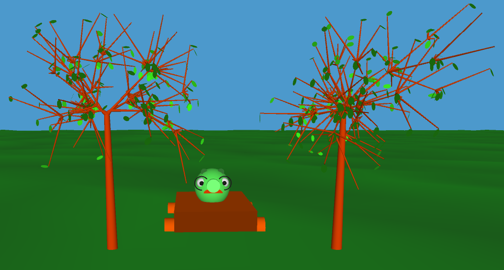
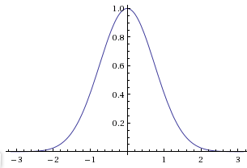

A while ago I wrote about my school project that involves [generating pretty trees](http://swizec.com/blog/using-prime-numbers-to-generate-pretty-trees/swizec/1705 "Using prime numbers to generate pretty trees") and concluded the post with the idea that I now have to implement some way for the branch lengths to be a bit [random](http://en.wikipedia.org/wiki/Randomness "Randomness") to add more variability.




```lisp
(nth choices
       (rand-nth (0 0 0 0 0 0 0 0 0 0 1 1 1 1 1 1 1 1 2 2 2 2 2 2 3 3 3 4))
```

This, however, isn't very elegant or even pretty to look at. Changing it so the maximum of the [probability distribution](http://en.wikipedia.org/wiki/Probability_distribution "Probability distribution") moves down the choices depending on how deep inside the tree we are would be painful. My next step was changing the weighed random choice so it would generate such a horrible list on its own and use a provided function to calculated the weights for every specific index. This gives us a way to neatly define the probability distribution we want every time we make a random choice from a list. Here's what the final function looks like

```lisp
(defn weighed-random-choice [choices weight]
  (defn indexes []
    (flatten (map #(replicate (weight %1) %1)
                  (take (count choices)
                        (iterate inc 0)))))

  (nth choices
       (rand-nth (indexes))))
```



```lisp
  (defn weight [x pivot]
  ; cos(x + sin(x)*0.9)*0.5+0.5
    (let [x (* x (/ Math/PI (count lengths)))
	  pivot (* pivot (/ Math/PI (count lengths)))]
      (int (Math/floor (* 10
			  (+ 0.5 (* 0.5
				    (Math/cos (+ (- x pivot)
						 (* 0.9 (Math/sin (- x pivot))))))))))))
```

Pivot is where the highest probability density needs to be and usually denotes the current depth we are at. If you see anything wrong with my approach go ahead and tell me :)

###### Related articles

- [Exploiting Randomness](http://ignoranceanduncertainty.wordpress.com/2011/03/21/exploiting-randomness/) (ignoranceanduncertainty.wordpress.com)
- [How to transform random variables from a non-normal distribution to a normal distribution?](http://ask.metafilter.com/182181/How-to-transform-random-variables-from-a-nonnormal-distribution-to-a-normal-distribution) (ask.metafilter.com)

[](http://www.zemanta.com/ "Enhanced by Zemanta")
