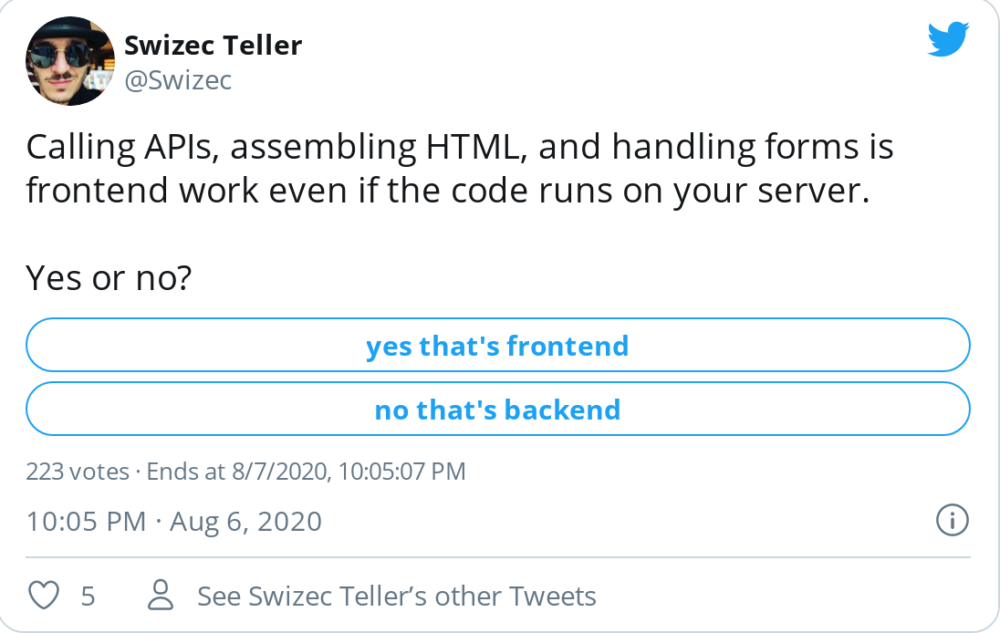

_&quot;He&#x27;s a frontend guy, is this even a fair question to ask?&quot;_

The head of engineering was worried about our systems design question. Part of the standard process:

- test algorithms
- ask about systems
- pair program on a skills-based test
- culture

I went through this in June. The algorithms question destroyed me and I thought about it for days 😅

The systems design question was fun though.

You design a social network newsfeed thingy. How would you store data? Which servers to use? What about caching? Where&#x27;s the SQL? Schema design? Querying? Security?

Fair question if that&#x27;s the work. Everyone&#x27;s been doing everything. Small team.

But will that stay true? Would you ask that question of someone who spent the last N years in a big company writing client JavaScript? 🤔

## Frontend vs. Backend

Growing up in the early 2000&#x27;s, there was no frontend and backend.

You write PHP? Okay you&#x27;re a web developer.

You write HTML? Yep, web developer.

You write CSS? Yep, web developer.

You do everything. Designer makes pretty pictures. You turn them into websites.

Code runs on the server, cobbles together HTML and CSS, inserts dynamic data, spits out a webpage. Browser renders and deals with user interaction. Anything a user clicks is a new request to the server and a full page reload.

Around 2010 the industry decided this was a bad idea. JavaScript apps were born.

We now had frontend and backend.

**Backend engineers wrote server code**. They designed data models, handled API requests, dealt with servers and hosting and REST design.

**Frontend engineers wrote the UI**. Build the HTML, fuss over CSS, write JavaScript for interactive widgets, sometimes call an API.

The work was visual in nature. Main goal was creating a nice user experience and offloading business logic to the server.

## Frontend Infrastructure vs. UI

As JavaScript apps became more complex the frontend world developed a split 👉 infrastructure vs. UI.

You build a design system and there&#x27;s no UI work left.

Design system ensures everything looks great. It&#x27;s got a whole team. They write the CSS, the core design atoms, and self-contained interactive components.

You don&#x27;t think _&quot;Hm, how do I make a date widget?&quot;_ or _&quot;I wonder how to add this animation and pleasant interaction on the type-ahead field&quot;_

Heck no!

You slap a `<DateInput />` or a `<Input typeahead={true} />` in there and move on. 💪

What you&#x27;re left with is the **frontend infrastructure work**.

How do you design the data models? Where do the API calls go? How do you cache requests? How do you architect your app for speed _and_ good developer experience? How does a widget bottom-left get state from top-right?

Sound familiar eh 🤔

## Backend of the Frontend vs. Deep Backend

You create a backend of the frontend.

The data layer that handles business logic, talks to the API, handles performance, and tells your UI layer how to act.

You can go days, weeks, entire projects, without touching UI code. But you&#x27;re working on the frontend. Writing JavaScript that runs in the browser.

🤯

Then you run this code on the server to create server-side rendering. Or on your own machine at deploy-time to create compiled JAMStack sites.

What gives? Where&#x27;s the backend?

The _true_ backend is no longer your data model and your business logic. It&#x27;s that API you&#x27;re calling.

_You_ treat the API as backend developers of old treated their database. GraphQL makes this even more obvious.

But _somebody_ builds that API. Makes it work. Makes it talk to other services. Ensures data&#x27;s consistent. Deals with caching at scale.

That&#x27;s **The Deep Backend**. The folks who live their lives in data pipelines, JSON validations, API schemas, databases, and server monitoring software.

It&#x27;s hard work. Mind-bending work. Plagued with [fundamental Two General paradoxes](https://serverlesshandbook.dev/robust-backend-design).

Imagine if Redux or useState had a 1% failure rate. 1% chance that you call an action and nothing happens. Oops.

That&#x27;s Deep Backend work.

## DevOps

DevOps is an area tangential to Deep Backend. Maybe orthogonal? 🤔

The part that deals with servers and hosting. Used to be part of backend work.

You provision a server, create a database, run scripts on the command line, write kubernetes configurations, and think about Docker and containers. Sometimes you play with the AWS console.

You live and die by your monitoring metrics and alarms.

Site goes down on Black Friday it&#x27;s your fault we&#x27;re losing millions per minute.

I don&#x27;t know anybody who _likes_ doing DevOps. But being an SRE – site reliability engineer – is _the_ highest paid position in software engineering right now.

## The future

The future is bright my friend.

With the rise of platforms like Netlify, Vercel, and Begin doing your DevOps, and serverless computing dealing with the repetitive backend work, _you_ can focus on the business logic.

Let AWS deal with servers. Let X deal with hosting. Let junior developers deal with fun UI challenges.

**You focus on Frontend Infrastructure, the Backend of the Frontend. The money maker.**

And hey with serverless, [writing server code is like the JavaScript work you know and love](https://serverlesshandbook.dev).

It&#x27;s a JavaScript function. Platform handles the rest. ✌️

## What did I tell the head of engineering?

That&#x27;s the wrong question. Ask them an app architecture question. Like you&#x27;re interviewing an iOS developer.

Our Express &quot;backend&quot; is frontend even if runs on the server.

Happy Friday ❤️

Cheers,  
~Swizec

PS: [79% votes for &quot;this is frontend&quot;, 20% for &quot;backend&quot;](https://twitter.com/Swizec/status/1291495546557931520) ✌️

PPS: all of the above is why I created [Serverless Handbook – modern backend for frontend engineers](https://serverlesshandbook.dev/)
