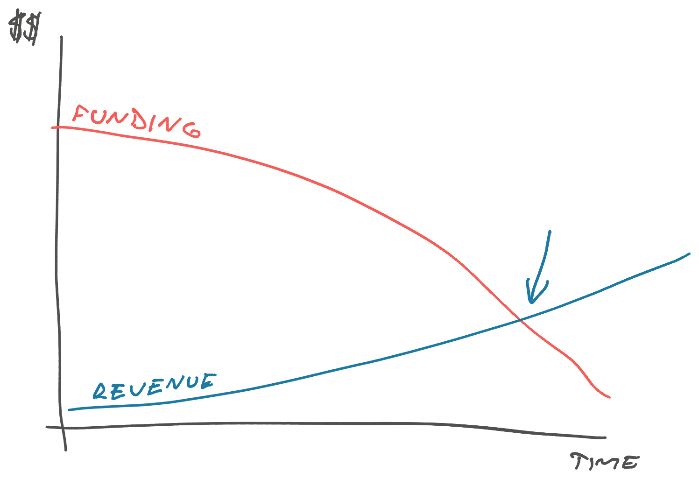

The tech industry has been going through a hiccup. It may be getting worse before it gets better. I wanted to share some tips and thoughts because layoffs are top of mind.

_I_ haven't been laid off, but people I know and care about have. This is as much for them as it is for you :)

## The situation

Layoffs are impacting the tech industry. Estimates put it over 150,000 people laid off in USA last year. [layoffs.fyi](https://layoffs.fyi) says we're at ~20,000 for this year ... it's January 10th 😅

This is likely to get worse.

But it's uniquely impacting tech. The rest of the economy is doing fine with [the lowest unemployment rate in 50 years](https://www.npr.org/2022/08/05/1116036160/the-unemployment-rate-fell-to-3-5-matching-its-lowest-level-in-the-last-50-years). Part of this is because life is returning to restaurants, shops, bars, and services. Good.

That doesn't explain everything. The underlying reason is how tech valuations work – discounted future profits. Your company is valued _on its promise_, **not** current results.

[As interest rates rise, tech valuations plummet](https://www.fullstackeconomics.com/p/rising-interest-rates-are-hammering-tech-stocks). And woo have the interest rates been rising! Why put money in a growth stock with lots of risk, if you can buy super safe bonds with high yields? 🤨

Investors (VCs) and _their_ investors (LPs) are not dumb.

### Default dead vs default alive

That impacts post-IPO companies because executives care about stock price. Stock price is a big component of everyone's salary.

The problem is worse for pre-IPO startups.

Startups are in a race against time. You burn funding to build revenue. If nothing changes, a [default dead](http://www.paulgraham.com/aord.html) startup runs out of money before revenue covers expenses. A default alive startup is either profitable or likely to become profitable before the money runs out.

The harder and more expensive it is to raise funding, the more you want to be default alive. Layoffs slow down your progress, but they also extend your runway.

Last year investors didn't care about profit or even revenue. Now they want startups who are default alive.

## In case of layoffs, break glass

So, if you or a friend gets laid off, what do you do?

First: Don't panic.

Typical layoffs have been in the [10% to 15% range](https://blog.eladgil.com/p/changing-times-or-why-is-every-layoff). Companies are staying bigger than pre-pandemic!

Meaning most layoffs are a regression to the mean. A correction of exuberant 2020/21 hiring back to historically average growth.

https://twitter.com/buccocapital/status/1610635135157956609

We'll see if that trend continues.

Tech [unemployment rate is 1.8%](https://www.computerworld.com/article/3542681/how-many-jobs-are-available-in-technology.html). It's going to be okay. You and your friend _will_ find a new job.

But **start looking now**. Yes, you got a nice severance package, full pay for a while. Finding a job you like always takes longer than you think! [Hard truth #2 about being laid off](https://www.stevenbuccini.com/8-hard-truths-on-getting-laid-off).

Replying to all those recruiters who sent you email over the past few years is a good start 😉

### Help your friends

Your friends just lost access to all their work history. Help them build a brag sheet and add it to their LinkedIn.

What was that project where they saved your butt? Tell them.

The project you shipped last summer that bumped metrics by a huge amount? What was it again? Look it up, tell them. Share the metric if you can.

Got a nice network because you've spent a decade in the industry? Pull a few strings for your junior friends, eh. They get hit the hardest.

Leave a nice endorsement on LinkedIn. Yes, recruiters look at those. Sing your friend's praises to anyone who asks. Now is not the time to talk about how they like to indent code by 3 spaces instead of 4.

## If you survived a layoff

Get back to work.

Best you can do is:

1.  Keep a brag sheet
2.  Show ownership
3.  Succeed at critical projects

Put the brag sheet on your LinkedIn every few months. That's how you get those recruiter emails.

Cheers, 
~Swizec

PS: if you could use a wonderful junior engineer, I know 2 that are looking
