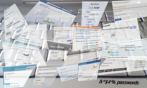

\_\_\_\_, showing SGML markup")

## Passwords suck

To make matters worse, "secure" passwords aren't secure at all. An 8 character password considering common [alphanumeric characters](http://en.wikipedia.org/wiki/Alphanumeric "Alphanumeric") people use most often gives you 60^8 combinations. At 1000 guesses per second this is guessable in about 5000 years. Okay, that's impractical. You're better off using a different vector of attack ... like a good wrench to the wrist. Or those stupid security questions. But passwords aren't random sequences of letters! Remember, people can't memorise those. Most often they use a common word and capitalize the first letter, then add a few numbers at the end. Or possibly some numbers at the start. There are just 15,222 6 letter words in the English language, giving enough room to add two numbers. Accounting for capitalizing the first letter that gives us 25^2+15222+10^2 combinations. Guessable in about 15 seconds. Oops. Including common substitions - [1337 sp34k](http://en.wikipedia.org/wiki/Leet "Leet") - gives us a few more combinations and the usual password is guessable in about three days. And that's with a very secure looking password that is almost impossible to remember! Sure, we cheated a bit by using a [dictionary attack](http://en.wikipedia.org/wiki/Dictionary_attack "Dictionary attack"), but hey, anything goes! I'm sure real attackers have even more tricks up their sleeves.

## Pass phrases win

\_\_

###### Related articles

- [How To Create A Strong Password & Keep Your Social Media Accounts Safe](http://www.simplyzesty.com/social-media/how-to-create-a-strong-password-keep-your-social-media-accounts-safe/)
- [What experts do to stay safe banking or buying online or by mobile](http://www.oregonlive.com/finance/index.ssf/2013/01/what_experts_do_to_stay_safe_w.html)
- [Warning: If You Don't Use a Secure Password, You Are At Risk](http://www.vikitech.com/14327/warning-secure-password-risk)
- [ssh with no password, with ssh-keygen key](http://www.garron.me/bits/ssh-key-keygen-login-no-password.html)
- [Password Security: The need for frequent change](http://radicaltype.wordpress.com/2012/11/30/password-security-the-need-for-frequent-change/)

