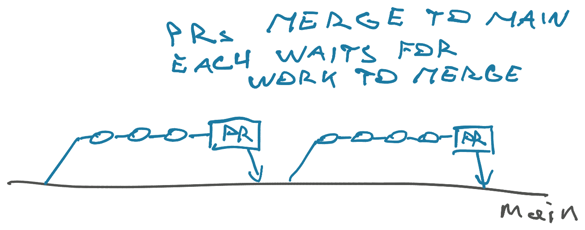
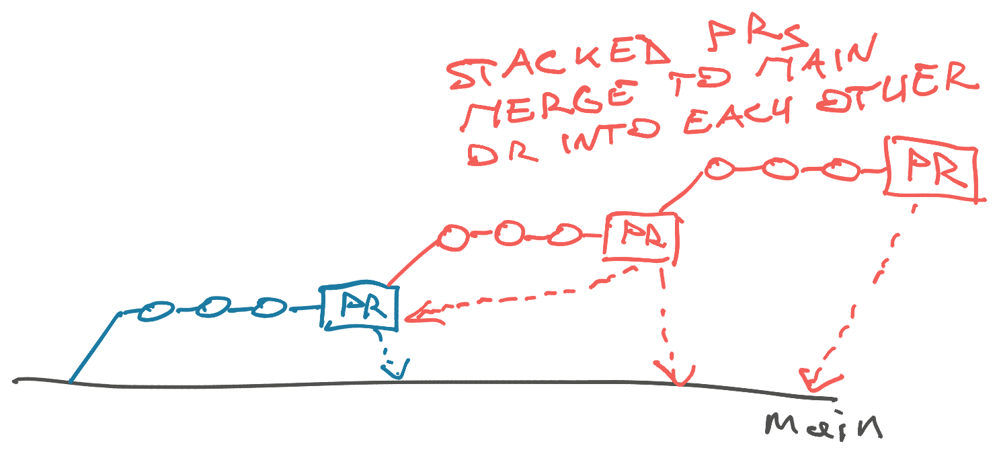
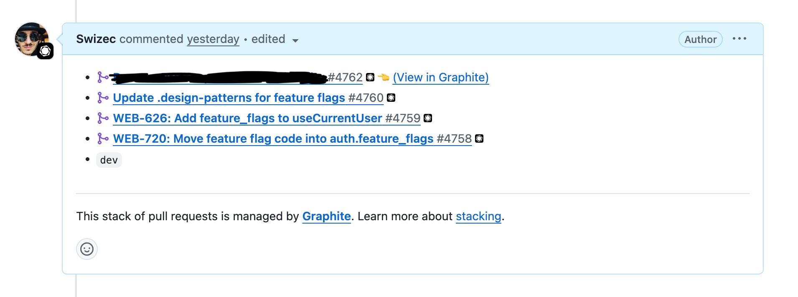

How fast you do code review is how fast you do everything. Your PR queue is the leading indicator of team velocity.

And yes it feels like a chore [when you're not working together](https://swizec.com/blog/5-soloists-in-a-trench-coat/). But there's strong support [in empirical literature](https://www.ijrte.org/wp-content/uploads/papers/v12i2/B76660712223.pdf) that code review decreases defects and improves code quality. It's also a SOC2 requirement that all production code was seen by at least 2 people.

I am personally not yet convinced on AI code reviewers. Low signal to noise and they lack taste.

So, how do you move quickly when your team can't review as fast as you can code? Stacked pull requests!

## Typical code review flow

A pull request is one unit of work. Independent, valuable, estimatable, small, testable. You can merge to main and you're pretty sure it works and does something useful.

It may have taken a few minutes, hours, or even days to produce one pull request. It has many commits. You're a modern engineer doing [trunk-based development](https://trunkbaseddevelopment.com) and strive for short-lived branches.

Personally, I treat commits as trash. They're a glorified cmd+s command to make sure I don't lose my work. Squash merge exists to clean this up. The pull request is the unit of work and I want our final git history to reflect that. Don't need every "Please work now" message saved forever 😅

You make a PR and then you wait.

Eventually you get comments, [hopefully without requesting changes](https://swizec.com/blog/approve-with-comment/), make your fixes and merge the code. But what about when your work doesn't fit in a pull request?

## Big unreviewable PRs

Sometimes you work on bigger things that don't fit one PR.

You want to refactor and clean up before you get to work. [Keep your station clear!](https://swizec.com/blog/better-is-good/) That would be annoying to review together with functional changes.

Or you're building functionality that consists of several sub-features. First you make a form to add a new Thing. Then you make the new Things viewable in a list. Then you add a way for people to interact with specific Thing.

The sub-features are independent but also not. Each step depends on code from the previous steps to work.

You're in the zone and don't want to wait for code review. Sometimes I code in the evening and nobody's gonna review that until morning. Sometimes I'm in meetings or fighting production fires all day and don't have time to review people's code.

A common mistake is to then stuff ever more things in your PR. It grows bigger and much hard to review. Your peers struggle to make sense of the diff. A bunch of different features all intermingled and they _probably_ work?

It takes you 20 minutes to test every change. The combinatorial explosion is killer. Your reviewers take an hour just to read the code let alone understand what's going on. Hope they trust you and don't need to spend 30 minutes to re-test it all.

The whole system falls apart. [Theory of Constraints defeated](https://swizec.com/blog/build-better-software-with-the-theory-of-constraints/)! You overwhelmed the critical resource (code review) with 1 big task that takes forever.

At my worst I reviewed a PR that took 2 full workdays just to read. It crashed my browser a lot.

## Stacked pull requests

What's better than a huge pull request? A stack of small requests!

Stacked pull requests are PRs that build on top of each other. You make something that works and could be merged on its own. Then you branch off of there and continue working.

Next time you get to a spot with something useful that you can show and verify, you make a pull request on top of your previous request. Keep going as long as makes sense.

When reviewers give you feedback, you add commits to each individual PR. When it's time to merge, you can go in any order. Merge every PR as it's ready, wait until the whole stack is approved and merge that, or whatever order makes sense to you.

Start merging from top of the stack (last PR) and each PR merges into the previous. If you merge from the bottom (first PR), it goes into main and your next PR then points to main. Keep going until the stack collapses and everything's merged.

### Graphite

Managing all this manually can be hard. Git CLI, I haven't even tried. GitHub has basic support for stacks (you can point PRs at each other) but the merging process is clunky and I always run into conflicts.

Been using [Graphite](https://graphite.com) for a couple weeks now and it's super nice. Fantastic for large refactorings and off-cycle coding sessions. I only get focus time on weekends and evenings these days 🙃

Graphite feels like the right amount of tooling. You get comments on every PR showing where you are in the stack, what's been merged, and helps you stay oriented.

Best part is the managed rebasing. When you merge the head of your stack, Graphite rebases your downstream PRs to match. Occasionally you need to help resolve a conflict but it's been 80% automatic so far.

Encourage trying it out. Slowed me down for about a day now I love it. When I tried a few years ago I didn't see the point.

But definitely break your large chunks of work into smaller PRs. Your reviewers will thank you and the work will flow faster I promise. Even if it feels like more overhead.

Cheers, 
\~Swizec
