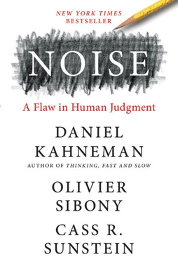
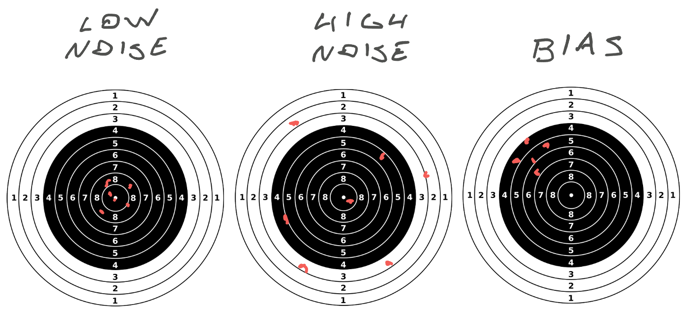

You know those tech interviews we all hate? Science says they're the best we can do. At least the modern kind.

I was reading (audiobook) Kahneman's latest book – [Noise](https://en.wikipedia.org/wiki/Noise:_A_Flaw_in_Human_Judgment) – and one of the chapters talks about interviews. The whole book is great but this chapter stood out because _everything people say is bad about modern interviews is actually good_ 🤯

Before we get into interview stuff, a few basics from the book.

## Bias vs Noise

Kahneman et al talk about statistical noise and how it impacts decision making in situations where human judgement is involved. The book uses examples like interviews, judicial proceedings, the behavior of juries, business decisions, medical diagnoses, and forensic science.

If you think of shooting at a target, noise describes the grouping of your shots. How similar to each other they are.

_Bias_ describes a consistent error – drift from the target. There are stats formulas you can use to compute bias by measuring "average" distance from target. Not all noise is bias and not all bias is noise.

Crucially: you can study noise without knowing the target. But you can't study bias without relating results to a target.

_PS: the shooting example comes from the book, this is not commentary on anything_

## Types of noise

Kahneman et al identify 3 types of noise.

1.  **Systematic noise** caused by consistent biases in judgement. Like an engineer who always under-estimates Jira stories.
2.  **Interpersonal noise** happens when different experts review the same data and come to different conclusions. Like when engineers disagree on a story estimate.
3.  **Situation noise** describes how the same expert changes their judgement based on random situational factors. Like an engineer who under-estimates when they're excited and over-estimates when tired.

## Bias cascades

An important lesson from Noise focuses on bias cascades where different reviewers influence each other.

Kahneman et al share a story from a college admissions committee. They used to have blind evaluations where each member evaluated applications independently. But that caused too much strife and disagreement so they changed their approach.

Now each person writes their estimate on the application for all to see. Peace and harmony ensued.

Can you spot the problem?

Yep. Whomever writes the first eval determines that student's fate. Evaluators see the score and think _"Yeah that sounds about right"_ instead of creating their own score.

Worryingly this also happens in forensic science. If the case-file shares the cops' opinion, the fingerprint expert is more likely to agree that fingerprints match 💩

## Insights for interviews

Here's what all that means for interviews.

Old style "chat" interviews where you talk to a candidate and have a conversation _feel_ the most effective. People love them because they get a strong gut feel for the candidate and think that's good.

Those interviews have a 50% correlation with on-the-job performance. Useless. The decision has more to do with the interviewer than the interviewee.

_Structured_ interviews work better. Prepare questions in advance, define an evaluation rubric, and ask everyone the same questions in the same order. Then evaluate their answers against the rubric, not against how you feel. This reduces situation noise.

When you take structured interviews and add a committee _without bias cascades_ – everyone submits their eval against the rubric before discussing the candidate – you get about a 65% correlation with on-the-job performance. They mention Google's process as having data to back this up.

About 4 independent interviews is a good balance between noise, time, and diminishing impact of additional opinions.

Structure interviews around job-like tasks and you get a 70% to 75% correlation with future performance. That's the best we can do.

## Why should you care?

Next time you're interviewing and think this bullshit is a random hazing ritual, remember that a good interview process has a 75% chance of predicting how you'll do on the job. And that the more diverse a candidate you are, the more structured interviews are in your favor. ✌️

If you get to design the process in your company, do the above. You'll find great people that way.

Cheers, 
~Swizec

PS: according to the book, executives have about a 55% success rate with business decision making. About as good as a chimp throwing darts 😂
