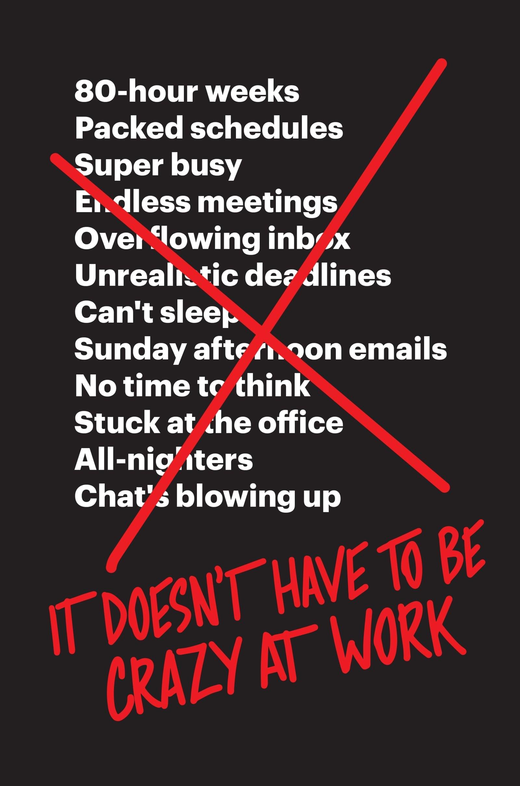

<!-- wp:paragraph -->

Amazing book. [Read it](https://www.amazon.com/gp/product/0062874780?pf_rd_p=d1f45e03-8b73-4c9a-9beb-4819111bef9a&pf_rd_r=KFQYFMZE934FR9V1VT5T).

<!-- /wp:paragraph -->

<!-- wp:image {"id":8656,"align":"center","width":800,"height":1208,"linkDestination":"custom"} -->

<!-- /wp:image -->

I listened to _It Doesn&#x27;t Have to be Crazy at Work_ on my weekly half marathon this Sunday. Difficult to follow at 1.5x speed, so I switched to 1.25x, and it was a perfect fit for a 2-hour run.

Reading at 1.25x is much more in line with its teachings anyway.

If you&#x27;ve read previous books from The Basecamp&#x27;s [Jason Fried](twittertlink) and [DHH](twitter-link), you already know what this one is about. Same teachings, distilled into a new form. Even better suited to get through your thick workaholic skull.

We need that, us workaholics. We&#x27;re too tired to learn things the first time.

And that&#x27;s what _It Doesn&#x27;t Have to be Crazy at Work_ is about: Don&#x27;t be tired. Be productive.

This 👇

https://www.instagram.com/p/BjTbTegl3pM/?taken-by=swizec

It remains to be seen if these lessons are going to stick. They&#x27;re hard to adopt. And by hard to adopt, I mean they require discipline. Working hard is easier than having discipline.

You can always push a little longer. But can you stop and continue tomorrow instead? That&#x27;s hard.

### Lessons in a nutshell:

- respect work time
- leave work at work
- you&#x27;re stressing your employees out
- a casual suggestion from the boss often reads like a decree
- vacation is good
- but only the sort of vacation where the office thinks you don&#x27;t even exist
- presence is prison
- treat people like adults
- you&#x27;re not the expert, the person doing the thing is the expert
- how long you take doesn&#x27;t matter, only what you get done
- set a deadline, then fit the project, not the other way around
- avoid large teams
- avoid inter-team coordination
- different projects will be ready at different times, embrace that

Yes, the book is written for bosses and business owners. Read it as an employee and it might just make you grumpy.

But that&#x27;s okay! You can suggest your boss read it. Or you can suggest some of its learnings in the next meeting about OMG our engineers are too slow how do we make them faster.

👉🏼 get out of their way
