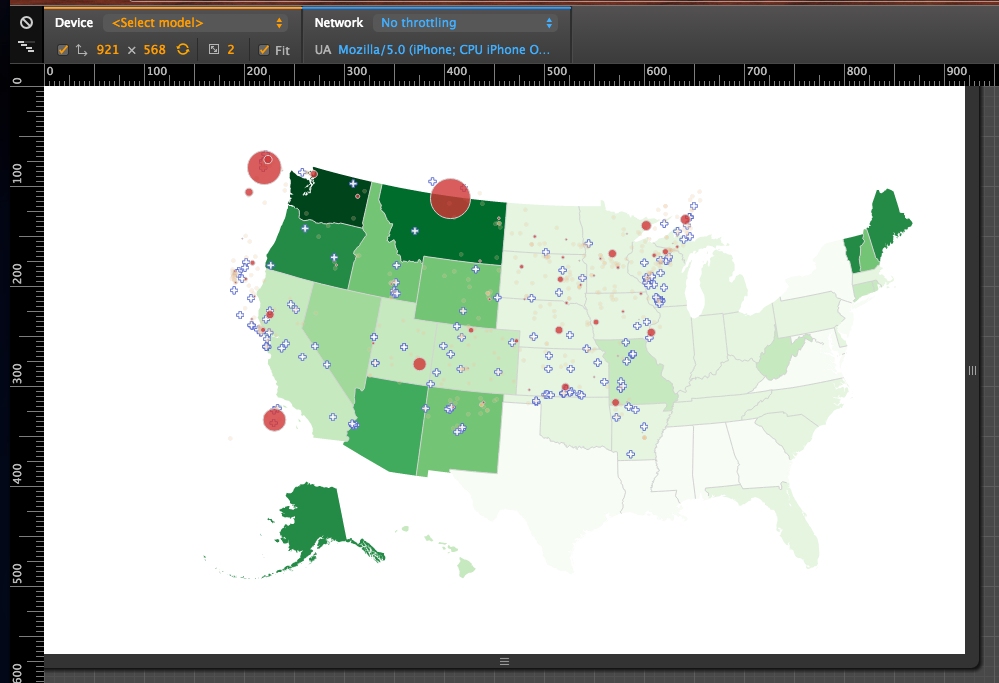

****

> the content is weak and looks more like a me too, rushed approach.

Seriously, screw you guy. That hurt. It was my first book and I slaved over that stupid thing for a year. Cut me some slack here! As for the scripts, my editor is encouraging:

> There isn't much feedback, the reviewers like the scripts as is(Can't say that I am surprised, your scripts were brilliant!)

But there is an estimated 220 minutes of material there. Three and a half hours. They asked for two hours ... oops. Now I just hope my video recording and editing skills will be up to snuff. If this comes out as good as it looks in my head, it's going to be awesome.
