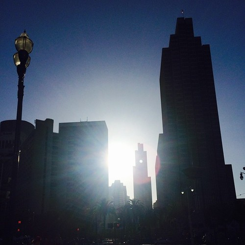

## People are pretty much the same

\_\_\_\_

## Slovenia complains about being expensive, but is kinda cheap

## The infrastructure in SF sucks

\_\_

## Slovenia is missing half of the service industry

To get a cab, I have to make a _phone call_ to a dispatch center. Then I have to wait like a lost soul on a street corner. No feedback about how long it's going to take; sometimes it's a minute, sometimes it's ten. Sometimes you have to call again. And you need cash to pay for a cab. No credit cards, no phone payments, just cash. But it's looking up. Some companies have apps now, but you still have to pay cash. When you want to get groceries ... well you'd better get off your arse and walk to a store. Only one chain offers delivery and the one time I tried it, you could tell it wasn't the core of their business. I'll try them again soon. Alas, there's no Google Shopping Express here. I loved that thing. Oh you ran out of energy drinks and suck at planning, we'll bring you some by tonight. For cheaper than buying at a store. In San Francisco there is even a service for cleaners (handy. You sign up online, cleaners show up, cleaners keep coming regularly for as long as you want. Payment is invisible by credit card - no awkward moments. When I asked on Twitter what my options were in Ljubljana, 14 people retweeted, 4 asked to be told when I find out, 1 told me I'm lazy, 1 sent me a sketchy phone number, and mum sent an email saying she'll do it. No mum, I'm not paying you to clean my apartment. Food delivery - in SF, app, in LJ, phone call. Healthy food delivery - in SF, app, in LJ, nope. Courier person for one thing - in SF, app, in LJ, nope. Pay back friend for lunch - in SF, app, in LJ, cash. Ship a few random items - in SF, app, in LJ, walk to post office and figure it out. And let's not even get started on splitting the bill. Biggest killer feature of the US! When many people dine, everyone throws their credit card on the table, each gets their own bill split exactly to the correct fraction. We tried that in Ljubljana with a friend and surprisingly the server was up to it. But the approach he took was solving the knapsack problem by hand and making two separate bills with unique items in such a way that we both paid similar amounts. Sigh.

## Life in general

**\_\_**

## The size

\_\_

## The verdict?

I don't know. Life in San Francisco feels easier, but it's a butt clenching exercise in making ends meet. Life in Ljubljana is more relaxed, but you spend ungodly amounts of time running support systems. The step counter is definitely chirpier in Ljubljana though. _shrug_
