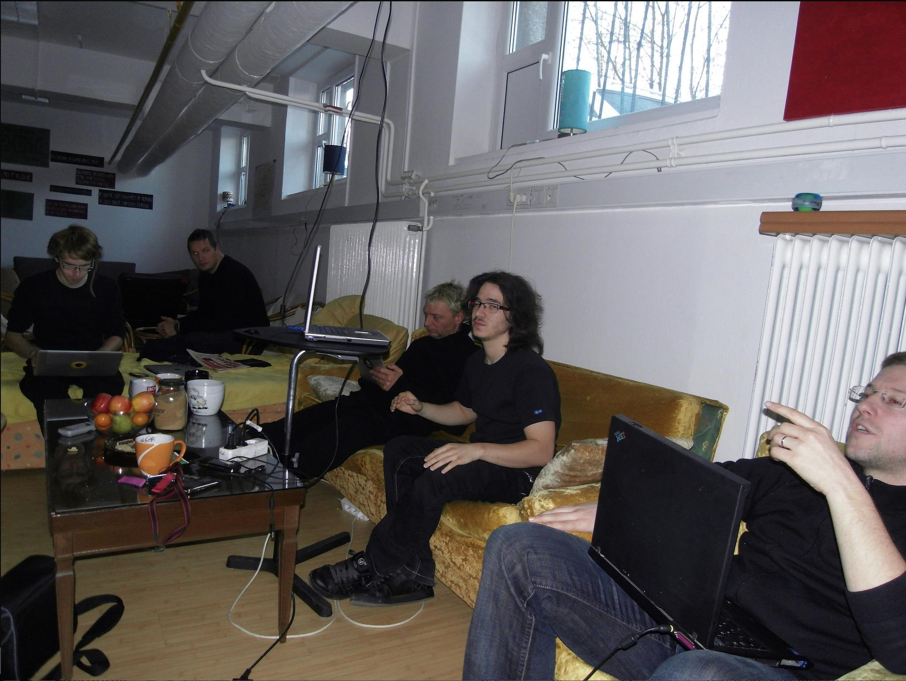
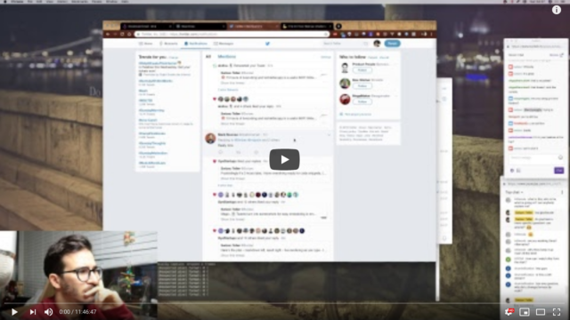

import { ContentUpgrades } from "@swizec/gatsby-theme-course-platform"

We live in exciting times my friend. It's never been this easy to build a webapp and make your first $1,000/month.

Story time!

Back in 2010 I created my first startup. Our goal was to build an AI that helps you make sense of the web. LazySharer to share links with friends, LazyReader to get a curated feed.

Here's me pitching on demo day at a local YCombinator clone 👇

Look how excited they all seem!

Back then an algorithmic feed was a wild and crazy idea. Never done before. Google was rumored to experiment with individualized search results. Facebook still had newest-first, Twitter said they'd never consider using algorithms ever.

Guess what the hardest part of building an AI that can build custom story feeds for every was?

Come on, guess.

## Building was hard as heck

That's right! Charging money. Hosting. A scalable backend. A JavaScript frontend. A clean API. A fast database. Those were the hardest parts.

Oh ... is that not what you guessed?

You see, back in 2010 The Cloud was in its infancy. AWS was just 4 years old, GoogleAppEngine 2 years.

Debate at our hacker space raged.

Should you use Cloud? Host on bare metal? Poke one of the 10 friends with a hosting company? Use the PC running in your bedroom?

We picked AppEngine. It promised "web scale". Gave us a NoSQL database – a new concept at the time – and everything else we needed to _grow super hella fast_.

Monetization? Please, PayPal is too hard ... we'll do it later. Once we have millions of users.

JavaScript webapp? Heck no. Ain't nobody got time for that. Cobbling HTML together on every request using Django, the python framework, is where it's at my friend.

After **months of building** we were ready to launch.

Our credit card melted instantly. 6 months later I was kicked out of the company.

<ContentUpgrades.IndieHacking />

## Fast forward to now

Times are different. I only realized just how much changed during Pat Walis's [24hour startup challenge](https://24hrstartup.com/) in late 2018.

_Can you build & launch a startup in 24 hours? Do it live on stream!_

Pat is crazy. There's no way.

Fuck it let's try.

12 hours later [TechLetter.App](https://techletter.app) was born. 😳

Best part? It made $4 in sales _and_ I use it to create these emails _and_ it costs $0/month to run.

## The hyper productive modern stack

The hyper productive modern stack is here, my friend. All the pieces are coming together.

I love inflection points 😍

After a year of research, it's still too early to name winners. What I _can_ tell you is the outline. A sketch of what the future holds.

– **serverless backends** Serverless is eating the backend. The cloud moved us from physical to logical servers and code stayed the same. That's changing. No more servers, just functions.

– **progressive web apps – PWA** Webapps are going progressive. An offline-first approach makes webapps work offline and stay fast in areas with spotty internet. Optimistic updates keep your UI fresh, you sync data when possible. Much like a mobile app.

– **JAMStack hosting** your progressive webapp is a static asset. It don't need no servers. Host it with a JAMStack provider and let them handle advanced caching, CDN config, DNS routing, continuous deployment, and everything else. You just get a blazing fast app.

– **GraphQL** changes the API layer. Write complex queries on the frontend, expose data on the backend, agree on data types and let GraphQL handle the rest. No more begging backend engineers to add a parameter, no more gigantic payloads with ten times more data than you need.

– **design systems take over** we're achieving the dream everyone promised: A designer creates your styles and you don't have to fiddle around. Build UI with a suite of components and it always comes out looking perfect.

– **more full-stack engineers** with backend simplified to "just JavaScript functions" and system complexity handled by serverless providers, everyone can own the full stack again. Write your frontend code, add a function to the backend, it's all the same.

**The rise of indie hackers** is my favorite result. **_YOU_** can build in a day or two what used to take a team of engineers weeks.

That means more startups, more ideas, more products. Without VCs. The infrastructure is cheap and open source, the time-to-build is short, users are plentiful. It's amazing.

Excited? hit reply

Cheers,  
~Swizec

PS: I've been meaning to turn TechLetterApp into a smol business at MarkdownEmail.com – been having too much fun using it. 2020 is the year. Maybe 😛
