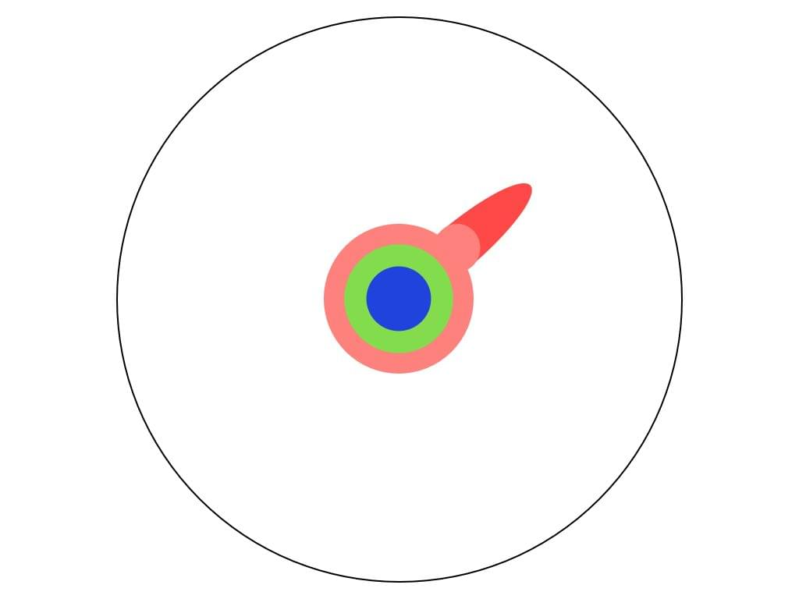
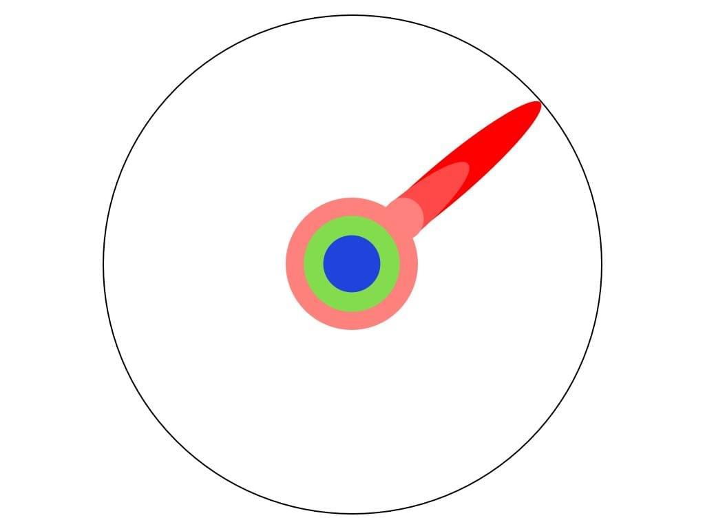
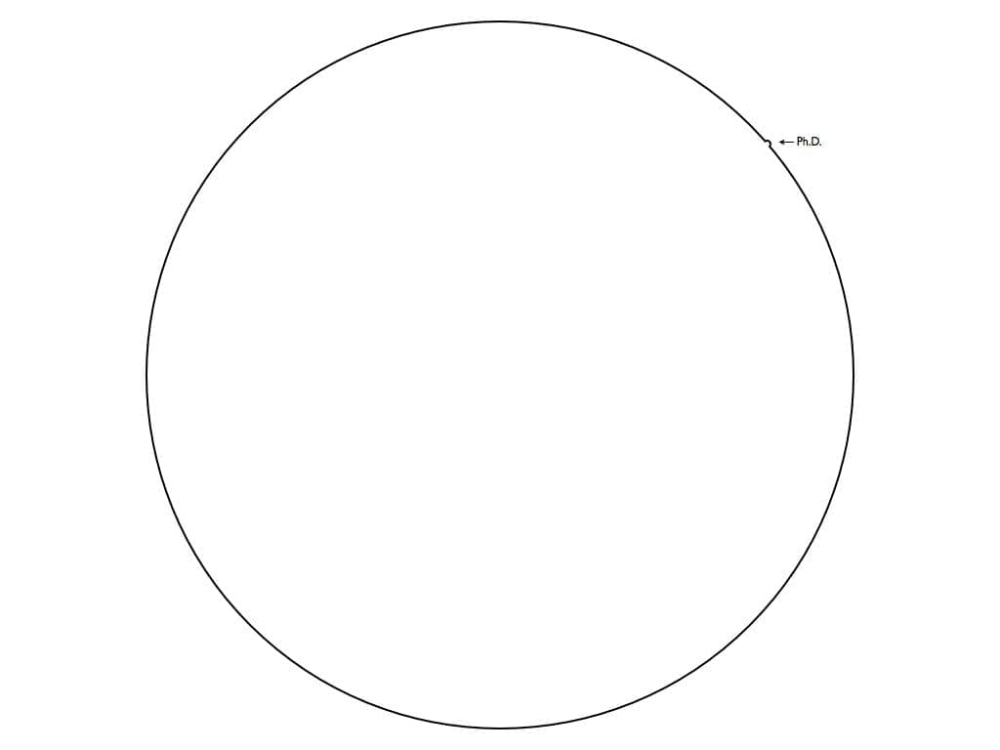

As a budding [programmer](http://en.wikipedia.org/wiki/Programmer "Programmer"), I could spend an hour programming and within that hour I learned so much the next hour was like three sets of the first combined.

Productivity grew exponentially with no sign of stopping. When the growth slowed, I would discover a new set of tools, a new framework or even a whole new language and my productivity would take a jerk, a stutter, jump around and make a massive leap forward.

With a bit of smoothing you'd still get a roughly [exponential curve](http://en.wikipedia.org/wiki/Exponential_growth "Exponential growth").

As Ralph W. Sockman, whomever he is, once said _"The larger the island of knowledge, the longer the shoreline of wonder."_

When my knowledge wasn't very vast, the increasing wonder only meant there were more things I could explore. pushing in one direction only showed a whole bunch of new and cool stuff that I could explore to become even better. Life was grand. And simple!

But lately this has stopped happening. I get almost exactly linear returns on the time I invest, sometimes even sublinear. It seems that no matter what new tool I add to my arsenal, productivity isn't affected very much. Learning the new tool barely makes up for the time invested into learning rather than doing from scratch.

## A ceiling

For example, I just finished a very simple project for a friend:

- import some schedule data from excel to postgre
s

- web interface to view class schedule

- web interface to change schedules

Simple right?

With the many years of writing python scripts, plenty of experience in data munging and countless web interfaces under my belt, this project should be a walk in the park. Considering I could do it in my sleep, it definitely shouldn't be more than an afternoon's worth of work.

It took **20 hours**.

And no, that's not because I spent so much time checking [Twitter](http://twitter.com "Twitter"), [Reddit](http://reddit.com/ "Reddit"), [HackerNews](http://news.ycombinator.com/ "Hacker News"), [Facebook](http://facebook.com "Facebook") and email. I optimized those problems out of my work time when I started using [the pomodoro technique](https://swizec.com/blog/living-life-in-25min-increments/ "Living life in 25min increments") about a year ago. A _huge_ boon to productivity.

Sure, I was forced to use a web framework I've never used before - Bottle. I reckon it added two hours to development time, it's really very very simple. Learning Bottle was on the level of learning a new syntax for Django.

Easy.

The HTML/CSS usually takes a while for such projects, but I used Bootstrap. Completely stock. Almost no modifications. That wasn't an issue either.

And yet, a project requiring barely any thinking, where I wasn't doing any [Yak Shaving](http://en.wiktionary.org/wiki/yak_shaving) and the budget was definitely too tight to [write the HTML in haiku](http://xkcd.com/554/) ... still took 20 hours. That's just too much.

## Many questions

I don't have an answer, but I do have a question: What's a guy to do when/if this glass ceiling is reached? Make sure to pick tougher projects? Learn ever more tools, but with diminishing returns? Concede that some things just take time and give up?

If I'm a 1x programmer, how do I become a 5x programmer? At least a 2x one? If I happen to be a 10x programmer, how do I become a 100x programmer? How do I even find out how much X programmer I am?

