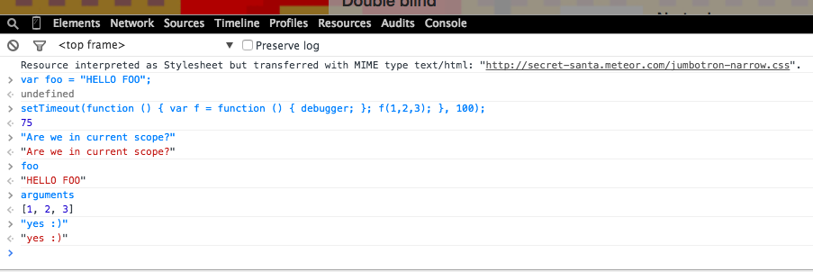

`console.log`\_\_` console.log``console.log ``writeln`` print``printf ``border: 1px solid red`` console.log``console.log `

```javascript
var do_something = function (arg1) {
  console.log("got into function", arg1);
  var foo = get_my_foo(arg1);
  do_another_thing();
  console.log("foo changed?", foo);
  return foo;
};
```

Not the prettiest. But it works. You can tell what's going on. You know for certain the function was called, what the argument value was, and you know the value of `foo` when it returns. Perfect for calling the code once. But what if it's part of a list building mechanism?

```javascript
a_lot_of_things.map(function (thing) {
  var label = do_something(thing);
  $("ul").append($("<li></li>").html(label));
});
```

Wellp, now you've got a bunch of console output to look through. Annoying, but manageable. You can still tell which argument produces which output. But we're stretching the limits of `console.log` here. Now what if somebody does this?

```javascript
async.map(a_lot_of_things, function (thing) {
  var label = do_something(thing);
  $("ul").append($("<li></li>").html(label));
});
```

Wow, that's annoying. Your `do_something` function is called asynchronously. The output is all jumbled up! Very annoying. But you can map input to output in your mind. They're both printed right next to each other. It's just harder because you have to read the whole output every time and can't jump to the line you're interested in. The problem is ALWAYS with just one of the elements. Obviously. Wow, we're really stretching that `console.log`. Let's break it.

```javascript
var do_something = function (arg1, callback) {
  console.log("got into function", arg1);
  var foo = get_my_foo(arg1);
  setTimeout(function () {
    do_another_thing();
    console.log("foo changed?", foo);
    callback(foo);
  }, 100);
};

async.map(a_lot_of_things, function (thing) {
  do_something(thing, function (label) {
    $("ul").append($("<li></li>").html(label));
  });
});
```

You wouldn't just spray `setTimeout`s in your code like that. But now you have an asynchronous function. Maybe it's an Angular watch, you're responding to a promise, or something. Point is, all of your `console.log` outputs are now jumbled up and useless. Something like this:

```html
got into function, foo1 got into function, foo3 foo changed?, yes got into
function, foo2 foo changed?, no got into function, foo4 got into function, foo5
foo changed?, yes foo changed?, no foo changed?, yes
```

` alert()``alert() `**` debugger;``console.log("foo changed?", foo)``debugger; `**`debugger;`\_\_` alert()``console.log``debugger `
