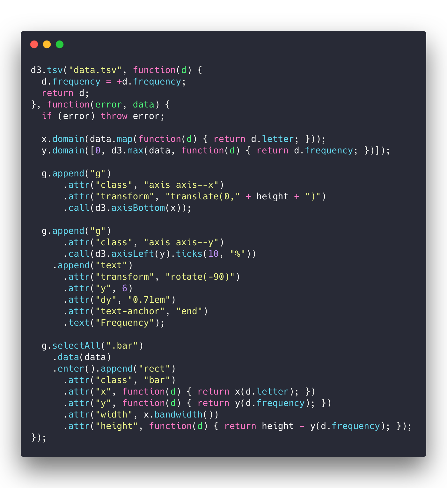
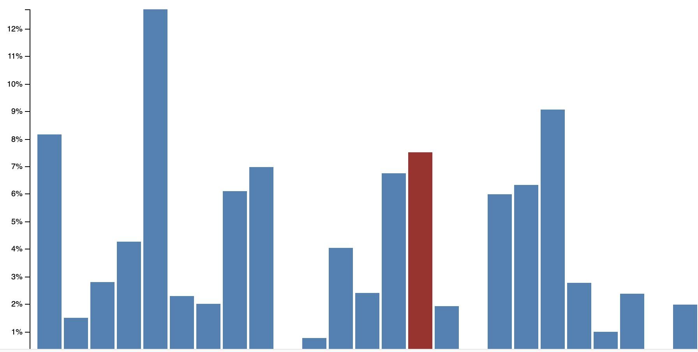
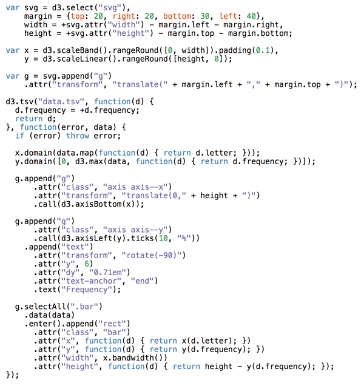
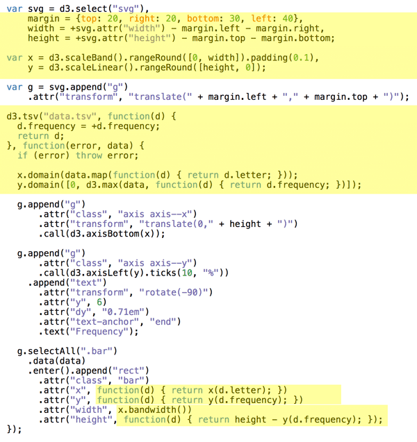
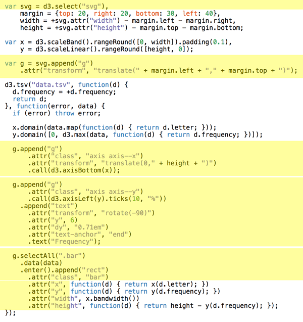
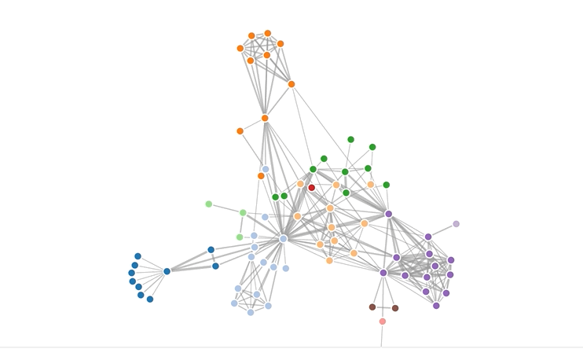

Yesterday we talked about how data visualization helps you understand the world. Today I wanted to tell you about JavaScript&#x27;s most popular data visualization library 👉 D3.D3 is amazing.D3 can do stuff like this[](https://www.nytimes.com/interactive/2014/upshot/mapping-the-spread-of-drought-across-the-us.html)

And like this

[](https://bl.ocks.org/kerryrodden/7090426)

D3 can even do 3D globe effects like this 😱

[](http://bl.ocks.org/dwtkns/4973620)

No wonder D3 is so popular. Like 82,000 stars on GitHub popular.

Used by The New York Times, The Guardian, and others for data journalism. Powering tools at Netflix, Uber, Gusto, 23andMe and other industry giants. D3 is everywhere.

If you saw an interactive data visualization, chances are it was built with D3.

2 reasons D3 is so popular 👇

1. Data science is the fastest growing field in software engineering [\[1\]](https://www.infoworld.com/article/3259891/data-science/why-data-science-and-machine-learning-are-the-fastest-growing-jobs-in-the-us.html)

2) D3 is the best way to build custom dataviz on the web. SVG, HTML, Canvas, even WebGL. You can do it all with D3.

D3 comes with a rich ecosystem of functions for almost anything you can think of. From simple medians, to automatic axis generators, and force diagrams.

Want to build a chart? You can; D3 might be too powerful.

Want a map? D3 has &#x27;em.

Want an interactive dashboard? D3.

Want to wow users with a unique twist on your dataset? Yep, D3.

Want users to dig into their own data? D3.

D3 is where it&#x27;s at for custom interactive data visualization on the web. ✌️

## But have you tried learning D3 before? oof

Here&#x27;s how it went when I first tried to learn D3.

_&quot;A-ha! I have an idea&quot;_


I took my idea and looked for a dataset. Some people have the dataset first. That&#x27;s probably smart.

And then ...


I had no idea how to start. I knew D3 was great. I knew it could do what I wanted. But WHAT DO I DO!?

So I looked for an example ... and discovered this mess



Ugh ... what is this code even doing? No matter, copy paste and hope for the best, right? As long as it works.

And then you tweak and tinker and move stuff around until the project looks right. A working visualization great success!




Sure you don&#x27;t quite understand how it works and you&#x27;d struggle to change anything ... but hey who understands their D3 code anyway? Almost no-one.

It&#x27;s like D3 was designed by someone with a PhD in data visualization. (it was)

# 3 key insights that help you learn D3.js from scratch

Good news!

Turns out D3 ain&#x27;t so bad. 3 little concepts help you understand any example out there.

It&#x27;s a trick I teach in my workshops. The usual response goes something like _&quot;That&#x27;s it!? That&#x27;s what&#x27;s going on?&quot;_

Yep. Now I&#x27;m about to tell you :)

## 1) Data manipulation vs. DOM manipulation

All D3 examples are split into two parts:

1. Data manipulation
2. DOM manipulation

First you prep your values, then you render.

I had to go through many examples to notice what&#x27;s going on. Inference learning is hard. Most people miss this pattern and it makes D3 look more confusing than it is.

The code above is part of a bar chart. Straight from D3&#x27;s documentation.

Here it is again



Doesn&#x27;t make a lot of sense does it? How does that 👆 create this 👇


Here&#x27;s how.

First you have Data Manipulation.



- some sizing variables (margin, width, height)
- two scales to help with data-to-coordinates conversion (x, y)
- load the dataset (d3.tsv) and update scale domains
- use scales to calculate attributes during DOM manipulation

And here&#x27;s the part that paints stuff on your screen



DOM manipulation in D3 happens via D3 selections. They&#x27;re a lot like jQuery `$(something)`. Personally I like to do this part with React.

Our example does a few things here

- selects the `<svg>` node (d3.select)
- appends a grouping `<g>` node (.append) with an SVG positioning attribute (translate)
- adds a bottom axis by appending a `<g>`, moving it, then calling `d3.axisBottom` . D3 has built-in axis generators
- adds a left axis using the same approach but rotating the ticks
- appends a text label &quot;Frequency&quot; to the left axis
- uses `selectAll.data` to make a virtual selection of `.bar` nodes and attach some data, then for every new data value (.enter), appends a `<rect>` node and gives it attributes

That last part is people always get lost. It looks like magic. I published my first D3 book in 2013 and I still think that&#x27;s magic. 🧙‍♂️

It&#x27;s a declarative approach to rendering data. Works great, hard to understand.

You can think of `.enter` as a loop over your data and everything chained after `.enter` is your loop&#x27;s body. Sort of like doing `data.map(d => append(rect).setManyAttributes())`

## 2) Scales

Scales are D3&#x27;s most versatile concept. They help you translate between two different spaces. Like, mathematical spaces. I told you this thing was invented by someone with a PhD.

Scales work like the mathematical functions you learned about in school. A domain maps to a range using some sort of formula.


Colored shapes in the domain map to colors in the range. No formula for this one, which makes it an ordinal scale.

```undefined
<code>let shapes = d3.scaleOrdinal()
    .domain(['triangle', 'rectangle', ...)
    .range(['red', 'orange', ...)
</code>
```

Once you have this scale, you can use it to translate from shapes to colors. `shapes('triangle')` returns `'red'`, rectangle is orange, etc..

You can create many different types of scales.

Linear, logarithmic, quantize, etc. Any basic transformation you can think of exists. The rest you can create by writing custom scales.

You&#x27;re most often going to use scales to turn data values into coordinates.

## 3) D3 layouts

Sure `.enter.append` looks like magic, but D3 layouts are the real mind=blown in the D3 ecosystem. They take your input data and return a full-featured visualization.

For example, a force layout using forces between nodes to place them on the screen.



I don&#x27;t know how that works and that&#x27;s the point. You don&#x27;t have to. The layout does it for you.

Here&#x27;s a key insight about layouts: _Layouts are the data part._

You take a `forceLayout` and feed it your data. It returns an object with a `tick` event callback.

```undefined
var simulation = d3.forceSimulation()
    .force("link", d3.forceLink().id(function(d) { return d.id; }))
    .force("charge", d3.forceManyBody())
    .force("center", d3.forceCenter(width / 2, height / 2));
```

This `simulation` now handles everything about rendering nodes. Changes their positions on every tick callback.

But it is up to you to render them.

A layout handles your data visualization in the abstract. You&#x27;re still in control of rendering. For a force layout, you have to update the DOM on every tick of the animation.

Once I figured this out, all fancy visualizations out there started making sense.


What&#x27;s something surprising you learned recently? Have you tried D3? tweet me

Cheers, ~Swizec

PS: you can watch me explain all this in [a 5 min video](https://www.youtube.com/watch?v=_kgyCiWbcY8)
