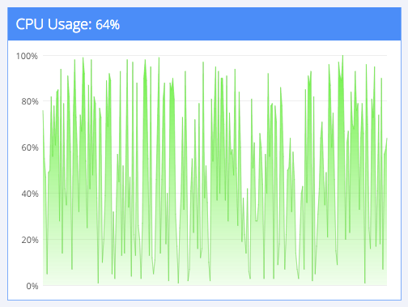
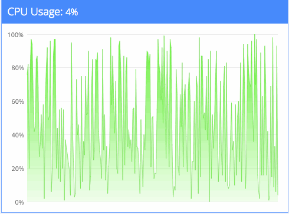
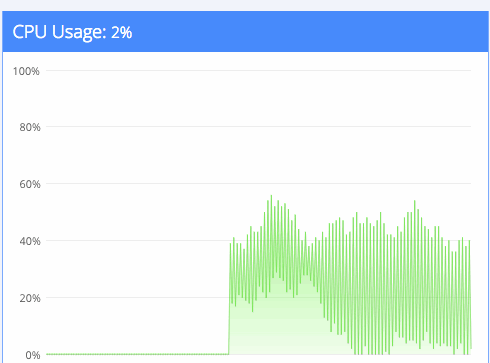
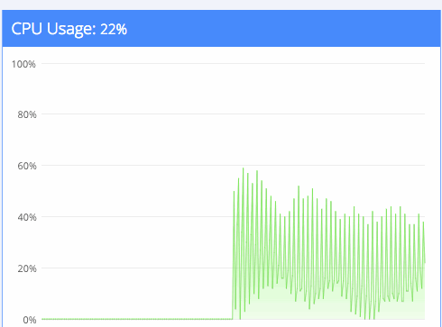
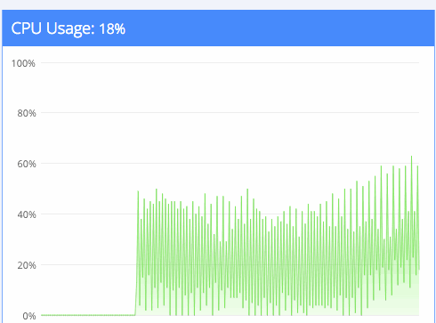
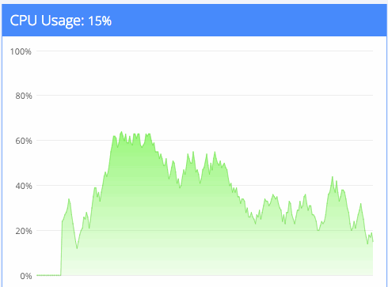

Making fake demo graphs is always fun. Here you are, making a graph without data, generating random datapoints, trying to make it as realistic as possible. Two days ago I was failing at the same. It sounds simple, right? To produce a random graph, you generate random data. Something like this:

```javascript
var data = _.range(250).map(function () {
  return Math.round(Math.random() * 100);
});
```

`250ms`

```javascript
io.on("connection", function (socket) {
  setInterval(function () {
    socket.emit("cpu", update());
  }, 250);

  function update() {
    return Math.round(Math.random() * 100);
  }
});
```



```javascript
io.on('connection', function (socket) {
    var previous = 0;

    setInterval(function () {
        previous = update(previous);
        socket.emit('cpu', previous);
    }, 250);

    function (previous) {
        previous += Math.random()*10-5;
        if (previous > 100) previous = 100;
        if (previous < 0) previous = 0;

        return Math.round(previous);
    }
});
```

\_\_` setInterval``connection `

```javascript
io.on('connection', function (socket) {
    var previous = 0;

    var interval = setInterval(function () {
        previous = update(previous);
        socket.emit('cpu', previous);
    }, 250);

    function (previous) {
        previous += Math.random()*10-5;
        if (previous > 100) previous = 100;
        if (previous < 0) previous = 0;

        return Math.round(previous);
    }

    socket.on('disconnect', function () {
        clearInterval(interval);
    });
});
```


