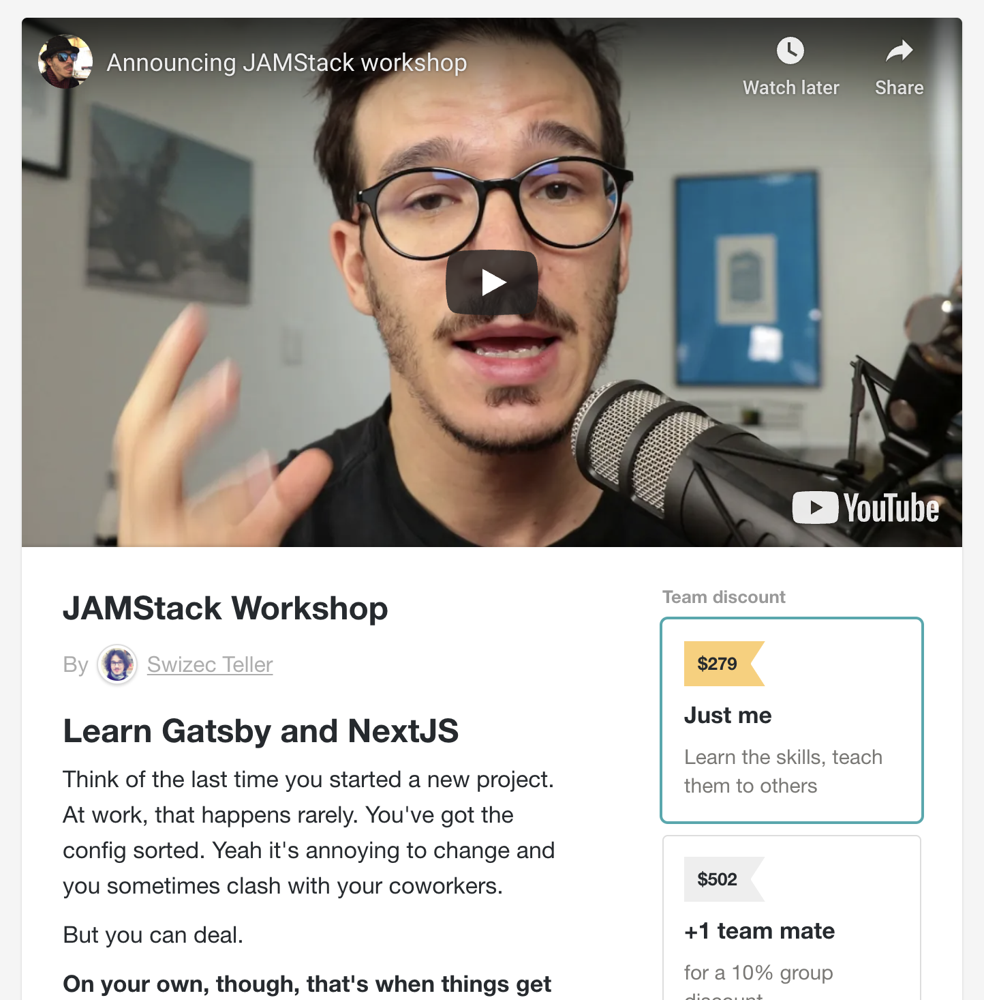

We're talking about the JAMStack this week and how it helps you ship. 🛳

And maybe that sounds weird. It's a buzzword Netlify invented to describe modern webapps. Here's what we're _really_ talking about 👉 Gatsby and NextJS.

Think of the last time you started a new project. At work, that happens rarely. You've got the config sorted. Yeah it's annoying to change and you sometimes clash with your coworkers.

But you can deal.

On your own, though, that's when things get frustrating. You spend the first few hours getting started.

[https://twitter.com/kyleshevlin/status/1320774265218633728](https://twitter.com/kyleshevlin/status/1320774265218633728)

Kyle gets it.

I used to, but I don't anymore. Screw that.

[https://twitter.com/Swizec/status/1320776658681393152](https://twitter.com/Swizec/status/1320776658681393152)

You see I used to be a Linux nerd back in the 2000's. One time I spent 3 days recompiling my entire operating system to flip a configuration flag that enabled dual monitors.

Compiling an operating system on a single core 1000GHz AMD Athlon ... ah the folly of youth.

When I switched to Mac, fussing with my computer melted away into the distance. Tweak 1 or 2 configs and you're done. Computer works.

You've outsourced all the annoying stuff and you're free to work on _your_ projects. No fiddling with tools.

[https://twitter.com/Swizec/status/1320917416415617025](https://twitter.com/Swizec/status/1320917416415617025)

## The JAMStack workshop

That's what the JAMStack workshop is about my friend. Showing you the tools that let you focus on _your_ project. Screw the basics everyone needs.

Join now and on **November 9th at 11am Pacific** you'll learn how to build a modern webapp. The user-facing parts.

The JAMStack Workshop is a 4 hour interactive workshop focused on practical exercises. You'll spend the whole time coding and answering questions. No boring lectures allowed.

Here's what a student had to say about a past workshop:

> Very hands on - excellent documentation and everything worked!!

I've spent the last 3 years perfecting my approach to workshops. You're gonna love this my friend.

No worries if you can't join live, the full recording is yours forever. But it's more fun live. You get to ask questions. 😉

And the mini-course you get in advance means we can spend our whole 4 hours together focusing on the exercises.

Or to quote another student from a past workshop:

> Wow Swizec this was fantastic! It would take us _months_ to figure this out on our own and you showed us in 4 hours.

## What we cover

The [JAMStack Workshop](https://gum.co/PdwnF) teaches you Gatsby AND NextJS. Yes both.

Why both? Because they're great for different reasons.

Gatsby works better for website-y apps and NextJS is better at webapps. Both can do either, but feel clunky when used for the wrong purpose.

Both are fantastic to use. Gatsby has more plugins and a larger community, NextJS has the backing of its own JAMStack provider (Vercel).

Both Gatsby and NextJS are based on the same principles:

- React on the frontend
- static-first UI generation
- JAMStack deployment
- build tools configured
- routing configured
- fantastic defaults to work with

_That_'s the key takeaway for this workshop. You'll learn the mindset behind a modern webapp. Whether you build with Gatsby, NextJS, your own setup, or the meta framework that comes out next week.

Once you understand the mindset my friend, a new framework is just an implementation detail. You might even build your own.

## More of what's inside

Gatsby and NextJS are great and I know you're smart enough to figure them out on your own. Jump into the docs for a few weeks and voila.

The JAMStack Workshop focuses on cutting through the noise with an opinionated guide based on years of experience.

You'll learn:

- how Gatsby and NextJS work
- how to use a flexible design system
- use other people's themes to skip fussy design steps
- add dark mode 🤘
- file-based routing and why that's a good idea
- using Markdown for content
- with MDX for rich JS-enabled content
- dynamic data loading in the browser
- static builds for your app with baked-in data
- keeping static data fresh when users navigate

You get blazing fast static-first apps with constantly fresh data, without shitloads of hard work to get there.

## How it works

Here's the best part: The JAMStack Workshop comes with a mini course.

You start with 20 to 30 minutes of video. A couple lessons where I explain the theory.

At the workshop, you're doing exercises. Everything's an exercise. I pose a problem, add light instructions, you create the solution. Then we walk through my solution and compare.

Solving problems is the best way to learn. Reading solutions doesn't work. Research says so.

And the mini-course you get in advance means we can spend our whole 4 hours together focusing on the exercises.

Or to quote another student from a past workshop:

> Wow Swizec this was fantastic! It would take us _months_ to figure this out on our own and you showed us in 4 hours.

Join [The JAMStack Workshop](https://gum.co/PdwnF) today. Enrollment closes Friday ✌️

Got questions? hit reply

Cheers, 
~Swizec

PS: you can [buy in 3 installments of \\\$99](https://gum.co/rhBat), if that's easier :)

and there's a team discount
