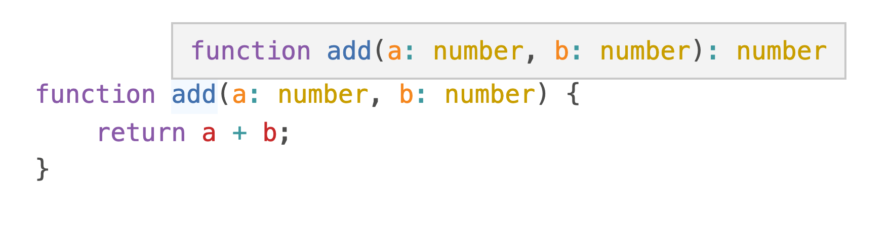
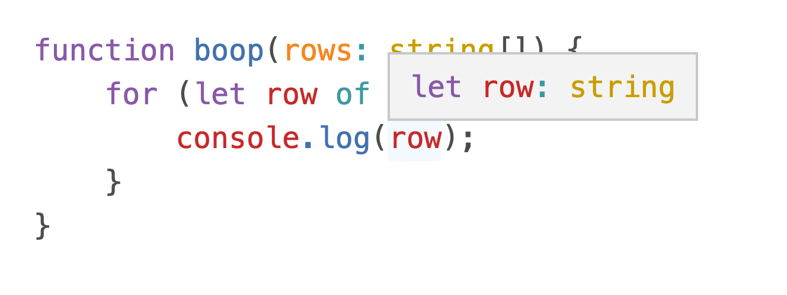
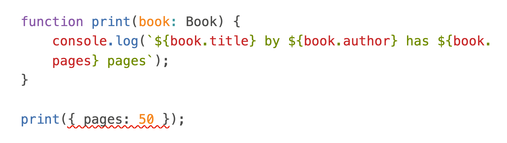
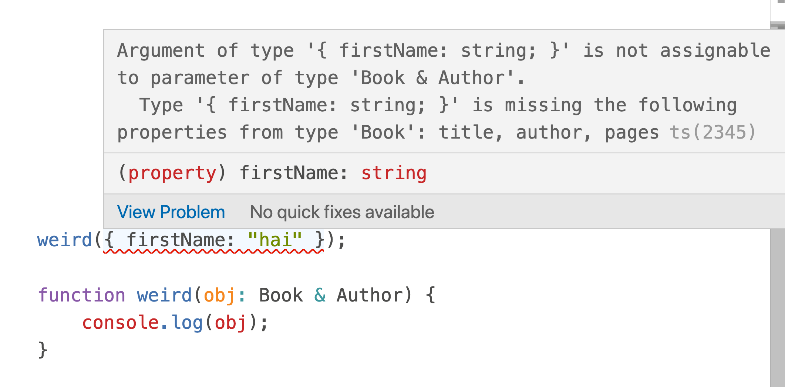

TypeScript is a language extension that adds static typing to JavaScript. It reached a breaking point sometime in 2020 and is fast becoming the default way to write JavaScript.

Why? Because it solves many of JavaScript's sharpest edges.

And [VSCode was a trojan horse for TypeScript](https://news.ycombinator.com/item?id=9460867). Sort of. The wonderful IDE support makes TypeScript shine. As VSCode became more popular, so did TypeScript.

Features like this:


Can you even imagine the number of things you no longer have to memorize? The editor tells you what's available! 😍

[TypeScript](https://www.typescriptlang.org/) is quick to learn, if you know JavaScript. I don't recommend _starting_ with TypeScript. That's too much and you won't grok the benefit.

https://twitter.com/Swizec/status/1436756320934236170

The official [TypeScript Handbook](https://www.typescriptlang.org/docs/handbook/intro.html) is a great way to start. Give it an afternoon, build a toy project or five, and you'll get the hang of it.

_Mastering_ TypeScript takes longer. ~2 years into my journey I'm still working on that part. The weirder your code gets, the harder the TypeScript becomes.

That's an important feature. TypeScript tells you when you're off track and asks _"Are you sure you wanna go there? Coz we can go there but it's gonna hurt and you can probably write simpler code instead."_

https://twitter.com/Swizec/status/1440705514250268672

TypeScript is a forcing function to keep your code dumb, obvious, and quick to read.

## TypeScript in 5 minutes

Here's a 5 minute guide to TypeScript, if you don't have an afternoon to read the handbook and want to skip some parts that fall away with experience.

This assumes you're comfortable with types as a concept. I think that's the part that frustrates people into saying TypeScript itself is hard.

https://twitter.com/oleg008/status/1436782583409434627

TypeScript _does_ get tricky with advanced use and when you're doing acrobatics to fit poorly constructed code into a language that's trying to force you into simplicity.

### What is a type

**You can think of types as declaring the shape and form of a variable. They tell you, the programmer, what to expect.**

Like when you say "lunch meat". You don't mean sliced pastrami, specifically, you mean any pre-sliced meat that tastes good in a sandwich.

TypeScript types work the same way.

### The syntax

You can think of TypeScript as syntax sugar on top of JavaScript. It's designed to compile away and _leave no trace in production code_. This will be important when we talk about pitfalls.

The syntax follows a `name: type` pattern.

You can declare the type of almost any JavaScript expression by adding a colon and saying the type. For example:

```typescript
// declare name of a const or let
const name: string = "Swizec"

// declare expected attribute types
function add(a: number, b: number) {
  return a + b
}

// declare function return type
function boop(): string {
  return "this must be a string"
}
```

TypeScript uses inference to guess types for you when it's easy. Means less work for you 🙌

For example, TypeScript knows adding two numbers produces a number even if you don't say nothing.



In stark contrast to _certain languages_ that make you type everything out like a lunatic.

### The core types

The core TypeScript types are `string`, `number`, and `boolean`.

`string` for text, `number` for all numbers (integers, decimals, fractions, everything), `boolean` for true/false.

You also have `null` and `undefined`. When you give up there is `any`.

The rest builds from there.

### Building types

You can use unions to define different possibilities:

```typescript
// arg can be a string or a null
// this fails if arg is undefined
function boop(arg: string | null) {
  if (arg) {
    console.log(arg)
  }
}
```

You can use use a question mark `?` to define optionality:

```typescript
// arg can be undefined
// same as typing arg: string | undefined
function boop(arg?: string) {
  if (arg) {
    console.log(arg)
  }
}
```

Any type can become an array, if you add `[]`:

```typescript
// expects an array of string
function boop(rows: string[]) {
  for (let row of rows) {
    console.log(row)
  }
}
```

Because the array is typed, TypeScript can infer the type of each row 🤩



You can define the specific shape of objects:

```typescript
function print(book: { title: string; author: string; pages: number }) {
  console.log(`${book.title} by ${book.author} has ${book.pages} pages`)
}
```

`print` expects an object with properties `title` and `author` as strings, and `pages` as a number. Anyone who calls this function will know what shape of object to pass as an argument.

Great for React component props 😉

### Defining your own types

Writing that out every time is cumbersome. That's where type aliases come in.

```typescript
type Book = {
  title: string
  author: string
  pages: number
}
```

You can now use `Book` as a type any time you want to declare that something should be book-shaped.

```typescript
function print(book: Book) {
  console.log(`${book.title} by ${book.author} has ${book.pages} pages`)
}
```

Much better ✌️

Custom types work in all the same ways as built-in types. You can use unions, re-use them in other object types, and make properties optional.

```typescript
// the book's author is an object
type Book = {
  title: string
  author: Author
  pages: number
}

// lastName and birthYear are optional
type Author = {
  firstName: string
  lastName?: string
  birthYear?: number
}
```

### String union types

String union types are one of my favorite features of TypeScript. They help with [SHOUTING CONSTANTS](https://swizec.com/blog/stop-shouting-shouting/).

```typescript
type Author = {
  firstName: "Bob" | "Alice"
  lastName?: string
  birthYear?: number
}
```

The only possible first names for authors are `Bob` and `Alice`. Nothing else can exist.

## Why even bother?

TypeScript shines on a team. Even if the team is you and you-from-6-months-ago.

https://twitter.com/Swizec/status/1446181530489872384

Using TypeScript solves two classes of problems:

1.  How to understand and navigate a codebase
2.  How to ensure basic things aren't breaking

Autocomplete helps you navigate the codebase. You always know what's possible. Reading types helps you understand the codebase. You quickly see the range of expected options.

You can understand how to use a function or library just from reading its types. Implementation details don't matter. 😍

TypeScript _ensures_ the implementation details don't matter because it throws errors when you hold the code wrong. VSCode even gives you squiggly lines when you're being silly.



Books are more than a number of pages. The `print` function said it wants books, not any random object.

This covers a large majority of unit tests that people write.

https://twitter.com/Swizec/status/1361800387708116994

Imagine if instead of writing dozens of unit tests to make sure you know when a function changes and you're holding it wrong, you declare its type and let tooling handle the rest.

Instant ~80% test coverage 🤯

## Important pitfalls

https://twitter.com/Swizec/status/1440479750883971081

Avoid `any` like the plague. The less TypeScript knows for certain about your code, the less helpful it becomes.

Make types as specific as possible, but not more than necessary. If any callable expression will work, say `Function`, not `() => void`.

Union types represent _the intersection_ of objects. A union of `Book | Author` is trying to describe every object that is made up of common properties of books and authors. If you want objects that can be a book _and_ an author, use `&`.

```typescript
// firstName is the lowest common denominator
function weird(obj: Book | Author) {
  console.log(obj)
}

weird({ firstName: "hai" })
```

Turn that `|` into an `&` and the world makes intuitive sense:



I've lost a lot of time to that one. Hurts my brain 😅

Most important pitfall: **_Do not be lulled into thinking you are writing C# or Java_.** You're writing JavaScript. Write it like JavaScript.

Do not rely on fancy polymorphism tricks and type overloading. There are no types at runtime beyond the types that JavaScript supports.

```typescript
// this doesn't work!
// at run-time you get typeof obj === "object"
function argh(obj: Book & Author) {
	if (obj typeof Book) {
		// do book stuff
	} else if (obj typeof Author) {
	  // do author stuff
	}
}
```

Enjoy ❤️

Cheers,<br/>
~Swizec

PS: yes, you can mix TypeScript and JavaScript in the same project. Great way to start using it slowly
