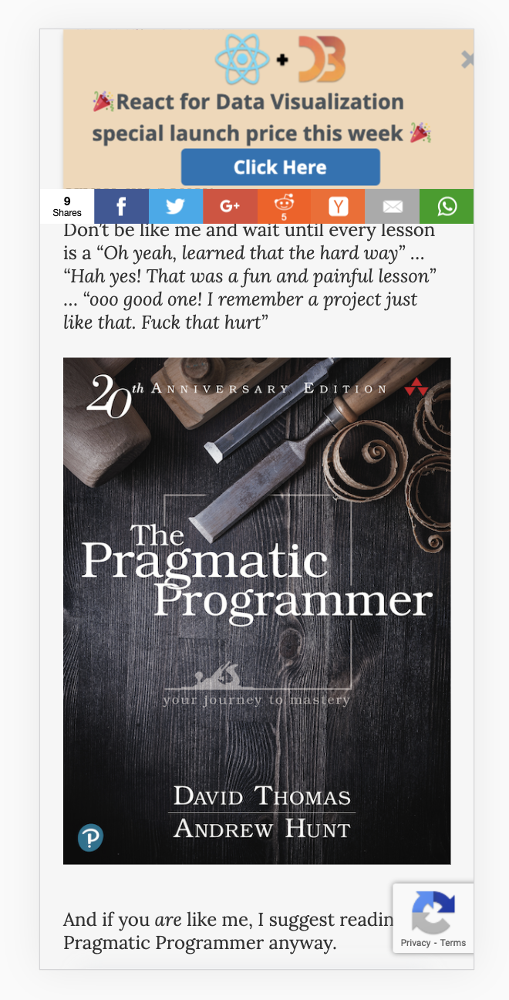

After 4 years of putting it off, 1 year of tinkering, a month of work, and $1500 of hired help, my new blog is finally here 🎉 You're looking at it now.

Unless you're reading via email. You should [try it in the browser](https://swizec.com/blog/lessons-from-migrating-a-14-year-old-blog-with-1500-posts-to-gatsby).

This is the story of why, how, and what I learned.

## First, a bit of background

swizec.com started with a [test post on April 20th, 2006](https://swizec.com/blog/site-set-up/). Yes, I kept the post. Original design lives in [a time capsule on archive.org](https://web.archive.org/web/20060507223112/https://swizec.com/).


😍

Back then I had a custom PHP framework running the site.

It was great: open source, flexible, and way over-engineered. Ran a few big sites in production when I used it for my after-school job at a web agency.

When I got more serious about writing articles in the early 2010's, the site moved to Wordpress. Got tired of tinkering and wanted to focus on writing.

Wordpress is great because of its vast ecosystem of plugins, templates, and ease of use. No wonder it [powers 37% of the web](https://kinsta.com/wordpress-market-share/).

When you set it up right, Wordpress can be fast. Mine used caching strategies so intense it became a static site generator.

New page loads from PHP machinery and database access. Every reader thereafter hits a static HTML dump of the whole page.

## Why move to Gatsby

I hated using Wordpress.

The interface was slow, the editor was crap, markdown support never worked right, and adding a new post before [TechLetter.App](https://techletter.app/) was a 20 minute exercise in frustration.

It was so bad that for almost 4 years I paid someone $500/mo to manually publish my articles. I couldn't stand it. And yes he helped with other parts of publishing, too. It was great ❤️

Then the bugs started.

Bad experience on mobile, email signup forms that reject subscribers, a custom template in need of fixing, degrading performance. All the things Google increasingly cares about.

SEO started suffering. Users began to bounce. People hated the site. _I_ hated the site.

And I dreaded even the thought of fixing any of it. You have to open an FTP client (do I still have one??), edit straight on production (no idea how to run it locally), re-learn Wordpress machinery ... 🤢

At the same time Gatsby was getting better and better.

### Exploring Gatsby through smaller sites

Gatsby's main draw is that you can write markdown, consume it into React machinery, and spit out a pure HTML static website. Works without JS, in theory.

I first used Gatsby for a proper site with the [reactfordataviz.com](https://reactfordataviz.com) homepage.

Worked great. Markdown for certain subpages, React for the homepage. Looked fantastic and was a breeze to use. And now I had a bunch of reshufflable components to play with and optimize the homepage 😍

We soon added a blog at [reactfordataviz.com/articles](https://reactfordataviz.com). Didn't want to build it myself, hired help.

That was cumbersome to use.

Then [ServerlessHandbook.Dev](https://serverlesshandbook.dev) came around and I discovered Gatsby+MDX. Based on machinery from the [RebassJS](https://rebassjs.org/) docs site.

This is it. The experience I always wanted with the machinery I always needed. Fantastic!


MDX is Markdown that supports React components. Write Markdown as usual and get full access to the magic of React.

Heck yeah 🤘

Used an updated version of that machinery to build a custom course platform for [ServerlessReact.Dev](https://serverlessreact.dev), migrated [reactfordataviz.com](https://reactfordataviz.com) soon after, and built the new blog. That's when I hit a snag ...

### Why not NextJS

[NextJS](https://nextjs.org/) wasn't ready when I started this process. Barely a blip in the ecosystem.

They made a lot of progress the past 6 months. But we're here now. Maybe next time 🤷‍♂️

## The result of moving to Gatsby

The new site looks way better I think. And it works on mobile.

Compare this old iPhone X screenshot of the old site:



With the new one:


Much better don't you think?

You can see an even bigger difference in Lighthouse metrics and performance. When you open the site now, it's instant. Before, you had to wait. A lot.

Compare the [old homepage](https://old.swizec.com) (a plain html static site, not wordpress), to the [new homepage with far more info](https://swizec.com)


Or a typical article with a bunch of text and a couple images.


Large articles with embeds and many images are even worse. I managed a cool _9_ performance score with the old site ✌️


Comparisons made using [web.dev/measure](https://web.dev/measure). There's a bug that doesn't recognize Gatsby's blur-up effect correctly. Makes performance look worse than it is.


### A better authoring experience

My favorite part is the new authoring and tinkering experience.

Everything you see is a MDX file on the filesystem. Put a file in `/src/pages/*.mdx` and it becomes a page on that path.

I have native support for all sorts of embeds anywhere on the site via [gatsby-remark-embedder](https://github.com/MichaelDeBoey/gatsby-remark-embedder). 13 different services right now. All it takes is paste a link on its own line.

I use [gatsby-remark-giphy](https://github.com/Swizec/gatsby-remark-giphy) to embed and search for gifs with ``


And anywhere on the site, I can mix React and Markdown. Top of the homepage looks like this:

```javascript
<Box width={[1, 1, 2/3]} m="auto" p={3}>

# Want a better JS engineer career?

<FormCK copyBefore={<></>}>

## Start with an interactive cheatsheet 📖

Then get thoughtful letters 💌 on **mindsets, tactics, and technical skills** for your career.

<Box sx={{textAlign: 'left'}}>

"Man, love your simple writing! Yours is the only email I open from marketers and only blog that I give a fuck to read & scroll till the end. And wow always take away lessons with me.

Inspiring! And very relatable. 👌"

~ [Ashish Kumar](https://twitter.com/ashfame/status/1286756578226405376)

</Box>

</FormCK>
```

Yep, that's Markdown feeding into children of a `<FormCK>` component for a custom ConvertKit form. Makes this:


Ok it needs a loading indicator 🤔

Same machinery works in articles. Write markdown same as usual, have support for everything I use in [TechLetter.App](https://techletter.app), and stop relying on code sample screenshots for the web.

That's because I can publish the same Markdown source file to both my newsletter and swizec.com ✌️

Oh and this part here `width={[1, 1, 2/3]}`? That's responsive. How wide do you want this thing to be at different screen sizes. Heck yeah 💪

### A rough publishing experience

The _authoring_ experience is great. The tinkering experience is fantastic. The _publishing_ experience sucks.

Here's why:

- **each article is a page**, meaning I have to manually slugify the title, make a new directory, paste the source
- **frontmatter is manual**, which means after I paste the source, I have to add a title, description, publish date, and a few other knicknacks
- **remote images don't blur up** and that's okay, images have to be part of source. There's a script – `yarn fix-images` – that downloads images and puts them in source
- **publishing takes forever** Gatsby is slow as shit for large sites like this. I'm using Gatsby Cloud, but it doesn't support incremental builds for MDX 👉 each article takes 30min+ to publish.

Add another 15min+ for Netlify to deploy. Vercel couldn't do it because of the 10,000 files restriction.


**On the bright side!** Publishing works through git, the blog is open source, and I'm never going to lose another image ever again.

I used to [hotlink](https://en.wikipedia.org/wiki/Inline_linking) lots of images. From various websites, image hosts that no longer work, all sorts of places.

Those images are gone. 404. 500. Gateway Timeout. Dead.

All images are part of swizec.com's source now. I will keep them forever ❤️

## The biggest downside

I'm back to maintaining my own platform instead of writing.

And maybe this time it's okay. I can add more and better features, I'm not afraid of fixing bugs, and unlike before I can hire help.

Plus it's way easier to add random pages when I need them ✌️

Cheers,
~Swizec

PS: more technical look into the snags I hit migrating a large site coming later this week, I couldn't make it fit :)
