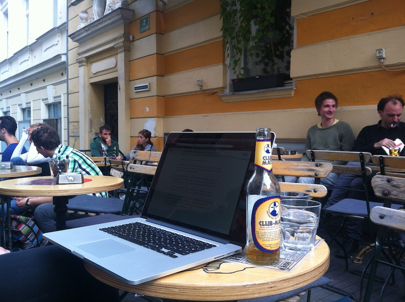

\_\_

## A week is nothing

When you're just starting out as a one-man business you're a rocket. You're essentially twiddling your thumbs so turnaround times are zero. Everything can be done immediately, you can start a new client yesterday, and you can get anything done in a week or two. Of course you feel everyone who doesn't work at the same pace is lazy. What do you mean it takes a week just to get back to me on the contract? What do you mean you need a few days to assemble the stuff I need to get work done? After a few short months, you understand. You're busy. You have plenty of work. Oh a new client has a cool project? You might have time in a month or two. If anything takes more than an hour, it will have to wait for tomorrow. Then you will need to think about it. Then you might have to check with somebody. Then a week has passed. Congratulations, you're just as slow as everyone who seemed super lazy two months ago.

## Only accept exciting projects

## The more you charge, the more you work

Another side-effect of focusing on exciting projects is you can charge more with a clear conscience. You're getting so much done and you're so very productive, why not charge more? Yes, I know. It doesn't work like that. As long as your lines-of-code or features-implemented productivity isn't horrifying, your clients don't care. But it does help with that nagging engineer conscience that keeps whispering in your ear _"Dude, you're not really this productive. You can't justify this price."_ But here's the funny thing, the higher my rate has become, the more and the better work I get. When I was starting out my rate was too low and clients treated me as an extension of themselves. They were making all the decisions, I was just the bloke that coded it up. Even though I did everything I'll explain in the last section, they still treated me as one of those _just a coders_. Essentially, they didn't trust my judgement. But the more I raised my rates, the more they did trust me. The more they leaned on me for advice, the more they talked to me as an expert rather than a goon. I think early on I even lost potential clients because I wasn't charging enough and failed to send a "I am an expert. Promise!" signal.

## Hourly sucks

## Only one client at a time

Part of the reason a day rate works so well is that you can't work on more than one client per day. [Context switching](http://en.wikipedia.org/wiki/Context_switch "Context switch") between projects is hard. Especially when they use completely different technologies, have a whole different team attached, a different set of problems, different market, different everything. Imagine how stressful changing jobs is. Now imagine doing that more than once a day. Work a few hours for client A, then a few hours for client B. A few hours for client C, god forbid. If you want to pull it off with any semblance of quality work, you're going to need at least an hour or two to switch your brain too. Time you could spend having fun. Switching every few days is easier. I used to do two or three days for one client, then another two for another. But even this got exhausting and I noticed the quality of my work deteriorating. Nowadays I try to block off at least one whole week for a client and I no longer try to have more than one client at a time. There's no need to hedge bets. If you do good work, your clients will treat you well and there will never be a problem. With my next contract I am officially switching to a weekly rate.

## Coding is the least important part of the job

