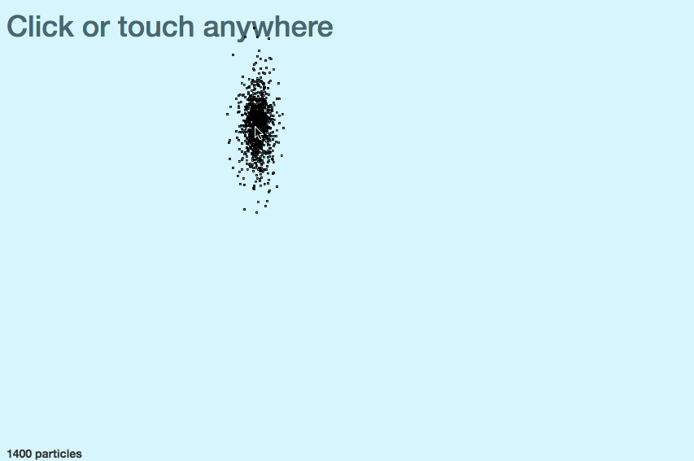
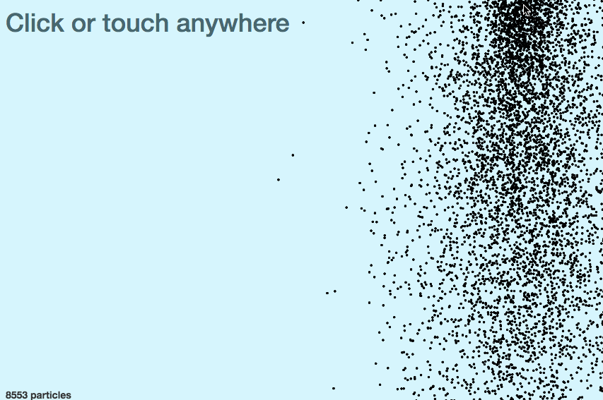

_\*\*\*\*_`canvas.drawImage`\_\_` .arc``.stroke `

```javascript
// draw a sprite particle in componentDidMount
this.context.beginPath();
this.context.arc(1.5, 1.5, 1, 0, 2*Math.PI, false);
this.context.stroke();

// copy pasta particle

drawParticle(particle) {
   let { x, y } = particle;

   this.context.drawImage(this.canvas, 0, 0, 3, 3, x, y, 3, 3);
}
```

`.drawImage`` .drawImage``this.canvas``Image() `

```javascript
// reducer

case ‘TIME_TICK’:
        let {svgWidth, svgHeight, lastFrameTime} = state,
            newFrameTime = new Date(),
            multiplier = (newFrameTime-lastFrameTime)/(1000/60); // N frames dropped

        let movedParticles = state.particles
                                  .filter((p) => {
                                      return !(p.y > svgHeight || p.x < 0 || p.x > svgWidth);
                                  })
                                  .map((p) => {
                                      let [vx, vy] = p.vector;
                                      p.x += vx*multiplier;
                                      p.y += vy*multiplier;
                                      p.vector[1] += Gravity*multiplier;
                                      return p;
                                  });

        return Object.assign({}, state, {
            particles: movedParticles,
            lastFrameTime: new Date()
        });
```

` drawImage``drawImage``Image() `
