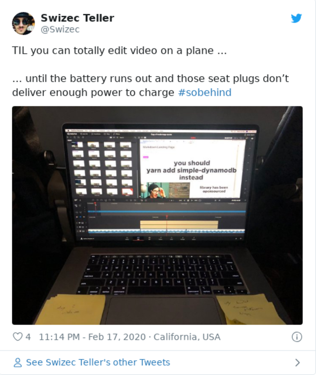
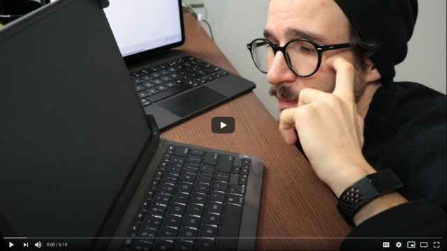
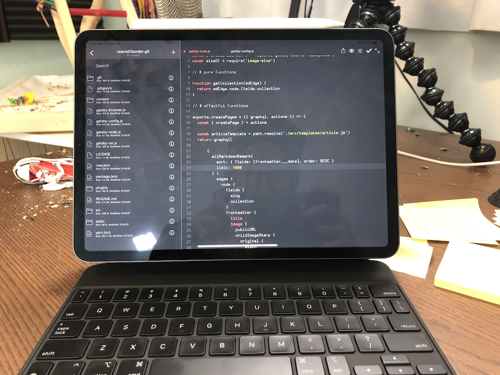
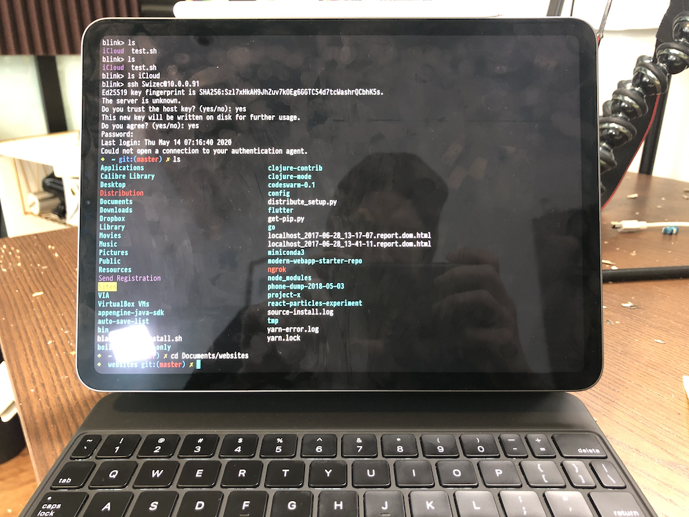

You know how your laptop feels like it's for serious work only?

It sits on your desk plugged into your monitor and your keyboard and your mouse and maybe some speakers and who knows what else. Lives on its little stand like a PC tower of old. Travels with you reluctantly when you really really need it to.

This is great for coding. Fantastic even.

You have a powerful device, great peripheries, and it doesn't draw the power of a small electric car or the noise of a tiny wind turbine.

But sometimes you just want to send a quick email. Do some light work on an airplane. Sit back on the couch scroll through Slack and answer GitHub comments while a good-not-quite-fantastic show plays in the background.

What then?

Are you really going to unhook your laptop from aaaallll its devices, mess up your window layout (why macos why), and bring it with you?

Eh maybe.

Works okay with a 13inch. Sometimes with a 14inch. And when I got my 16inch laptop in February I was like _heck no_.

That thing is _huge_. Way too serious for light work and good luck fitting it on an airplane tray table.

I mean you can ...

## Looking for a light work device

A light work device is something that:

- works fast
- big enough screen to be comfortable
- small enough to feel casual
- good for typing

My iPad Pro had the first 3. I've had iPads before and damn this thing is on another level. With the pencil v2 it's the first iPad that didn't go into a dusty drawer never to resurface after a month.

But I couldn't type.

Slack was a chore, email was painful, don't even think about writing newsletters.

And then Apple announced the Magic Keyboard. Perfect, right?

Well ... sort of perfect. It doesn't bend over. The iPad becomes a baby laptop and stops being a tablet. 🙄

So I bought the Logitech keyboard to compare.

Didn't like that either. It bends over but the keys are tiny and weird. 🙄

The [silly video above](https://www.youtube.com/watch?v=okKkMrYSKeA) was fun to make. You should give it a watch, I go into more detail on pros and cons of each keyboard.

tl;dr is that I'm keeping the Magic Keyboard. Sturdy, heavy, kind of weird, and with _amazing_ keyboard feel. Feels just like my laptop.

## What about light coding?

Ok, got the light work device I always wanted. Girlfiend is already upset that work is creeping into our Netflix time.

What about light coding? Could the iPad pull that off?

YES!

Only very light coding.

You can use the [Buffer Editor](https://buffereditor.com/) to write code. Pulls from GitHub, pushes to GitHub, all works well. Some trickery around 2FA tokens.

The editing experience is super nice. Bump up your font size a bit and it's downright cushy. Even supports multiple tabs 👌

But you can't run your code.

BufferEditor doesn't have a built-in way to run your code that I could find. No way to execute npm modules, no way to install locally, nothing that would let you see what you're doing.

Bit of a shame. Light coding only.

### Maybe with SSH hackery?

So it turns out iPads support terminals nowadays. Using the [Blink Shell](https://blink.sh/)

That's me SSH-ing from my iPad into my laptop as myself. With full control to do whatever I want.

Buffer supports SSH as well, by the way.

So here's what you could do if you really wanted to:

1.  Open your project in Buffer via SSH
2.  SSH into your machine
3.  Run Gatsby
4.  Open dev URL on your iPad

Now you can edit code from your iPad on your serious laptop and preview locally on your iPad.

That is just ridiculous that's possible. 🤯

And I think it goes beyond "light work" ...

Cheers,  
~Swizec
