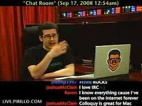

> \[18:21:38] &lt;HairyFotr> \_chatty-botko\_ we desire to hear moar of you're infinite wisdom \[18:21:38] &lt;\_chatty-botko\_> know it broken ? \_chatty-botko\_ doesn't though gets

[IRC](http://en.wikipedia.org/wiki/Internet_Relay_Chat "Internet Relay Chat") might seem quaint and outdated, but for keeping in touch with a group of friends it beats [Twitter](http://twitter.com "Twitter"), Facebook and Google+ hands down.


There's a bunch of _others_ on those things. With IRC there's just us ... and a robot overlord.

Mostly `__botko__` makes sure to mention when we repost links and keeps irc logs for us. But as soon as [@smotko](https://twitter.com/#!/smotko) added random phrases to make keeping us in place more interesting. We wanted more.

We wanted our bot to speak.

It's been ages since I coded just for fun, so last night I made `__botko__` talk.

## What to say?

> \[18:03:13] &lt;\_chatty-botko\_> \_botko\_ probably feels left out \[18:12:45] &lt;\_chatty-botko\_> auto complete :D whoa! mind = blown

So how do you make a robot speak?

Natural language generation is a _huge_ field, hell I'm doing [my thesis](http://swizec.github.com/Le-Thesis/) in that general vicinity. For this project I just wanted to have a little fun, not invent a monster -> [markov chain](http://en.wikipedia.org/wiki/Markov_chain "Markov chain") [text generation](http://en.wikipedia.org/wiki/Natural_language_generation "Natural language generation")!

The way a markov chain text generator works is basically:

1.  split a text into words
2.  create n-grams (n-length groups of words, I used n=1)
3.  create unique hashes of all n-grams
4.  map each [n-gram](http://en.wikipedia.org/wiki/N-gram "N-gram") to a list of _next_ n-grams

You end up with this sort of data structure.

```python
{-8818677644356330256: {'next': {-6361492750444014453: 1},
                        'text': ['dobu'],
                        'weight': 1.9},
 -8629397782117610386: {'next': {}, 'text': ['podatkov'], 'weight': 0.9},
 7424044602067048: {'next': {14336086128129331: 0.9, 1480645349370722979: 1},
                    'text': [':D'],
                    'weight': 2.9},
# and so on for quite a while
```

While this works great for static text, an irc chatroom is a rolling [time series](http://en.wikipedia.org/wiki/Time_series "Time series") that never really ends. Not only will you soon run out of memory, how do you deal with staying relevant?

I had to wait until `4:03AM` for the solution to hit me!

It doesn't have to be complicated at all - just decay the weights of all _next_ items whenever you poke an element. And do the same whenever a new text is added to the Corpus.

Especially important is to choose the starting point well. The more relevant it is to current discussion, the more chance you have of saying something relevant. So instead of choosing at random, we make a weighted choice here as well.

When everything is packaged together, usage becomes pretty simple:

```python
corpus.add(text) # repeat this a couple of times

# to generate, you just
corpus.rewind()
text = " ".join(take(corpus, 5)) # creates a 5 word text
```

All the [code is on github](https://github.com/Swizec/botko/blob/speaking/src/Corpus.py).

Making the data structure iterable like that was especially interesting. Now I can change how the generator works without affecting external code.

```python
    def __iter__(self):
        return self

    def __setitem__(self, ngram, value):
        key = self.__hash(ngram)
        self.data[key] = value

    # adapted from
    # http://eli.thegreenplace.net/2010/01/22/weighted-random-generation-in-python/
    def __weighted_choice(self, items):
        rnd = random.random() * sum([w for w, k in items])
        for i, item in enumerate(items):
            rnd -= item[0]
            if rnd < 0:
                return item[1]

    def __next(self, ngram):
        item = self.__getitem__(ngram)

        if len(item['next']) == 0:
            raise StopIteration

        return self.data[self.__weighted_choice(zip(item['next'].values(),
                                                    item['next'].keys()))
                         ]['text']

    def next(self):
        if not hasattr(self, 'current_ngram'):
            self.rewind()

        self.current_ngram = self.__next(self.current_ngram)
        return self.current_ngram
```

Pretty cool right?

## When to speak?

Okay, that takes care of generating the text. But when should `__botko__` speak anyway?



You certainly don't want the bot to spam everyone. But you don't want him to be completely quiet most of the time. Speaking every X amount of events is simply too predictable and boring ...

Ideally you'd want him to speak more when the chatroom is busier and less when it's a bit quiet. When it's been quiet for a long time and it suddenly becomes very busy, that's also a good time to speak.

Sort of like a greeting.

I ended up using a combination of chat velocity and the rate of chat acceleration change to determine the probability of speaking, which is then still left up to [randomness](http://en.wikipedia.org/wiki/Randomness "Randomness").

Velocity is measured as the ratio between the timespan of the last 10 messages and the timespan of the last 60. This basically measures how densely the messages are coming into the chatroom right now.

```python
velocity_rate = (now - 10_messages_ago_time)/(now - 60_messages_ago_time)
```

The rate of acceleration change idea took some time to materialize in my head. The idea is that you want to make it likelier for the bot to speak when there is a sudden flurry of activity and fall back to the `velocity_rate` formula when conditions are mostly stable.

```python
v_i = average_speed_of_last_[0+i : i*5]_messages
a_i = delta_of_two_speeds
accel_rate = a_1/a_2
```

It looks simple in pseudocode, but I promise it took a fair amount of head banging to come up with that!

This part of the [code is also on github](https://github.com/Swizec/botko/blob/speaking/src/chitchat.py).

## Lovely!

That's pretty much it. Our IRC room now has a bot that entertains everyone with its nonsense and I couldn't make myself go to bed until almost five in the morning.

All that's left to do now is tweaking the parameters a bit, perhaps iron out a bug or two.

I'm almost tempted to connect this guy to #startups ...

> \[18:27:27] wisdom ACTION uses this quote in blogpost because it's starting \[18:27:43] I almost have to use that ... \[18:27:44] kul, to da si se spet zacel ful pogovarjat, prej
