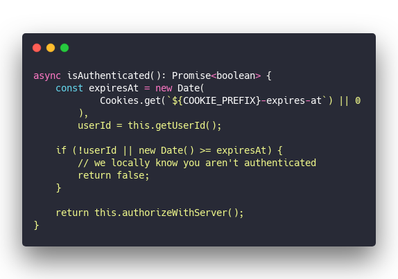
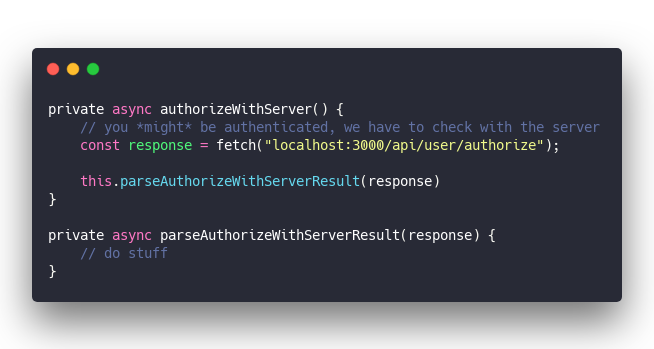
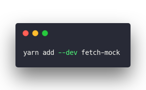
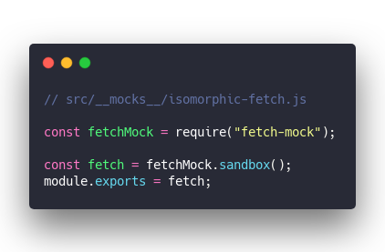
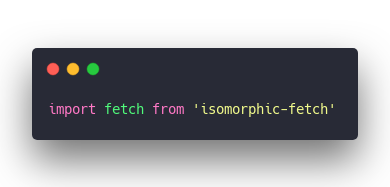
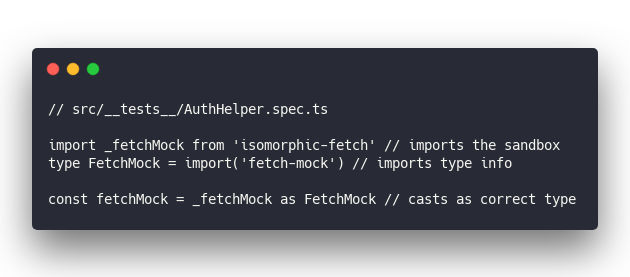
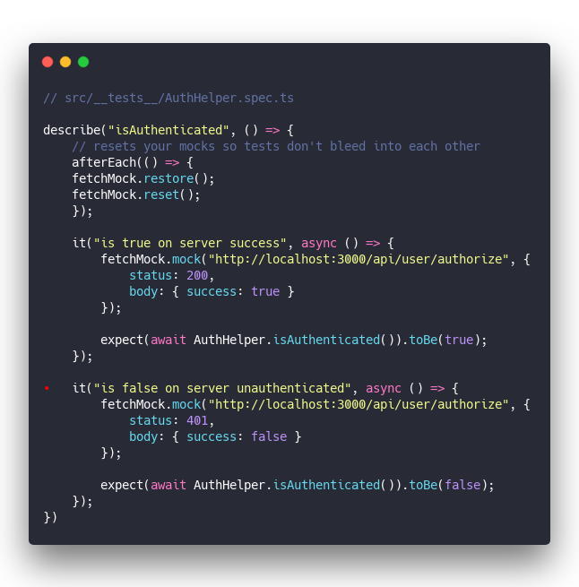

Some days your code flows, your fingers fly, and you're god amongst nerds. Other days you're testing `fetch()` requests.

So I'm writing this to save you some time. The definitive _how to mock and test fetch requests_ guide for 2020.

First, a little background

## Why even test requests?

Integration testing. Also known as the only useful testing. 😛

Semantics aside, most bugs happen on the edges. The touch points between systems. Interfaces between modules.

What bigger in-between point than calling an API? Lots can go wrong. Server can fail, network down, strange response codes, or just corruption on the wire.

Take for example this `isAuthenticated` method from a library I built at work.

&t=seti&l=typescript&ds=true&wc=true&wa=true&pv=48px&ph=32px&ln=false&code=async%20isAuthenticated()%3A%20Promise%3Cboolean%3E%20%7B%0A%20%20%20%20const%20expiresAt%20%3D%20new%20Date(%0A%20%20%20%20%20%20%20%20%20%20%20%20Cookies.get(%60%24%7BCOOKIE_PREFIX%7D-expires-at%60)%20%7C%7C%200%0A%20%20%20%20%20%20%20%20)%2C%0A%20%20%20%20%20%20%20%20userId%20%3D%20this.getUserId()%3B%0A%0A%20%20%20%20if%20(!userId%20%7C%7C%20new%20Date()%20%3E%3D%20expiresAt)%20%7B%0A%20%20%20%20%20%20%20%20%2F%2F%20we%20locally%20know%20you%20aren't%20authenticated%0A%20%20%20%20%20%20%20%20return%20false%3B%0A%20%20%20%20%7D%0A%0A%20%20%20%20return%20this.authorizeWithServer()%3B%0A%7D>)

Is the user authenticated? Check local cookies. That's always gonna work.

And if cookies _look_ correct, you gotta ask the server if they're _actually_ correct. User might have been banned, deleted, access revoked, or just changed their password.

That API request is the most likely failure point.

Wanna _really_ test this method? Gonna have to test the fetch.

## Why mock fetch requests?

A pure unit testing approach says you should never mock requests to other systems.

You assume the request works and test that your function makes the request. Then you test the function that's called after the fetch.

And you enter the unit testing fallacy.

Besides, structuring your code to allow a pure unit testing approach makes it harder to read, understand, and tedious to work with. You'd need something like this:

&t=seti&l=typescript&ds=true&wc=true&wa=true&pv=48px&ph=32px&ln=false&code=private%20async%20authorizeWithServer()%20%7B%0A%20%20%20%20%2F%2F%20you%20*might*%20be%20authenticated%2C%20we%20have%20to%20check%20with%20the%20server%0A%20%20%20%20const%20response%20%3D%20fetch(%22localhost%3A3000%2Fapi%2Fuser%2Fauthorize%22)%3B%0A%20%20%20%20%0A%20%20%20%20this.parseAuthorizeWithServerResult(response)%0A%7D%0A%0Aprivate%20async%20parseAuthorizeWithServerResult(response)%20%7B%0A%20%20%20%20%2F%2F%20do%20stuff%0A%7D>)

Yeah that's not gonna get out of hand 🙄

Keep your code simple and mock the request instead. Hook into the `fetch()` API and manipulate what it returns. That is the way to testing bliss my friend.

## How to mock fetch requests in Jest

After more hours of trial and error than I dare admit, here's what I found: You'll need to mock the `fetch` method itself, write a mock for each request, and use a fetch mocking library.

### install

The library that worked best for me was [`fetch-mock`](https://github.com/wheresrhys/fetch-mock).

&t=seti&l=shell&ds=true&wc=true&wa=true&pv=48px&ph=32px&ln=false&code=yarn%20add%20--dev%20fetch-mock>)

### mock

You tell Jest to use a mock library like this:

&t=seti&l=typescript&ds=true&wc=true&wa=true&pv=48px&ph=32px&ln=false&code=%2F%2F%20src%2F__mocks__%2Fisomorphic-fetch.js%0A%0Aconst%20fetchMock%20%3D%20require(%22fetch-mock%22)%3B%0A%0Aconst%20fetch%20%3D%20fetchMock.sandbox()%3B%0Amodule.exports%20%3D%20fetch%3B>)

Jest imports this file instead of `isomorphic-fetch` when running your code. Same approach works to replace any other library.

Put a file of &lt;library name> in `src/__mocks__` and that file becomes said library. In this case we're replacing the `isomorphic-fetch` library with a `fetch-mock` sandbox.

So when your code says

&t=seti&l=typescript&ds=true&wc=true&wa=true&pv=48px&ph=32px&ln=false&code=import%20fetch%20from%20'isomorphic-fetch'>)

It's actually getting the sandbox 🤘

You'll need to import _a_ fetch to support mocking – can't rely on the global `window.fetch` I'm afraid. You can't use that in test environments anyway since it doesn't exist.

### types

Using TypeScript in tests, you'll have to jump through another hoop: TypeScript doesn't understand that isomorphic-fetch is mocked and gets confused.

You have to tell the type system that _"Hey, this is actually fetch-mock. All is well."_

&t=seti&l=null&ds=true&wc=true&wa=true&pv=48px&ph=32px&ln=false&code=%2F%2F%20src%2F__tests__%2FAuthHelper.spec.ts%0A%0Aimport%20_fetchMock%20from%20'isomorphic-fetch'%20%2F%2F%20imports%20the%20sandbox%0Atype%20FetchMock%20%3D%20import('fetch-mock')%20%2F%2F%20imports%20type%20info%0A%0Aconst%20fetchMock%20%3D%20_fetchMock%20as%20FetchMock%20%2F%2F%20casts%20as%20correct%20type>)

Convoluted but how else is TypeScript supposed to know `isomorphic-fetch` is actually `fetch-mock` ...

PS: I'm assuming Jest because it's become the industry standard for JavaScript testing in the past few years.

## And now it works ✌️

All you gotta do now is mock a request and write your test.

&t=seti&l=typescript&ds=true&wc=true&wa=true&pv=48px&ph=32px&ln=false&code=%2F%2F%20src%2F__tests__%2FAuthHelper.spec.ts%0A%0Adescribe(%22isAuthenticated%22%2C%20()%20%3D%3E%20%7B%0A%09%2F%2F%20resets%20your%20mocks%20so%20tests%20don't%20bleed%20into%20each%20other%0A%09afterEach(()%20%3D%3E%20%7B%0A%20%20%20%20fetchMock.restore()%3B%0A%20%20%20%20fetchMock.reset()%3B%0A%09%7D)%3B%0A%09%0A%09it(%22is%20true%20on%20server%20success%22%2C%20async%20()%20%3D%3E%20%7B%0A%09%09fetchMock.mock(%22http%3A%2F%2Flocalhost%3A3000%2Fapi%2Fuser%2Fauthorize%22%2C%20%7B%0A%09%09%09status%3A%20200%2C%0A%09%09%09body%3A%20%7B%20success%3A%20true%20%7D%0A%09%09%7D)%3B%0A%09%09%0A%09%09expect(await%20AuthHelper.isAuthenticated()).toBe(true)%3B%0A%09%7D)%3B%0A%09%0A%E2%80%8C%09it(%22is%20false%20on%20server%20unauthenticated%22%2C%20async%20()%20%3D%3E%20%7B%0A%09%09fetchMock.mock(%22http%3A%2F%2Flocalhost%3A3000%2Fapi%2Fuser%2Fauthorize%22%2C%20%7B%0A%09%09%09status%3A%20401%2C%0A%09%09%09body%3A%20%7B%20success%3A%20false%20%7D%0A%09%09%7D)%3B%0A%09%09%0A%09%09expect(await%20AuthHelper.isAuthenticated()).toBe(false)%3B%0A%09%7D)%3B%0A%7D)>)

Each of those tests is saying _"When you fetch() this URL, return this object_. No network calls are made, no servers harmed, no ambiguity about what happens. Just solid tests doing exactly what you want.

And now you know your code works. Bliss 😌

Happy Friday,  
~Swizec
