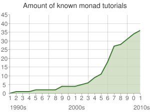

**\_\_\_\_**

## Monads annoy me

Really, they're just annoying. Annoying little shits. Yesterday I was doing something simple:

- take some values from mongodb
- draw a graph

Simple right? Can't be more than ten or twenty lines of either python or javascript. I spent the entire day in **_Monad Hell _**getting it done in [Haskell](http://haskell.org "Haskell (programming language)"). And that's after the [dependency hell](http://en.wikipedia.org/wiki/Dependency_hell "Dependency hell") of installing _Chart_ on my computer ... _cabal_ isn't very good, but that's a whole different blogpost. You see, when you take some values out of Mongo, the operation might have failed! You know it didn't, you know everything should just crash and burn and alarms should be going off if it did, so it's never going to. Not as far as this piece of code is concerned. But Haskell doesn't know that. It _might have_ failed. So everything you get out is wrapped in the _Maybe_ monad. Except sometimes it isn't.

```haskell
known'::[Document] -> (UTCTime, Double)
known' docs = (cast' $ (valueAt "time") (docs!!0),
               cast' $ (valueAt "amount") (docs!!0))

-- Couldn't match expected type `Double' with actual type `Maybe a0'
--    In the expression: cast' $ (valueAt "amount") (docs !! 0)
```

Great. Ok so those are maybes, don't really care, moving on. By the way, if the function really _does_ fail it either dies with an index out of bounds error (not enough Documents) or with some sort of _fields weren't there_ error, if you give it the wrong sort of Document. So it's not like it could actually fail in a way that it would still work and those Maybes would be warranted.

```haskell
plot.hs:52:7:
    Couldn't match expected type `Double'
                with actual type `Maybe Double'
    In the first argument of `(+)', namely `money'
    In the first argument of `(-)', namely `money + p'
    In the expression: money + p -
```

Gah! At this point you're (or at least I was) getting frustrated and you suddenly can't remember where that short and sweet description of _instance_ was even though it kept slapping you in the face the whole time you were trying to figure out how to take a value out of some monad or another _and keep it the fuck out._ I don't know what instances are, not completely, but they look like a magic thing that can make [type conversions](http://en.wikipedia.org/wiki/Type_conversion "Type conversion") automatic. And that's awesome so I need to look it up. Anyway, you settle for a simple function

```haskell
double'::Maybe Double -> Double
double' Nothing = 0.0
double' (Just x) = x
```


###### Related articles

- [](http://www.haskellforall.com/2012/06/you-could-have-invented-free-monads.html)[Why free monads matter](http://www.haskellforall.com/2012/06/you-could-have-invented-free-monads.html)
- [](http://scientopia.org/blogs/goodmath/2012/08/19/monads-and-programming/)[Monads and Programming](http://scientopia.org/blogs/goodmath/2012/08/19/monads-and-programming/)
- [](http://www.haskell.org/haskellwiki/index.php?title=Monad_tutorials_timeline&diff=49591&oldid=prev)[Monad tutorials timeline](http://www.haskell.org/haskellwiki/index.php?title=Monad_tutorials_timeline&diff=49591&oldid=prev)
- [](http://www.haskell.org/haskellwiki/index.php?title=Hask&diff=49966&oldid=prev)[Hask](http://www.haskell.org/haskellwiki/index.php?title=Hask&diff=49966&oldid=prev)
- [](http://unfoldthat.com/2011/04/02/python-monads.html)[Python Monads - new approach](http://unfoldthat.com/2011/04/02/python-monads.html)

[](http://www.zemanta.com/?px "Enhanced by Zemanta")
