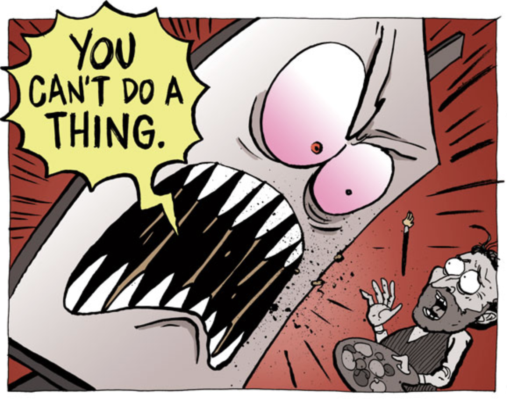

When was the last time you were there at line 0 of a new app, my friend?

If you&#x27;re like most professional engineers, the answer is _&quot;Never&quot;_. And if I were to grab you by the arm, tie you to a chair, and yell _&quot;Build a webapp or I&#x27;m not letting you go!&quot;_ ... would you know how?

Wait is that Hugh Jackman? I didn&#x27;t know he was in Swordfish 😱

Asked to build something new, most engineers hem and haw, wring their arms, think real hard, and give up. The blank editor steals their juice.

You sit down. Great idea in mind. And then ... shit, how do I start?

Artists call this [The Blank Canvas Effect](https://zenpencils.com/comic/lilvincent/), writers have the blank page, engineers ... the greenfield project?

## Why most engineers can&#x27;t build from scratch

Think about it, why can&#x27;t most engineers build something from scratch? Is it because they&#x27;re bad engineers?

Of course not. They&#x27;re _amazing_ engineers creating great value for their companies.

So why then ...

Most of us just never get the chance. Think about it.

There&#x27;s [a story on HackerNews](https://news.ycombinator.com/item?id=21961560) from an engineer at Google. Brilliant guy with a sneaking suspicion that he&#x27;s gotten lazy.

> I never challenge myself to deeply learn about what I&#x27;m doing, it&#x27;s almost like I&#x27;ve been using only 10% of my mental capacity for work Even when I get a meaningful project, all I do is copy code from the internal codebase and patch things together until they work.

Sound familiar?

Yeah me too. That&#x27;s just how it works in a mature product.

You have this massive codebase and your job is to make small adjustments. A tweak here, a trim there, a loving refactor over yonder.

That&#x27;s it. Maintenance. That&#x27;s all they want.

Your job is to understand the codebase and know where to find existing solutions to new problems. Like a taxi driver that knows every street in London.

When you do build a new feature, the hard part is making it fit into the codebase. Oh and finding all the legos.

**but the legos are already there** _you never build from scratch_

Don&#x27;t you want to invent new legos? Is this what you became an engineer for?

## Most engineers don&#x27;t know how it all fits together

> Dude, sometimes you and Sean talk about these things so casually and it&#x27;s like I know the words, but how it all relates together just doesn&#x27;t make any sense

A fresh engineer whispered that to me the other day. Ashamed almost.

Mate, there&#x27;s no shame. You&#x27;ve been an engineer for a year. Sean and I have been at it for decades. We&#x27;ve seen it all.

_&quot;Do you know this stuff just because back then you had to?&quot;_

Yes thanks I&#x27;m old and grew up in the internet dark ages. 🙄

But Luis is right. I did grow up in the dark ages.

So many basics I take for granted, people just don&#x27;t learn anymore. It&#x27;s a solved problem. Click a button and you&#x27;re done.

Like how to set up a server? Spin up a database? Send an HTTP request? Deal with AJAX? Hacks before websockets? How HTML works? Where does CSS come in? How to create a user? Where to store data? How to make sure your data is safe? Where do you CDN? Why would you CDN? What should you process on the frontend? What on the backend? What&#x27;s the point of compiling your code? When does it not make sense to build static? Why is code faster the 2nd time it runs? What&#x27;s a cache?

Layers upon layers of technology that evolved before my eyes as I learned the ropes.

You don&#x27;t have that luxury do you? Most don&#x27;t. The number of programmers [about doubles every 5 years](https://blog.cleancoder.com/uncle-bob/2014/06/20/MyLawn.html) after all.

That&#x27;s a loooot of fresh blood that never learned the basics.

And why would they?

You come into a company. Everything&#x27;s already there. Somebody built the infrastructure, somebody created the legos, somebody solved the basics.

Your job is to be an expert in a tiny little niche and crush it. Maybe you&#x27;re the best UI engineer in the world, or a CSS grand master, killing it at React, or the best person that&#x27;s ever walked the planet when it comes to complex data processing pipelines.

But remember the Swordfish scenario.

If you want to build a side project to make an extra $1,000/month, _you need to know how it all fits together_. You&#x27;re on your own.

**YOU get to build the legos** 🎉

And that&#x27;s exciting! And a little scary.

You got dis my friend, I believe in you 💪

Think you could build something from scratch? hit reply

Cheers,  
~Swizec

PS: one of my favorite things to say when teaching the Build &amp; Launch a whole app workshop is this _&quot;Sorry, I&#x27;m going to copy paste this first part, I don&#x27;t do this very often and always forget how to start&quot;_