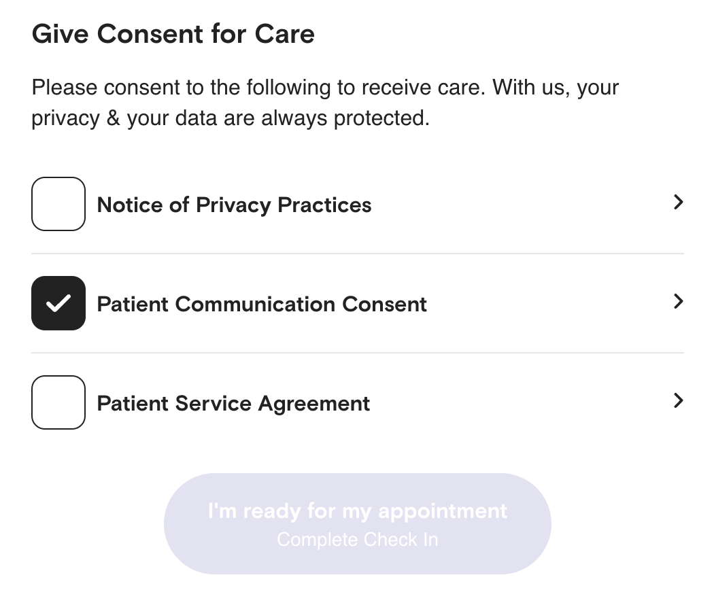

The quickest way to simplify a complex function with lots of logic is to turn it into data. Here's what I mean.

Take this screen for example. It shows a list of consent forms for a medical appointment.



Nothing special. Checkmarks and links to PDFs. The submit button saves the list into a `jsonb` field in Postgres so we have an exact immutable record.

But where does the list come from? 🤔

## Is it a backend or frontend concern?

When I first built this 2 years ago, the list depended on:

- **how this appointment happens** – virtual and in-person appointments have different forms
- **what kind of appointment is it** – certain appointments have special forms, like acupuncture
- **the latest PDF links** – the URLs will change when/if the forms are updated

That sounded like a lot of contextual business logic to shove into the UI. Yes it knows all the data, but interpreting it felt like a step too far.

Plus if the PDF links change and you consent to a cached version of the list (if they're hardcoded in JavaScript), that could be a problem 🤔

I built the dumbest possible UI:

```javascript
function ConsentForms({ appointment }) {
  // makes an API call
  const { forms } = useConsentForms(appointment.id);

  return (
    <ul>
      {forms?.map((form) => (
        <li>
          <a href={form.url}>{form.name}</a> <Checkbox checked={form.checked} />
        </li>
      ))}
    </ul>
  );
}
```

Make an API call to get list of consent forms, iterate and render. The surrounding code took care of saving.

We never had to touch this again. Run `git blame` and it says "swizec 2 years ago" except where we made style tweaks and changed links to open in a new tab.

## Business logic grows complex, always

2 years ago the team was small and doing lots. We added a basic function on the backend with a hardcoded list of forms:

```javascript
const consentForms = {
	default: [ ... ],
	acupuncture: [ ... ],
	virtual: [ ... ]
}

exports.getForms = (appointment) => {
	if (isVirtual(appointment)) {
		return consentForms.virtual
	} else {
		if (isAcupuncture(appointment)) {
			return consentForms.acupuncture
		} else {
			return consentForms.default
		}
	}
}
```

Special forms for special appointments, defaults for the rest. Easy. Why didn't you do this on the frontend Swizec?

Here's why 👉 over the next 2 years, we:

- added 5 more "special" appointments
- added support for "special" appointments within virtual _and_ in-person
- added support for checking whether you've consented to _this_ version of _this_ form and pre-filling the checkmark appropriately

That last one was a beauty of querying JSON data with SQL. Gotta love Postgres. Glad I wasn't the one figuring it out 😅

The function grew to 70 lines of code backed by a 120 line config object. But the frontend never changed.

## Turn it into data!

As the business grew, they wanted to make this list depend on which city you're in. Health care is funny like that.

Our form logic would gain another dimension and explode in complexity. Too many combinations, too hard to test.

And they warned about new even crazier ideas coming soon!

We turned all our fancy business logic into a database table:

- appointment type
- location
- is virtual
- form id

Now you can get the list of forms with a single query:

```sql
select * from forms f, form_linkages fl where
	fl.appointment_type = ?
	fl.location = ?
	fl.is_virtual = ?
	fl.form_id = f.id
```

Bam. Done.

Analysts want to know which forms belong where? Query. Code needs a list of forms? Query. Business wants to update config? Query. New appointment type? Query. New location? Query. New form? Query. List of current forms in production? Query.

And this whole time the UI didn't change. Because we kept it dumb.

Cheers,<br/>
~Swizec

PS: this puts us on the path towards a CMS so engineering never has to think about consent forms again ✌️
